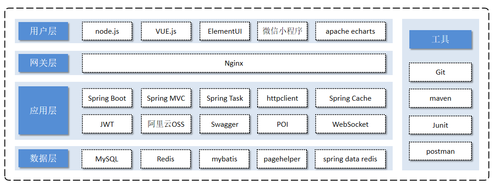

# 软件设计、项目介绍、产品原型、技术选型

## 一、软件开发流程

1.需求分析；需求规格说明书、产品原型；

2.设计：UI 设计，数据库设计、接口设计；

3.编码：项目代码、单元测试；

4.测试：测试用例、测试报告；

5.上线运维：软件环境安装、配置。

## 二、角色分工

项目经理：对整个项目负责，任务分配，把控进度。

产品经理：进行需求调研，输出调研文档，产品原型。

UI 设计师：根据产品原型，输出界面效果图。

架构师：项目整体架构设计，技术选型。

开发工程师：代码实现。

测试工程师：编写测试用例，输出测试报告。

运维工程师：软件环境搭建，项目上线。

## 三、软件环境

软件开发工程师，在编码的过程中，不可避免地会接触多种软件环境；

工作中常遇到的三套环境， 分别是开发环境、测试环境、生产环境。

开发环境（development）：

- 软件开发人员，在开发阶段使用的环境，就是开发环境；
- 一般是开发者本地环境，或局域网中的服务器，外部用户无法访问。

测试环境（testing）：

- 软件开发人员，将项目的功能模块开发完毕，并且单元测试通过后，就需要将项目部署到测试服务器上；
- 一般是专门给测试人员使用的环境， 也就是测试环境，用于项目测试，一般外部用户无法访问。

生产环境（production）：

- 当项目开发完毕，并且测试人员测试通过后，就可以上线项目，
- 将项目部署到线上环境，并正式对外提供服务，这个线上环境也称之为生产环境。

## 五、项目介绍

苍穹外卖是专门为餐饮企业（餐厅、饭店）定制的一款软件产品，其中包括以下三大模块：

基础数据模块：

- 项目概述
- 环境搭建
- 员工管理
- 分类管理
- 菜品管理
- 套餐管理实战

点餐业务模块：

- 店铺营业状态设置；
- 微信登陆；
- 缓存商品；
- 购物车；
- 用户下单；
- 订单支付和订单管理；
- 历史订单；
- 订单状态定时处理；
- 来单提醒和客户催单；

统计报表模块：

- 图形报表统计；
- Excel 报表统计。

其中包括两个客户端：后台管理系统、小程序应用。

- 后台管理系统，给餐饮企业内部员工使用：
  - 可以对餐厅的分类、菜品、套餐、订单、员工等进行管理维护；
  - 对餐厅的各类数据进行统计；
  - 同时也可进行来单语音播报功能。
- 小程序端，给消费者使用：
  - 可以在线浏览菜品、添加购物车、下单、支付、催单等。

**管理端**和**用户端**的功能架构如下图所示，其中有具体业务功能模块：

## 六、产品原型

用于展示项目的业务功能，并不是最终的页面效果，一般由产品经理进行设计。

管理端原型图（见项目资料）：由餐饮企业内部员工使用。 主要功能有：

| 模块      | 描述                                                         |
| --------- | ------------------------------------------------------------ |
| 登录/退出 | 内部员工必须登录后，才可以访问系统管理后台。                 |
| 员工管理  | 管理员可以在系统后台对员工信息进行管理，包含查询、新增、编辑、禁用等功能。 |
| 分类管理  | 主要对当前餐厅经营的菜品分类或套餐分类进行管理维护，包含查询、新增、修改、删除等功能。 |
| 菜品管理  | 主要维护各个分类下的菜品信息，包含查询、新增、修改、删除、启售、停售等功能。 |
| 套餐管理  | 主要维护当前餐厅中的套餐信息，包含查询、新增、修改、删除、启售、停售等功能。 |
| 订单管理  | 主要维护用户在移动端下的订单信息，包含查询、取消、派送、完成，以及订单报表下载等功能。 |
| 数据统计  | 主要完成对餐厅的各类数据统计，如营业额、用户数量、订单等。   |

用户端原型图（见项目资料）：由消费者使用。主要功能有:

| 模块        | 描述                                                         |
| ----------- | ------------------------------------------------------------ |
| 登录/退出   | 用户需要通过微信授权后登录使用小程序进行点餐。               |
| 点餐-菜单   | 在点餐界面需要展示出菜品分类/套餐分类，并根据当前选择的分类加载其中的菜品信息，供用户查询选择。 |
| 点餐-购物车 | 用户选中的菜品就会加入用户的购物车，主要包含查询购物车、加入购物车、删除购物车、清空购物车等功能。 |
| 订单支付    | 用户选完菜品/套餐后，可以对购物车菜品，进行结算支付，这时就需要进行订单的支付。 |
| 个人信息    | 在个人中心页面中会展示当前用户的基本信息，用户可以管理收货地址，也可以查询历史订单数据。 |

## 七、技术选型

本项目的技术选型，将会从用户层、网关层、应用层、数据层这几个方面进行介绍项目中使用到的技术框架和中间件：

- Spring Task：Spring 提供的定时任务框架。
- httpclient：发送 Http 请求；
- Spring Cache：Spring 提供的缓存框架。
- Swagger：后端用来生成接口文档的技术。可用来测试后端接口。
- POI：操作 Excel 表格。
- WebSocket：一种网络协议，用来实现“催单”、“来单提醒”的功能。
- spring data redis：用于简化 Java 代码操作 Redis 的 API。
