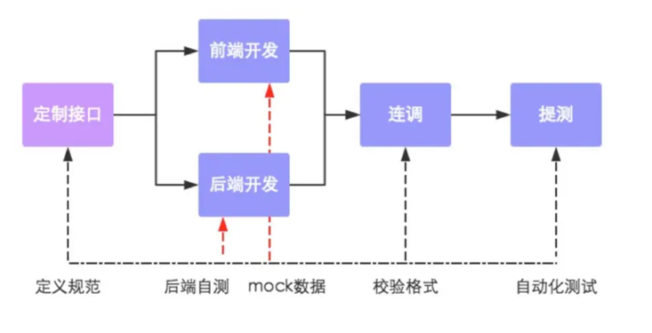

# 导入接口文档、Swagger

## 一、前后端分离开发的流程

第一步：定义接口，确定接口的路径、请求方式、传入参数、返回参数。

第二步：前端开发人员和后端开发人员并行开发，同时，也可自测。

第三步：前后端人员进行连调测试。

第四步：提交给测试人员进行最终测试。



将资料中提供的两个接口文件，导入到 Api 测试工具中。

├─📄 苍穹外卖-管理端接口.json
└─📄 苍穹外卖-用户端接口.json

## 二、Swagger

[Swagger](https://swagger.io/>) 是一个规范和完整的框架，用于生成、描述、调用可视化 RESTful 风格的 Web 服务，它的主要作用是：

- 使得前后端分离开发更加方便，有利于团队协作；
- 自动生成在线接口文档，降低后端开发人员编写接口文档的负担；
- 功能测试。

Swagger 可以为后端生成接口文档，并帮助后端进行接口测试。

### 1.Spring 与 Swagger

Spring 已经将 Swagger 纳入自身的标准，建立了 Spring-swagger 项目，现在叫 Springfox。

通过在项目中引入 Springfox ，即可非常简单、快捷的使用 Swagger。

knife4j 依赖，是为 Java MVC 框架集成 Swagger 生成 Api 文档的增强解决方案，前身是 swagger-bootstrap-ui；

> kni4j 取名是希望它能像一把匕首一样小巧，轻量，并且功能强悍！

目前，一般都使用 knife4j 框架。使用步骤：

1.导入 knife4j 依赖：

sky-takeout-backend/pom.xml

```xml
<dependency>
    <groupId>com.github.xiaoymin</groupId>
    <artifactId>knife4j-spring-boot-starter</artifactId>
    <version>${knife4j}</version>
</dependency>
```

sky-takeout-backend/sky-pojo/pom.xml

```xml
<dependency>
    <groupId>com.github.xiaoymin</groupId>
    <artifactId>knife4j-spring-boot-starter</artifactId>
</dependency>
```

sky-takeout-backend/sky-server/pom.xml

```xml
<dependency>
    <groupId>com.github.xiaoymin</groupId>
    <artifactId>knife4j-spring-boot-starter</artifactId>
</dependency>
```

2.在配置类中，加入 knife4j 相关配置；并设置静态资源映射；这部分都是固定代码。

Spring Boot2 集成 Knife4j 的自动配置。

sky-takeout-backend/sky-server/src/main/java/com/sky/config/WebMvcConfiguration.java

```java
/**
 * 通过knife4j生成接口文档
 * @return
*/
@Bean
public Docket docket() {
    ApiInfo apiInfo = new ApiInfoBuilder()
            .title("苍穹外卖项目接口文档")
            .version("2.0")
            .description("苍穹外卖项目接口文档")
            .build();
    Docket docket = new Docket(DocumentationType.SWAGGER_2)
            .apiInfo(apiInfo)
            .select()
            .apis(RequestHandlerSelectors.basePackage("com.sky.controller"))
            .paths(PathSelectors.any())
            .build();
    return docket;
}
```

Spring Boot3 集成 knife4j 的自动配置，[参考文档](https://www.cnblogs.com/TechMyZeal/p/18094999)

sky-takeout-backend/sky-server/src/main/java/com/sky/config/WebMvcConfiguration.java

```java
package com.sky.config;

import io.swagger.v3.oas.models.OpenAPI;
import io.swagger.v3.oas.models.info.Info;
import lombok.extern.slf4j.Slf4j;
import org.springframework.context.annotation.Bean;
import org.springframework.context.annotation.Configuration;
import org.springframework.web.servlet.config.annotation.WebMvcConfigurer;

/**
 * 配置类，注册 web 层相关组件
 */
@Configuration
@Slf4j
public class WebMvcConfiguration implements WebMvcConfigurer {

    /**
     * 通过 knife4j 生成接口文档
     *
     * @return
     */
    // Spring Boot3 配置方式
    @Bean
    public OpenAPI publicApi() {
        log.info("开始创建接口文档...");
        return new OpenAPI()
                .info(new Info()
                        .title("苍穹外卖项目接口文档")
                        .version("1.0")
                        .description("苍穹外卖项目接口文档"));
    }
}
```

启动项目，在浏览器中访问 `http://localhost:8080/doc.html`

### 2.Swagger 常用注解

通过注解，可以控制生成的接口文档，使接口文档拥有更好的可读性，常用注解如下：

#### 2.1.Swagger2 注解

| **注解**          | **说明**                                               |
| ----------------- | ------------------------------------------------------ |
| @Api              | 用在 Controller 类上，表示对类的说明。                 |
| @ApiModel         | 用在实体（Entity、DTO、VO）类上                        |
| @ApiModelProperty | 用在实体类属性上，描述属性信息                         |
| @ApiOperation     | 用在方法上，例如Controller的方法，说明方法的用途、作用 |
| @ApiParam         | 参数注释                                               |
| @ApiResponse      | 响应码                                                 |
| @ApiResponses     | 多个响应码                                             |

在Spring Boot中使用Swagger注解，可以有效地帮助生成API文档，以下是每个注解的用法示例：

##### 2.1.1. `@Api`

`@Api` 用于在Controller类上进行说明，提供API文档中该Controller的信息。

```java
import io.swagger.annotations.Api;
import org.springframework.web.bind.annotation.RestController;

@Api(tags = "用户管理", description = "提供用户相关的API接口")
@RestController
public class UserController {
    // Controller方法
}
```

##### 2.1.2. `@ApiModel`

`@ApiModel` 用于在实体类（如DTO、VO、Entity等）上进行说明，通常用于描述数据模型。

```java
import io.swagger.annotations.ApiModel;

@ApiModel(description = "用户实体类")
public class User {
    private Long id;
    private String name;
    private Integer age;
    
    // getters and setters
}
```

##### 2.1.3. `@ApiModelProperty`

`@ApiModelProperty` 用于描述实体类属性的详细信息，比如是否必填、数据类型等。

```java
import io.swagger.annotations.ApiModelProperty;

public class User {
    @ApiModelProperty(value = "用户ID", required = true)
    private Long id;

    @ApiModelProperty(value = "用户姓名", example = "张三")
    private String name;

    @ApiModelProperty(value = "用户年龄", example = "25")
    private Integer age;

    // getters and setters
}
```

##### 2.1.4. `@ApiOperation`

`@ApiOperation` 用于描述Controller方法的功能和作用，提供关于该方法的详细说明。

```java
import io.swagger.annotations.ApiOperation;

public class UserController {
    
    @ApiOperation(value = "获取用户详情", notes = "根据用户ID获取用户的详细信息")
    @GetMapping("/users/{id}")
    public User getUser(@PathVariable Long id) {
        // 返回用户信息
    }
}
```

##### 2.1.5. `@ApiParam`

`@ApiParam` 用于描述方法参数，常用于解释参数的用途和含义。

```java
import io.swagger.annotations.ApiParam;

public class UserController {
    
    @ApiOperation(value = "根据ID更新用户信息")
    @PutMapping("/users/{id}")
    public User updateUser(
        @ApiParam(value = "用户ID", required = true) @PathVariable Long id,
        @ApiParam(value = "用户更新信息") @RequestBody User user) {
        // 更新用户信息
    }
}
```

##### 2.1.6. `@ApiResponse`

`@ApiResponse` 用于描述方法可能返回的响应状态码及对应的信息，通常配合 `@ApiOperation` 使用。

```java
import io.swagger.annotations.ApiOperation;
import io.swagger.annotations.ApiResponse;
import io.swagger.annotations.ApiResponses;

@ApiOperation(value = "删除用户", notes = "根据用户ID删除指定的用户")
@ApiResponses({
    @ApiResponse(code = 200, message = "删除成功"),
    @ApiResponse(code = 404, message = "用户未找到"),
    @ApiResponse(code = 500, message = "服务器内部错误")
})
@DeleteMapping("/users/{id}")
public void deleteUser(@PathVariable Long id) {
    // 删除用户操作
}
```

##### 2.1.7. `@ApiResponses`

`@ApiResponses` 用于描述多个响应码。它是 `@ApiResponse` 的集合，允许在方法上同时说明多个响应码的情况。

```java
import io.swagger.annotations.ApiResponse;
import io.swagger.annotations.ApiResponses;

@ApiOperation(value = "获取用户列表", notes = "返回所有用户的列表")
@ApiResponses({
    @ApiResponse(code = 200, message = "请求成功"),
    @ApiResponse(code = 400, message = "请求参数不正确"),
    @ApiResponse(code = 500, message = "服务器内部错误")
})
@GetMapping("/users")
public List<User> getUsers() {
    // 返回用户列表
}
```

这些注解为Swagger提供了丰富的文档描述，能够让API文档更加清晰、易懂。如果有任何特定的疑问，欢迎进一步交流！

#### 2.2.OpenAPI3 注解

| Swagger3                                                     | 注解说明                                                    |
| ------------------------------------------------------------ | ----------------------------------------------------------- |
| @Tag(name = “接口类描述”)                                    | 用在 Controller 类，表示对类的说明。                        |
| @Operation(summary = “接口方法描述”)                         | 用在 Controller 方法，说明方法的用途、作用                  |
| @Parameters                                                  | 用在 Controller 方法                                        |
| @Parameter(description=“参数描述”)                           | 用在 Controller 方法上 @Parameters 里 Controller 方法的参数 |
| @Parameter(hidden = true) 、@Operation(hidden = true)、@Hidden | 排除或隐藏 api                                              |
| @Schema(description = "参数描述")                            | 用在实体（Entity、DTO、VO）类或实体属性上                   |

`@Tag` 注解使用：

sky-takeout-backend/sky-server/src/main/java/com/sky/controller/admin/EmployeeController.java

```java
@Tag(name = "员工管理接口")
public class EmployeeController {……}
```

`@Operation` 注解使用：

sky-takeout-backend/sky-server/src/main/java/com/sky/controller/admin/EmployeeController.java

```java
@Operation(summary = "员工登录")
public Result<EmployeeLoginVO> login(@RequestBody EmployeeLoginDTO employeeLoginDTO) {……}
```

`@Schema` 注解使用：

sky-takeout-backend/sky-pojo/src/main/java/com/sky/dto/EmployeeLoginDTO.java

```java
package com.sky.dto;

import io.swagger.v3.oas.annotations.media.Schema;
import lombok.Data;

import java.io.Serializable;

@Data
@Schema(description = "员工登录时传递的数据模型")
public class EmployeeLoginDTO implements Serializable {
    @Schema(description = "用户名")
    private String username;

    @Schema(description = "密码")
    private String password;
}
```
