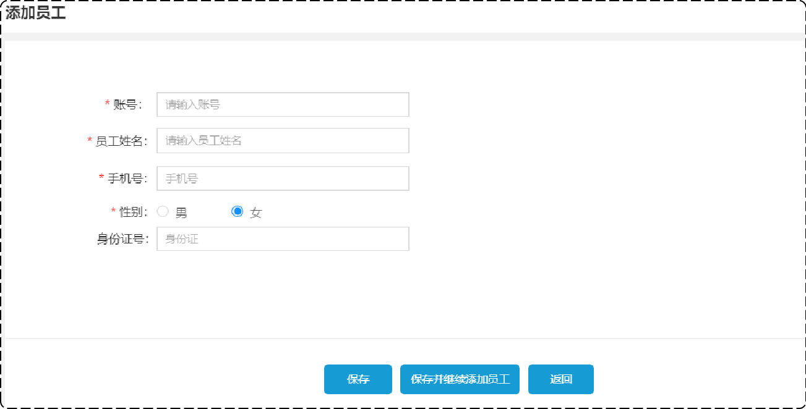
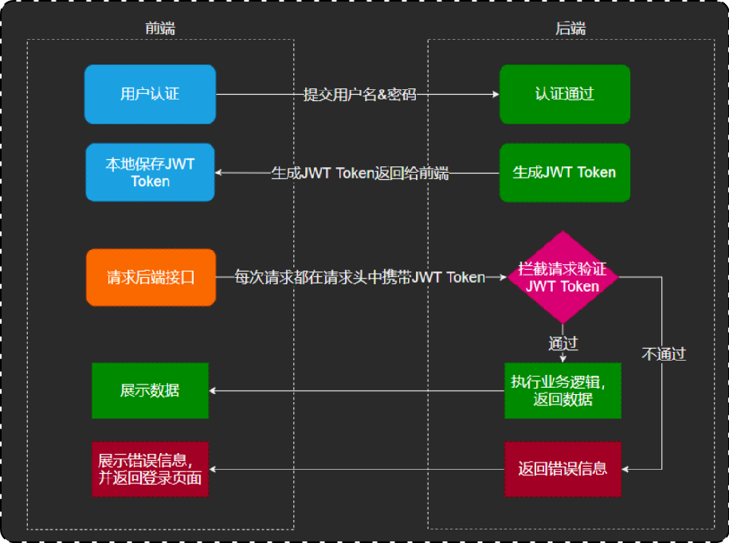

# 员工管理-新增员工

## 一、需求分析和设计

### 1.产品原型

因为产品原型比较直观，便于我们理解业务。一般在做需求分析时，往往都是对照着产品原型进行分析。

后台系统中可以管理员工信息，通过新增员工来添加后台系统用户。



注意事项：

1. 账号必须是唯一的；
2. 手机号为合法的 11 位手机号码；
3. 身份证号为合法的 18 位身份证号码；
4. 密码默认为 `123456`；

当填写完表单信息，点击"保存"按钮后，会提交该表单的数据到服务端；

在服务端中，需要接受数据，然后将数据保存至数据库中。

### 2.接口设计

本项目接口约定：

- 管理端发出的请求，以 `/admin` 开头；
- 用户端发出的请求，以 `/user` 开头

基本信息

**Path：** /admin/employee

**Method：** POST

**接口描述：**

请求参数

Headers

| 参数名称     | 参数值           | 是否必须 | 示例 | 备注 |
| ------------ | ---------------- | -------- | ---- | ---- |
| Content-Type | application/json | 是       |      |      |

Body

| 名称     | 类型    | 是否必须 | 默认值 | 备注   | 其他信息      |
| -------- | ------- | -------- | ------ | ------ | ------------- |
| id       | integer | 非必须   |        | 员工id | format: int64 |
| idNumber | string  | 必须     |        | 身份证 |               |
| name     | string  | 必须     |        | 姓名   |               |
| phone    | string  | 必须     |        | 手机号 |               |
| sex      | string  | 必须     |        | 性别   |               |
| username | string  | 必须     |        | 用户名 |               |

返回数据

| 名称 | 类型    | 是否必须 | 默认值 | 备注 | 其他信息      |
| ---- | ------- | -------- | ------ | ---- | ------------- |
| code | integer | 必须     |        |      | format: int32 |
| data | object  | 非必须   |        |      |               |
| msg  | string  | 非必须   |        |      |               |

### 3.数据库设计

employee 表结构：

| **字段名**  | **数据类型** | **说明**     | **备注**    |
| ----------- | ------------ | ------------ | ----------- |
| id          | bigint       | 主键         | 自增        |
| name        | varchar(32)  | 姓名         |             |
| username    | varchar(32)  | 用户名       | 唯一        |
| password    | varchar(64)  | 密码         |             |
| phone       | varchar(11)  | 手机号       |             |
| sex         | varchar(2)   | 性别         |             |
| id_number   | varchar(18)  | 身份证号     |             |
| status      | Int          | 账号状态     | 1正常 0锁定 |
| create_time | Datetime     | 创建时间     |             |
| update_time | datetime     | 最后修改时间 |             |
| create_user | bigint       | 创建人id     |             |
| update_user | bigint       | 最后修改人id |             |

SQL 脚本

```mysql
DROP TABLE IF EXISTS `employee`;

CREATE TABLE `employee`
(
    `id`          bigint                       NOT NULL AUTO_INCREMENT COMMENT '主键',
    `name`        VARCHAR(32) COLLATE utf8_bin NOT NULL COMMENT '姓名',
    `username`    VARCHAR(32) COLLATE utf8_bin NOT NULL COMMENT '用户名',
    `password`    VARCHAR(64) COLLATE utf8_bin NOT NULL COMMENT '密码',
    `phone`       VARCHAR(11) COLLATE utf8_bin NOT NULL COMMENT '手机号',
    `sex`         VARCHAR(2) COLLATE utf8_bin  NOT NULL COMMENT '性别',
    `id_number`   VARCHAR(18) COLLATE utf8_bin NOT NULL COMMENT '身份证号',
    `status`      INT                          NOT NULL DEFAULT '1' COMMENT '状态 0:禁用，1:启用',
    `create_time` datetime                              DEFAULT NULL COMMENT '创建时间',
    `update_time` datetime                              DEFAULT NULL COMMENT '更新时间',
    `create_user` bigint                                DEFAULT NULL COMMENT '创建人',
    `update_user` bigint                                DEFAULT NULL COMMENT '修改人',
    PRIMARY KEY (`id`),
    UNIQUE KEY `idx_username` (`username`)
) ENGINE=InnoDB AUTO_INCREMENT=2 DEFAULT CHARSET=utf8mb3 COLLATE=utf8_bin COMMENT='员工信息';

INSERT INTO `employee`
VALUES (1, '管理员', 'admin', '123456', '13812312312', '1', '110101199001010047', 1, '2022-02-15 15:51:20',
        '2022-02-17 09:16:20', 10, 1);
```

- 其中，employee 表中的 status 字段，已经设置了默认值 1，表示状态正常。

## 二、代码开发

当前端提交的数据，和实体类（比如 `Employee`）中对应的属性，差别比较大时，建议使用 DTO 来封装数据。

设计 DTO 类，并为其使用 Swagger 注解。

sky-takeout-backend/sky-pojo/src/main/java/com/sky/dto/EmployeeDTO.java

```java
package com.sky.dto;

import io.swagger.v3.oas.annotations.media.Schema;
import lombok.Data;

import java.io.Serializable;

@Data
@Schema(description = "员工新增数据模型")
public class EmployeeDTO implements Serializable {
    @Schema(description = "员工id")
    private Long id;
    @Schema(description = "用户名")
    private String username;
    @Schema(description = "姓名")
    private String name;
    @Schema(description = "手机号")
    private String phone;
    @Schema(description = "性别")
    private String sex;
    @Schema(description = "身份证号")
    private String idNumber;
}
```

控制器层 `EmployeeController` 类中，定义 `save` 方法。

sky-takeout-backend/sky-server/src/main/java/com/sky/controller/admin/EmployeeController.java

```java
……

/**
 * 此方法用于：新增员工
 *
 * @param employeeDTO 新增员工数据
 * @return Result
 */
@Operation(summary = "新增员工")
@PostMapping
public Result<String> save(@RequestBody EmployeeDTO employeeDTO) {
    log.info("新增员工，员工数据：{}", employeeDTO);

    int num = employeeService.save(employeeDTO);
    return Result.success("成功插入 " + num + " 条数据");
}

……
```

在 Servce 层的 `EmployeeService` 接口中，定义 `save` 方法。

sky-takeout-backend/sky-server/src/main/java/com/sky/service/EmployeeService.java

```java
……

/**
 * 此方法用于：新增员工的业务方法
 *
 * @param employeeDTO 新增的员工信息
 * @return 操作记录数
 */
int save(EmployeeDTO employeeDTO);

……
```

在 Servce 层的 `EmployeeServiceImpl` 类中，实现 `save` 方法。

sky-takeout-backend/sky-server/src/main/java/com/sky/service/impl/EmployeeServiceImpl.java

```java
……

/**
 * 此方法用于：新增员工的业务方法
 *
 * @param employeeDTO 新增的员工信息
 * @return 操作记录数
 */
@Override
public int save(EmployeeDTO employeeDTO) {
    Employee employee = new Employee();

    // 使用对象属性拷贝，前提是两个对象中的属性名一致
    BeanUtils.copyProperties(employeeDTO, employee);

    // 数据补充
    employee.setStatus(StatusConstant.ENABLE); // 设置状态
    employee.setPassword(DigestUtils.md5DigestAsHex(PasswordConstant.DEFAULT_PASSWORD.getBytes())); // 设置密码
    employee.setCreateTime(LocalDateTime.now()); // 设置创建事件
    employee.setUpdateTime(LocalDateTime.now()); // 设置修改事件
    // TODO 需要改为当前登录用户的 Id
    employee.setCreateUser(10L); // 设置创建用户
    employee.setUpdateUser(10L); // 设置修改用户

    return employeeMapper.insert(employee);
}

……
```

在 Mapper 层的 `EmployeeMapper` 接口中，定义 `insert` 方法：

sky-takeout-backend/sky-server/src/main/java/com/sky/mapper/EmployeeMapper.java

```java
……

/**
 * 此方法用于：插入员工
 *
 * @param employee 要插入的员工对象
 * @return 操作记录数
 */
@Insert("INSERT INTO employee(name, username, password, phone, sex, id_number, status, create_time, update_time, create_user, update_user) " +
        "VALUES (#{name}, #{username},#{password}, #{phone}, #{sex}, #{idNumber}, #{status}, #{createTime}, #{updateTime}, #{createUser}, #{updateUser}) ")
int insert(Employee employee);

……
```

在 application.yml 配置文件中，已开启驼峰映射

sky-takeout-backend/sky-server/src/main/resources/application.yml

```yaml
mybatis:
  configuration:
    #开启驼峰命名
    map-underscore-to-camel-case: true
```

## 三、功能测试

在开发阶段，后端主要使用接口文档，进行测试。

使用 Swagger 接口文档，或者接口测试工具，访问 GET 请求 `/admin/employee` 接口的资源。

测试通过后，再使用提供的前端页面，创建员工。

## 四、代码完善

问题 1：录入的用户名，如果已经存在，那么会抛出异常；该异常未处理。

发送请求，携带一个已存在的 `username`，后端报错如下：

```sh
java.sql.SQLIntegrityConstraintViolationException: Duplicate entry 'jinjin' for key 'employee.idx_username'
  at com.mysql.cj.jdbc.exceptions.SQLError.createSQLException(SQLError.java:118) ~[mysql-connector-j-8.3.0.jar:8.3.0]
  ……
```

返回的响应结果如下：

```json
{
    "timestamp": "2024-10-22T11:22:22.322+00:00",
    "status": 500,
    "error": "Internal Server Error",
    "path": "/admin/employee"
}
```

在全局异常处理类中，处理该异常：

sky-takeout-backend/sky-server/src/main/java/com/sky/handler/GlobalExceptionHandler.java

```java
package com.sky.handler;

import com.sky.constant.MessageConstant;
import com.sky.exception.BaseException;
import com.sky.result.Result;
import lombok.extern.slf4j.Slf4j;
import org.springframework.web.bind.annotation.ExceptionHandler;
import org.springframework.web.bind.annotation.RestControllerAdvice;

import java.sql.SQLIntegrityConstraintViolationException;

/**
 * 全局异常处理器，处理项目中抛出的业务异常
 */
@RestControllerAdvice
@Slf4j
public class GlobalExceptionHandler {
    /**
     * 捕获业务异常
     *
     * @param ex
     * @return
     */
    @ExceptionHandler
    public Result exceptionHandler(BaseException ex) {
        log.error("异常信息：{}", ex.getMessage());

        return Result.error(ex.getMessage());
    }

    /**
     * 此方法用于：重载处理数据库操作异常
     *
     * @param ex 异常
     * @return Result
     */
    @ExceptionHandler
    public Result<String> exceptionHandler(SQLIntegrityConstraintViolationException ex) {
        log.error("异常信息：{}", ex.getMessage());

        if (ex.getMessage().contains("Duplicate entry")) {
            String[] split = ex.getMessage().split(" ");
            String msg = split[2] + MessageConstant.ALREADY_EXISTS;
            return Result.error(msg);
        } else {
            return Result.error(MessageConstant.UNKNOWN_ERROR);
        }
    }
}
```

- 使用方法重载的方式，处理异常。

问题 2：新增员工时，创建人 id 和修改人 id 设置为固定值。

思路：在生成 JWT 令牌时，封装了用户的 Id；所以要在请求头的 JWT 令牌中，获取用户的 Id。

回顾 JWT工作时序图如下：



那么，在拦截器中，获取到员工 Id 后，如何传递给 Service 层呢？答案是使用 `ThreadLocal`。

### 1.ThreadLocal

ThreadLocal 并不是 Thread，而是 Thread 的局部变量。

ThreadLocal 为每个线程，提供单独一份存储空间，具有线程隔离的效果；

- 只有在线程内，才能获取到对应的值，线程外则不能访问。

ThreadLocal 常用方法如下：

- `public void set(T value)`，设置当前线程的线程局部变量的值。
- `public T get()`，返回当前线程所对应的线程局部变量的值。
- `public void remove()`，移除当前线程的线程局部变量。

客户端每次发起请求，Tomcat 服务器都会为其分配一个线程，来处理不同的逻辑，

- 比如：拦截器，控制器，业务层……的逻辑。

为 ThreadLocal 封装一个工具类：

sky-takeout-backend/sky-common/src/main/java/com/sky/context/BaseContext.java

```java
package com.sky.context;

public class BaseContext {
    public static ThreadLocal<Long> threadLocal = new ThreadLocal<>();

    public static void setCurrentId(Long id) {
        threadLocal.set(id);
    }

    public static Long getCurrentId() {
        return threadLocal.get();
    }

    public static void removeCurrentId() {
        threadLocal.remove();
    }
}
```

在拦截器中，获取到员工 Id，并存入 ThreadLocal。

sky-takeout-backend/sky-server/src/main/java/com/sky/interceptor/JwtTokenAdminInterceptor.java

```java
……

/**
 * 校验jwt
 *
 * @param request
 * @param response
 * @param handler
 * @return
 * @throws Exception
 */
public boolean preHandle(HttpServletRequest request, HttpServletResponse response, Object handler) throws Exception {
    // 判断当前拦截到的是 Controller 的方法还是其他资源
    if (!(handler instanceof HandlerMethod)) {
        // 当前拦截到的不是动态方法，直接放行
        return true;
    }

    //1、从请求头中获取令牌
    String token = request.getHeader(jwtProperties.getAdminTokenName());

    //2、校验令牌
    try {
        log.info("jwt校验:{}", token);
        Claims claims = JwtUtil.parseJWT(jwtProperties.getAdminSecretKey(), token);
        Long empId = Long.valueOf(claims.get(JwtClaimsConstant.EMP_ID).toString());
        log.info("当前员工id：", empId);
        BaseContext.setCurrentId(empId); // 获取到员工 Id，并存入 ThreadLocal
        //3、通过，放行
        return true;
    } catch (Exception ex) {
        //4、不通过，响应401状态码
        response.setStatus(401);
        return false;
    }
}

……
```

在业务层中，取出 ThreadLocal 中保存的员工 Id

sky-takeout-backend/sky-server/src/main/java/com/sky/service/impl/EmployeeServiceImpl.java

```java
/**
 * 此方法用于：新增员工的业务方法
 *
 * @param employeeDTO 新增的员工信息
 * @return 操作记录数
 */
@Override
public int save(EmployeeDTO employeeDTO) {
    Employee employee = new Employee();

    // 使用对象属性拷贝，前提是两个对象中的属性名一致
    BeanUtils.copyProperties(employeeDTO, employee);

    // 数据补充
    employee.setStatus(StatusConstant.ENABLE); // 设置状态
    employee.setPassword(DigestUtils.md5DigestAsHex(PasswordConstant.DEFAULT_PASSWORD.getBytes())); // 设置密码
    employee.setCreateTime(LocalDateTime.now()); // 设置创建事件
    employee.setUpdateTime(LocalDateTime.now()); // 设置修改事件
    Long currentId = BaseContext.getCurrentId(); // 取出 ThreadLocal 中保存的员工 Id
    employee.setCreateUser(currentId); // 设置创建用户
    employee.setUpdateUser(currentId); // 设置修改用户

    return employeeMapper.insert(employee);
}
```
