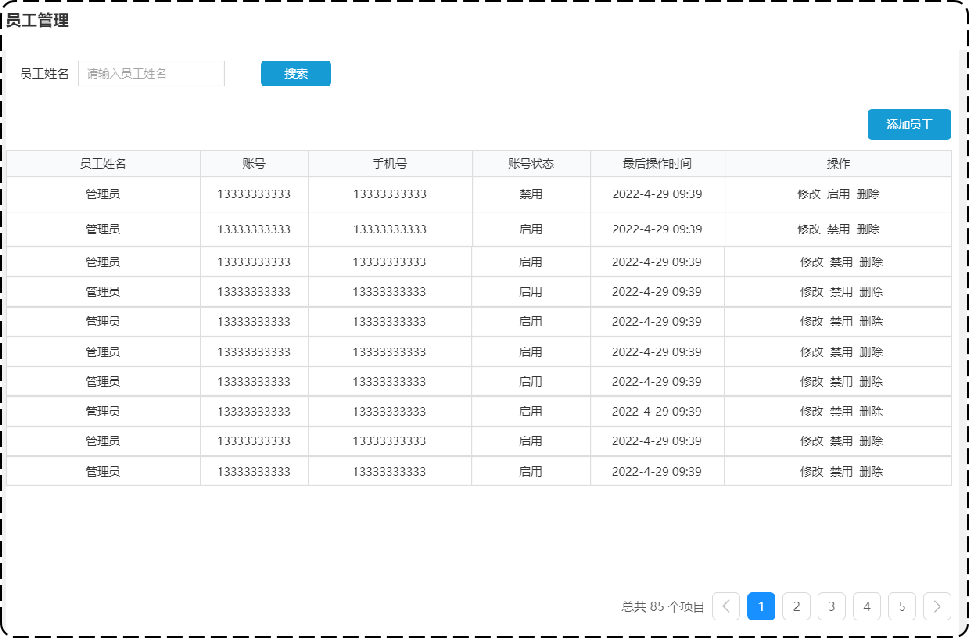

# 员工管理之分页查询员工

## 一、需求设计和分析

### 1.产品原型

员工分页查询需求设计和分析如下图所示：



业务规则：

- 根据页码展示员工信息；
- 每页展示 10 条数据；
- 分页查询时可以根据需要，输入员工姓名进行查询；

### 2.接口设计

#### 2.1.基本信息

**Path：** /admin/employee/page

**Method：** GET

#### 2.2.接口描述

请求参数

Query

| 参数名称 | 是否必须 | 示例 | 备注       |
| -------- | -------- | ---- | ---------- |
| name     | 否       | 张三 | 员工姓名   |
| page     | 是       | 1    | 页码       |
| pageSize | 是       | 10   | 每页记录数 |

#### 2.3.返回数据

| 名称          | 类型        | 是否必须 | 默认值 | 备注 | 其他信息          |
| ------------- | ----------- | -------- | ------ | ---- | ----------------- |
| code          | number      | 必须     |        |      |                   |
| msg           | null        | 非必须   |        |      |                   |
| data          | object      | 必须     |        |      |                   |
| ├─ total      | number      | 必须     |        |      |                   |
| ├─ records    | object []   | 必须     |        |      | item 类型: object |
| ├─ id         | number      | 必须     |        |      |                   |
| ├─ username   | string      | 必须     |        |      |                   |
| ├─ name       | string      | 必须     |        |      |                   |
| ├─ password   | string      | 必须     |        |      |                   |
| ├─ phone      | string      | 必须     |        |      |                   |
| ├─ sex        | string      | 必须     |        |      |                   |
| ├─ idNumber   | string      | 必须     |        |      |                   |
| ├─ status     | number      | 必须     |        |      |                   |
| ├─ createTime | string,null | 必须     |        |      |                   |
| ├─ updateTime | string      | 必须     |        |      |                   |
| ├─ createUser | number,null | 必须     |        |      |                   |
| ├─ updateUser | number      | 必须     |        |      |                   |

## 二、代码开发

封装 DTO 类 `EmployeePageQueryDTO`

sky-takeout-backend/sky-pojo/src/main/java/com/sky/dto/EmployeePageQueryDTO.java

```java
package com.sky.dto;

import io.swagger.v3.oas.annotations.media.Schema;
import lombok.Data;

import java.io.Serializable;

@Schema(description = "员工分页查询对象")
@Data
public class EmployeePageQueryDTO implements Serializable {
    @Schema(description = "员工姓名")
    private String name;
    @Schema(description = "页码")
    private int page;
    @Schema(description = "每页显示记录数")
    private int pageSize;
}
```

封装响应给前端的数据类 `PageResult`

sky-takeout-backend/sky-common/src/main/java/com/sky/result/PageResult.java

```java
package com.sky.result;

import io.swagger.v3.oas.annotations.media.Schema;
import lombok.AllArgsConstructor;
import lombok.Data;
import lombok.NoArgsConstructor;

import java.io.Serializable;
import java.util.List;

/**
 * 封装分页查询结果
 */
@Schema(description = "分页查询结果对象")
@Data
@AllArgsConstructor
@NoArgsConstructor
public class PageResult<T> implements Serializable {
    @Schema(description = "总记录数")
    private long total;
    @Schema(description = "当前页数据集合")
    private List<T> records;
}
```

在控制器层的 EmployeeController 类中，定义方法 `pageQuery`，用于处理分页查询的 GET 请求。

sky-takeout-backend/sky-server/src/main/java/com/sky/controller/admin/EmployeeController.java

```java
……

/**
 * 此方法用于：分页查询员工信息
 *
 * @param employeePageQueryDTO 分页查询条件
 * @return Result<PageResult < Object>>
 */
@Operation(summary = "分页查询员工信息")
@GetMapping("/page")
public Result<PageResult<Employee>> pageQuery(EmployeePageQueryDTO employeePageQueryDTO) {
    log.info("分页查询员工信息，查询条件为：{}", employeePageQueryDTO);

    Page<Employee> PageEmps = employeeService.pageQuery(employeePageQueryDTO);
    PageResult<Employee> result = new PageResult<>(PageEmps.getTotal(), PageEmps.getResult());
    return Result.success(result);
}

……
```

在 Service 层的 EmployeeService 接口中，定义 `pageQuery` 方法。

sky-takeout-backend/sky-server/src/main/java/com/sky/service/EmployeeService.java

```java
……

/**
 * 此方法用于：分页查询员工信息
 * @param employeePageQueryDTO 分页查询条件
 * @return PageResult<Object>
 */
Page<Employee> pageQuery(EmployeePageQueryDTO employeePageQueryDTO);

……
```

使用 MyBatis 框架提供的 PageHelper 依赖，来简化分页查询的操作。

- PageHelper 底层基于 ThreadLocal 实现，自动计算 OFFSET 值和 LIMIT 值，并动态拼接 SQL 语句。

引入 PageHelper 依赖：

sky-takeout-backend/pom.xml

```xml
<dependency>
    <groupId>com.github.pagehelper</groupId>
    <artifactId>pagehelper-spring-boot-starter</artifactId>
    <version>${pagehelper}</version>
</dependency>
```

在 Service 层的 `EmployeeServiceImpl` 实现类中，实现  `pageQuery` 方法。

sky-takeout-backend/sky-server/src/main/java/com/sky/service/impl/EmployeeServiceImpl.java

```java
……

/**
 * 此方法用于：分页查询员工信息
 *
 * @param employeePageQueryDTO 分页查询条件
 * @return PageResult<Object>
 */
@Override
public Page<Employee> pageQuery(EmployeePageQueryDTO employeePageQueryDTO) {
    // 开始分页查询
    PageHelper.startPage(employeePageQueryDTO.getPage(), employeePageQueryDTO.getPageSize());

    return employeeMapper.selectEmpByPage(employeePageQueryDTO);
}

……
```

在 Mapper 层的 EmployeeMapper 接口中，定义 `selectEmpByPage` 方法。

sky-takeout-backend/sky-server/src/main/java/com/sky/mapper/EmployeeMapper.java

```java
……

/**
 * 此方法用于：分页查询员工信息
 * @param employeePageQueryDTO 查询条件
 * @return Page<Employee>
 */
Page<Employee> selectEmpByPage(EmployeePageQueryDTO employeePageQueryDTO);

……
```

使用 XML 映射文件的方式，处理 SQL。

在配置文件中，配置 XML 映射文件的位置：

sky-takeout-backend/sky-server/src/main/resources/application.yml

```yaml
mybatis:
  #mapper 配置文件
  mapper-locations: classpath:mapper/*.xml
```

XML 映射文件：

sky-takeout-backend/sky-server/src/main/resources/mapper/EmployeeMapper.xml

```xml
<?xml version="1.0" encoding="UTF-8" ?>
<!DOCTYPE mapper PUBLIC "-//mybatis.org//DTD Mapper 3.0//EN"
        "http://mybatis.org/dtd/mybatis-3-mapper.dtd" >
<mapper namespace="com.sky.mapper.EmployeeMapper">
    <select id="selectEmpByPage" resultType="com.sky.entity.Employee">
        SELECT id, name, username, password, phone, sex, id_number, status, create_time, update_time, create_user, update_user FROM employee
        <where>
            <if test="name != null and name != ''">
                AND name LIKE concat('%',#{name},'%')
            </if>
        </where>
        ORDER BY create_time DESC
    </select>
</mapper>
```

## 三、功能测试

在开发阶段，后端主要使用接口文档，进行测试。

使用 Swagger 接口文档，或者接口测试工具，访问 GET 请求 `/admin/employee/page` 接口的资源。

测试通过后，再使用提供的前端页面，分页查询员工。

## 四、代码完善

查询数据库，返回的员工记录中，创建事件、修改事件等等时间相关的字段，格式不对（2024-10-22T19:06:11）。

解决方案有两种：

方式一：在属性上加 jackson 依赖的 `@JsonFormat` 注解，使用 `pattern` 属性对日期进行格式化

sky-takeout-backend/sky-pojo/src/main/java/com/sky/entity/Employee.java

```java
package com.sky.entity;

import com.fasterxml.jackson.annotation.JsonFormat;
import io.swagger.v3.oas.annotations.media.Schema;
import lombok.AllArgsConstructor;
import lombok.Builder;
import lombok.Data;
import lombok.NoArgsConstructor;

import java.io.Serial;
import java.io.Serializable;
import java.time.LocalDateTime;

@Schema(description = "员工对象")
@Data
@Builder
@NoArgsConstructor
@AllArgsConstructor
public class Employee implements Serializable {
    @Serial
    private static final long serialVersionUID = 1L;
    @Schema(description = "员工 Id")
    private Long id;
    @Schema(description = "用户名")
    private String username;
    @Schema(description = "姓名")
    private String name;
    @Schema(description = "密码")
    private String password;
    @Schema(description = "手机号")
    private String phone;
    @Schema(description = "性别")
    private String sex;
    @Schema(description = "身份证号")
    private String idNumber;
    @Schema(description = "状态")
    private Integer status;
    @Schema(description = "创建时间")
    @JsonFormat(pattern = "yyyy-MM-dd HH:mm:ss") // 格式化
    private LocalDateTime createTime;
    @Schema(description = "修改时间")
    @JsonFormat(pattern = "yyyy-MM-dd HH:mm:ss") // 格式化
    private LocalDateTime updateTime;
    @Schema(description = "创建用户")
    private Long createUser;
    @Schema(description = "修改用户")
    private Long updateUser;
}
```

方式二（推荐）：在 `WebMvcConfiguration` 配置类中，扩展 Spring MVC 的消息转换器，统一对日期类型进行格式化处理。

sky-takeout-backend/sky-server/src/main/java/com/sky/config/WebMvcConfiguration.java

```java
……

/**
 * 此方法用于：扩展 Spring MVC 框架的消息转换器，对后端返回的数据，进行统一处理
 *
 * @param converters 消息转换器集合
 */
@Override
public void extendMessageConverters(List<HttpMessageConverter<?>> converters) {
    log.info("扩展消息转换器：{}", converters);

    // 创建一个消息转换器对象
    MappingJackson2HttpMessageConverter covert = new MappingJackson2HttpMessageConverter();
    // 为消息转换器对象，设置对象转换器，底层使用 Jackson 将 Java 对象转为 json
    covert.setObjectMapper(new JacksonObjectMapper());
    // 将自己的消息转化器加入容器中
    converters.add(0, covert);
}

……
```

设置对象转换器，底层使用 Jackson 将 Java 对象转为 json

sky-takeout-backend/sky-common/src/main/java/com/sky/json/JacksonObjectMapper.java

```java
package com.sky.json;

import com.fasterxml.jackson.databind.DeserializationFeature;
import com.fasterxml.jackson.databind.ObjectMapper;
import com.fasterxml.jackson.databind.module.SimpleModule;
import com.fasterxml.jackson.datatype.jsr310.deser.LocalDateDeserializer;
import com.fasterxml.jackson.datatype.jsr310.deser.LocalDateTimeDeserializer;
import com.fasterxml.jackson.datatype.jsr310.deser.LocalTimeDeserializer;
import com.fasterxml.jackson.datatype.jsr310.ser.LocalDateSerializer;
import com.fasterxml.jackson.datatype.jsr310.ser.LocalDateTimeSerializer;
import com.fasterxml.jackson.datatype.jsr310.ser.LocalTimeSerializer;

import java.time.LocalDate;
import java.time.LocalDateTime;
import java.time.LocalTime;
import java.time.format.DateTimeFormatter;

import static com.fasterxml.jackson.databind.DeserializationFeature.FAIL_ON_UNKNOWN_PROPERTIES;

/**
 * 对象映射器:基于 jackson 将 Java 对象转为 json，或者将 json 转为 Java 对象
 * 将 JSON 解析为 Java 对象的过程称为 [从 JSON 反序列化 Java 对象]
 * 从 Java 对象生成 JSON 的过程称为 [序列化 Java 对象到 JSON]
 */
public class JacksonObjectMapper extends ObjectMapper {
    public static final String DEFAULT_DATE_FORMAT = "yyyy-MM-dd";
    public static final String DEFAULT_DATE_TIME_FORMAT = "yyyy-MM-dd HH:mm:ss";
    //public static final String DEFAULT_DATE_TIME_FORMAT = "yyyy-MM-dd HH:mm";
    public static final String DEFAULT_TIME_FORMAT = "HH:mm:ss";

    public JacksonObjectMapper() {
        super();
        //收到未知属性时不报异常
        this.configure(FAIL_ON_UNKNOWN_PROPERTIES, false);

        //反序列化时，属性不存在的兼容处理
        this.getDeserializationConfig().withoutFeatures(DeserializationFeature.FAIL_ON_UNKNOWN_PROPERTIES);

        SimpleModule simpleModule = new SimpleModule()
                .addDeserializer(LocalDateTime.class, new LocalDateTimeDeserializer(DateTimeFormatter.ofPattern(DEFAULT_DATE_TIME_FORMAT)))
                .addDeserializer(LocalDate.class, new LocalDateDeserializer(DateTimeFormatter.ofPattern(DEFAULT_DATE_FORMAT)))
                .addDeserializer(LocalTime.class, new LocalTimeDeserializer(DateTimeFormatter.ofPattern(DEFAULT_TIME_FORMAT)))
                .addSerializer(LocalDateTime.class, new LocalDateTimeSerializer(DateTimeFormatter.ofPattern(DEFAULT_DATE_TIME_FORMAT)))
                .addSerializer(LocalDate.class, new LocalDateSerializer(DateTimeFormatter.ofPattern(DEFAULT_DATE_FORMAT)))
                .addSerializer(LocalTime.class, new LocalTimeSerializer(DateTimeFormatter.ofPattern(DEFAULT_TIME_FORMAT)));

        //注册功能模块 例如，可以添加自定义序列化器和反序列化器
        this.registerModule(simpleModule);
    }
}
```
