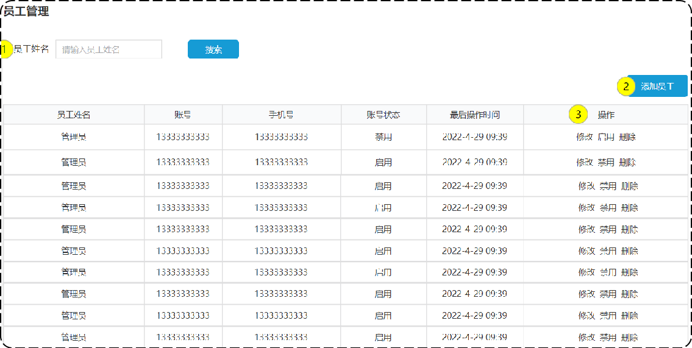
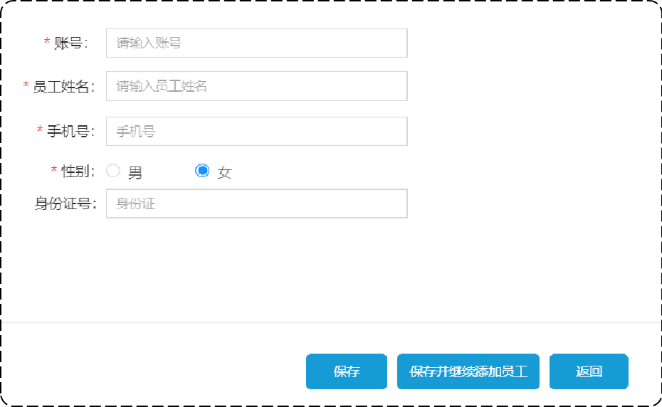

# 员工管理之编辑员工

## 一、需求设计和分析

### 1.产品原型

在员工列表页面，点击“编辑”按钮，



跳转到编辑页面。将员工信息，回显在该页面上，以供用户修改。



### 2.接口设计

回显（根据 Id 查询）员工。

#### 1.根据 id 查询员工

基本信息

**Path：** /admin/employee/{id}

**Method：** GET

接口描述：

请求参数

路径参数

| 参数名称 | 示例 | 备注   |
| -------- | ---- | ------ |
| id       | 100  | 员工id |

返回数据

| 名称          | 类型    | 是否必须 | 默认值 | 备注 | 其他信息          |
| ------------- | ------- | -------- | ------ | ---- | ----------------- |
| code          | integer | 必须     |        |      | format: int32     |
| data          | object  | 必须     |        |      |                   |
| ├─ createTime | string  | 非必须   |        |      | format: date-time |
| ├─ createUser | integer | 非必须   |        |      | format: int64     |
| ├─ id         | integer | 非必须   |        |      | format: int64     |
| ├─ idNumber   | string  | 非必须   |        |      |                   |
| ├─ name       | string  | 非必须   |        |      |                   |
| ├─ password   | string  | 非必须   |        |      |                   |
| ├─ phone      | string  | 非必须   |        |      |                   |
| ├─ sex        | string  | 非必须   |        |      |                   |
| ├─ status     | integer | 非必须   |        |      | format: int32     |
| ├─ updateTime | string  | 非必须   |        |      | format: date-time |
| ├─ updateUser | integer | 非必须   |        |      | format: int64     |
| ├─ username   | string  | 非必须   |        |      |                   |
| msg           | string  | 非必须   |        |      |                   |

#### 2.编辑员工信息

基本信息

**Path：** /admin/employee

**Method：** PUT

**接口描述：**

请求参数

Headers

| 参数名称     | 参数值           | 是否必须 | 示例 | 备注 |
| ------------ | ---------------- | -------- | ---- | ---- |
| Content-Type | application/json | 是       |      |      |

Body

| 名称     | 类型    | 是否必须 | 默认值 | 备注 | 其他信息      |
| -------- | ------- | -------- | ------ | ---- | ------------- |
| id       | integer | 必须     |        |      | format: int64 |
| idNumber | string  | 必须     |        |      |               |
| name     | string  | 必须     |        |      |               |
| phone    | string  | 必须     |        |      |               |
| sex      | string  | 必须     |        |      |               |
| username | string  | 必须     |        |      |               |

返回数据

| 名称 | 类型    | 是否必须 | 默认值 | 备注 | 其他信息      |
| ---- | ------- | -------- | ------ | ---- | ------------- |
| code | integer | 必须     |        |      | format: int32 |
| data | string  | 非必须   |        |      |               |
| msg  | string  | 非必须   |        |      |               |

## 二、代码开发

### 1.根据 id 查询员工开发

在 Controller 层的 EmployeeController 类中，定义方法 `empById`

sky-takeout-backend/sky-server/src/main/java/com/sky/controller/admin/EmployeeController.java

```java
……

/**
 * 此方法用于：根据Id查询员工
 *
 * @param id 员工Id
 * @return Result
 */
@Operation(summary = "根据Id查询员工")
@GetMapping("/{id}")
public Result<Employee> empById(@PathVariable Long id) {
    log.info("根据Id查询员工，员工Id为：{}", id);

    Employee employee = employeeService.empById(id);
    return Result.success(employee);
}
```

在 Service 层的  EmployeeService 接口中定义方法 `empById`

sky-takeout-backend/sky-server/src/main/java/com/sky/service/EmployeeService.java

```java
……

/**
 * 此方法用于：根据 Id 查询员工信息
 *
 * @return 员工信息
 */
Employee empById(Long id);
```

在 Service 层的 EmployeeServiceImpl 实现类中实现方法 `empById`

sky-takeout-backend/sky-server/src/main/java/com/sky/service/impl/EmployeeServiceImpl.java

```java
……

/**
 * 此方法用于：根据 Id 查询员工信息
 *
 * @return 员工信息
 */
@Override
public Employee empById(Long id) {
    Employee employee = employeeMapper.selectEmpById(id);
    employee.setPassword("****");
    return employee;
}
```

在 Mapper 层的 EmployeeMapper 接口中，定义方法 `selectEmpById`

- 使用 XML 映射文件处理 SQL 语句。

sky-takeout-backend/sky-server/src/main/java/com/sky/mapper/EmployeeMapper.java

```java
……

/**
 * 此方法用于：根据id查询员工信息
 *
 * @param id 员工id
 * @return 员工信息
 */
@Select("SELECT id, name, username, password, phone, sex, id_number, status, create_time, update_time, create_user, update_user FROM employee WHERE id = #{id}")
Employee selectEmpById(Long id);
```

### 2.编辑员工信息开发

在 Controller 层的 EmployeeController 类中，定义方法 `modifyEmp`

sky-takeout-backend/sky-server/src/main/java/com/sky/controller/admin/EmployeeController.java

```java
……

/**
 * 此方法用于：编辑员工信息
 *
 * @param employeeDTO 员工信息
 * @return Result
 */
@Operation(summary = "编辑员工信息")
@PutMapping
public Result<String> modifyEmp(@RequestBody EmployeeDTO employeeDTO) {
    log.info("编辑员工信息，员工信息为：{}", employeeDTO);

    int num = employeeService.modifyEmp(employeeDTO);
    return num > 0 ? Result.success("成功编辑" + num + "条员工数据") : Result.error("编辑失败");
}
```

在 Service 层的  EmployeeService 接口中定义方法 `modifyEmp`

sky-takeout-backend/sky-server/src/main/java/com/sky/service/EmployeeService.java

```java
……

/**
 * 此方法用于：编辑员工信息
 *
 * @param employeeDTO 编辑的员工信息
 * @return 操作记录数
 */
int modifyEmp(EmployeeDTO employeeDTO);
```

在 Service 层的 EmployeeServiceImpl 实现类中实现方法 `modifyEmp`

sky-takeout-backend/sky-server/src/main/java/com/sky/service/impl/EmployeeServiceImpl.java

```java
/**
 * 此方法用于：编辑员工信息
 *
 * @param employeeDTO 编辑的员工信息
 * @return 操作记录数
 */
@Override
public int modifyEmp(EmployeeDTO employeeDTO) {
    Employee employee = new Employee();

    // 属性拷贝
    BeanUtils.copyProperties(employeeDTO, employee);
    // 补充数据
    employee.setUpdateTime(LocalDateTime.now());
    employee.setUpdateUser(BaseContext.getCurrentId());

    return employeeMapper.update(employee);
}
```

- 属性拷贝：使用 `BeanUtils` 工具类的属性拷贝，将 DTO 类转为实体类。
- 补充数据：使用 `ThreadLocal`，获取操作用户 Id。
- 复用 Mapper 层中已经开发好的 `update` 方法

## 三、功能测试

在开发阶段，后端主要使用接口文档，进行测试。

使用 Swagger 接口文档，或者接口测试工具，访问 `/admin/employee/{id}` 接口的资源，用于测试根据 id 查询员工接口。

使用 Swagger 接口文档，或者接口测试工具，访问 `/admin/employee` 接口的资源，用于编辑员工信息接口。

测试通过后，再使用提供的前端页面，进行测试。
