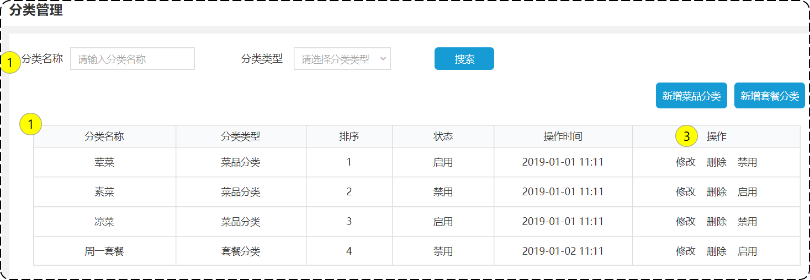

# 分类管理之导入分类模块功能代码

## 一、需求设计和分析

### 1.产品原型

后台系统中可以管理分类信息，分类包括两种类型，分别是**菜品分类**和**套餐分类**。

- 开发菜品、套餐模块，都要挂在分类下；
- 在移动端，要通过分类来选择菜品、套餐。



业务规则：

- 分类名称必须是唯一的；
- 分类按照类型可以分为菜品分类和套餐分类；
- 新添加的分类状态默认为“禁用”，因为新添加的分类，下面没有“菜品”和“套餐”。

### 2.接口设计

分类管理，有如下接口：

- **新增分类：**当后台系统中添加菜品时，需要选择一个菜品分类，在移动端也会按照菜品分类来展示对应的菜品。
- **分类分页查询：**在系统中以分页的方式，来展示列表数据。
- **根据id删除分类：**在分类管理列表页面，对某个分类进行删除操作；
  - 注意：当分类关联了“菜品”或“套餐”时，此分类不允许删除。
- **修改分类：**在分类管理列表页面，点击修改按钮，弹出修改窗口，在修改窗口回显分类信息并进行修改，最后点击确定按钮完成修改操作。
- **启用禁用分类：**在分类管理列表页面，对某个分类进行启用或者禁用操作。
- **分类类型查询：**当点击分类类型下拉框时，从数据库中查询所有的菜品分类数据进行展示。

### 3.数据库设计

category 表结构如下

| **字段名**  | **数据类型** | **说明**     | **备注**            |
| ----------- | ------------ | ------------ | ------------------- |
| id          | bigint       | 主键         | 自增                |
| name        | varchar(32)  | 分类名称     | 唯一                |
| type        | int          | 分类类型     | 1菜品分类 2套餐分类 |
| sort        | int          | 排序字段     | 用于分类数据的排序  |
| status      | int          | 状态         | 1启用 0禁用         |
| create_time | datetime     | 创建时间     |                     |
| update_time | datetime     | 最后修改时间 |                     |
| create_user | bigint       | 创建人id     |                     |
| update_user | bigint       | 最后修改人id |                     |

建表语句如下；

```mysql
DROP TABLE IF EXISTS `category`;
CREATE TABLE `category`
(
    `id`          bigint                       NOT NULL AUTO_INCREMENT COMMENT '主键',
    `type`        INT                                   DEFAULT NULL COMMENT '类型   1 菜品分类 2 套餐分类',
    `name`        VARCHAR(32) COLLATE utf8_bin NOT NULL COMMENT '分类名称',
    `sort`        INT                          NOT NULL DEFAULT '0' COMMENT '顺序',
    `status`      INT                                   DEFAULT NULL COMMENT '分类状态 0:禁用，1:启用',
    `create_time` datetime                              DEFAULT NULL COMMENT '创建时间',
    `update_time` datetime                              DEFAULT NULL COMMENT '更新时间',
    `create_user` bigint                                DEFAULT NULL COMMENT '创建人',
    `update_user` bigint                                DEFAULT NULL COMMENT '修改人',
    PRIMARY KEY (`id`),
    UNIQUE KEY `idx_category_name` (`name`)
) ENGINE=InnoDB AUTO_INCREMENT=23 DEFAULT CHARSET=utf8mb3 COLLATE=utf8_bin COMMENT='菜品及套餐分类';
```

## 二、代码导入

从 Mapper 到 Controller 层的顺序，来导入代码，避免报错。

在导入 CategoryMapper 时，还要导入DishMapper 和 SetmealMapper。

- 因为当要删除一个分类时，要判断该分类是否关联菜品，套餐。

导入 Service 层 CategoryServiceImpl 实现类时：

- 其中 deleteById 方法中，判断了分类是否关联了菜品或套餐；是，则抛出异常；

sky-takeout-backend/sky-server/src/main/java/com/sky/service/impl/CategoryServiceImpl.java

```java
……

/**
 * 根据id删除分类
 *
 * @param id
 */
public void deleteById(Long id) {
    //查询当前分类是否关联了菜品，如果关联了就抛出业务异常
    Integer count = dishMapper.countByCategoryId(id);
    if (count > 0) {
        //当前分类下有菜品，不能删除
        throw new DeletionNotAllowedException(MessageConstant.CATEGORY_BE_RELATED_BY_DISH);
    }

    //查询当前分类是否关联了套餐，如果关联了就抛出业务异常
    count = setmealMapper.countByCategoryId(id);
    if (count > 0) {
        //当前分类下有菜品，不能删除
        throw new DeletionNotAllowedException(MessageConstant.CATEGORY_BE_RELATED_BY_SETMEAL);
    }

    //删除分类数据
    categoryMapper.deleteById(id);
}
```

代码导入完成后，执行 Maven 生命周期 `compile` 指令，保证代码是可运行的。
