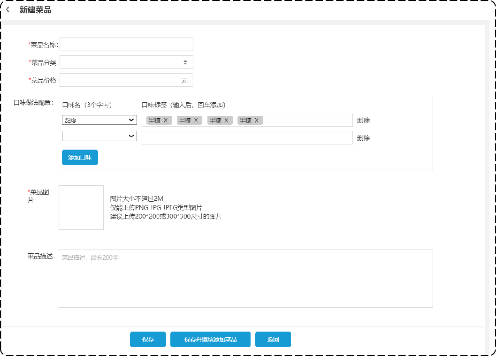

# 菜品管理之新增菜品

## 一、需求设计和分析

### 1.1.产品原型

后台系统中可以管理菜品信息，通过**新增功能**来添加一个新的菜品，

在添加菜品时需要选择当前菜品所属的菜品分类，并且需要上传菜品图片。

新增菜品原型如下：



业务规则：

- 菜品名称必须是唯一的。
- 菜品必须属于某个分类下，不能单独存在。
- 新增菜品时可以根据情况选择菜品的口味。
- 每个菜品必须对应一张图片。

### 1.2.接口设计

根据上述原型图先**粗粒度**设计接口，共包含3个接口。

接口设计：

- 根据类型查询分类（已完成）
- 文件上传
- 新增菜品

#### 1.2.1.新增菜品接口

基本信息

**Path：** /admin/dish

**Method：** POST

接口描述：

请求参数

Headers

| 参数名称     | 参数值           | 是否必须 | 示例 | 备注 |
| ------------ | ---------------- | -------- | ---- | ---- |
| Content-Type | application/json | 是       |      |      |

Body

| 名称        | 类型      | 是否必须 | 默认值 | 备注                       | 其他信息          |
| ----------- | --------- | -------- | ------ | -------------------------- | ----------------- |
| categoryId  | integer   | 必须     |        | 分类id                     | format: int64     |
| description | string    | 非必须   |        | 菜品描述                   |                   |
| flavors     | object [] | 非必须   |        | 口味                       | item 类型: object |
| ├─ dishId   | integer   | 非必须   |        | 菜品id                     | format: int64     |
| ├─ id       | integer   | 非必须   |        | 口味id                     | format: int64     |
| ├─ name     | string    | 必须     |        | 口味名称                   |                   |
| ├─ value    | string    | 必须     |        | 口味值                     |                   |
| id          | integer   | 非必须   |        | 菜品id                     | format: int64     |
| image       | string    | 必须     |        | 菜品图片路径               |                   |
| name        | string    | 必须     |        | 菜品名称                   |                   |
| price       | number    | 必须     |        | 菜品价格                   |                   |
| status      | integer   | 非必须   |        | 菜品状态：1为起售，0为停售 | format: int32     |

返回数据

| 名称 | 类型    | 是否必须 | 默认值 | 备注 | 其他信息      |
| ---- | ------- | -------- | ------ | ---- | ------------- |
| code | integer | 必须     |        |      | format: int32 |
| data | string  | 非必须   |        |      |               |
| msg  | string  | 非必须   |        |      |               |

#### 1.2.2.文件上传接口

基本信息：

**Path：** /admin/common/upload

**Method：** POST

接口描述：

请求参数

Headers

| 参数名称     | 参数值                | 是否必须 | 示例 | 备注 |
| ------------ | --------------------- | -------- | ---- | ---- |
| Content-Type | application/form-data | 是       |      |      |

Body

| 名称 | 类型 | 是否必须 | 默认值 | 备注 |
| ---- | ---- | -------- | ------ | ---- |
| file | file | 必须     |        | 文件 |

返回数据

| 名称 | 类型    | 是否必须 | 默认值 | 备注         | 其他信息      |
| ---- | ------- | -------- | ------ | ------------ | ------------- |
| code | integer | 必须     |        |              | format: int32 |
| data | string  | 非必须   |        | 文件上传路径 |               |
| msg  | string  | 非必须   |        |              |               |

### 1.3.数据库设计

新增菜品，就是将新增页面录入的菜品信息，插入到 dish 表；

如果添加了口味做法，还需要向 dish_flavor 表插入数据。所以在新增菜品时，涉及到两个表：

| 表名        | 说明       |
| ----------- | ---------- |
| dish        | 菜品表     |
| dish_flavor | 菜品口味表 |

菜品表 dish

| **字段名**  | **数据类型**  | **说明**     | **备注**    |
| ----------- | ------------- | ------------ | ----------- |
| id          | bigint        | 主键         | 自增        |
| name        | varchar(32)   | 菜品名称     | 唯一        |
| category_id | bigint        | 分类id       | 逻辑外键    |
| price       | decimal(10,2) | 菜品价格     |             |
| image       | varchar(255)  | 图片路径     |             |
| description | varchar(255)  | 菜品描述     |             |
| status      | int           | 售卖状态     | 1起售 0停售 |
| create_time | datetime      | 创建时间     |             |
| update_time | datetime      | 最后修改时间 |             |
| create_user | bigint        | 创建人id     |             |
| update_user | bigint        | 最后修改人id |             |

菜品口味表 dish_flavor

| **字段名** | **数据类型** | **说明** | **备注** |
| ---------- | ------------ | -------- | -------- |
| id         | bigint       | 主键     | 自增     |
| dish_id    | bigint       | 菜品id   | 逻辑外键 |
| name       | varchar(32)  | 口味名称 |          |
| value      | varchar(255) | 口味值   |          |

建表语句如下：

```mysql
DROP TABLE IF EXISTS `dish`;
CREATE TABLE `dish`
(
    `id`          bigint                       NOT NULL AUTO_INCREMENT COMMENT '主键',
    `name`        VARCHAR(32) COLLATE utf8_bin NOT NULL COMMENT '菜品名称',
    `category_id` bigint                       NOT NULL COMMENT '菜品分类id',
    `price`       DECIMAL(10, 2)                DEFAULT NULL COMMENT '菜品价格',
    `image`       VARCHAR(255) COLLATE utf8_bin DEFAULT NULL COMMENT '图片',
    `description` VARCHAR(255) COLLATE utf8_bin DEFAULT NULL COMMENT '描述信息',
    `status`      INT                           DEFAULT '1' COMMENT '0 停售 1 起售',
    `create_time` datetime                      DEFAULT NULL COMMENT '创建时间',
    `update_time` datetime                      DEFAULT NULL COMMENT '更新时间',
    `create_user` bigint                        DEFAULT NULL COMMENT '创建人',
    `update_user` bigint                        DEFAULT NULL COMMENT '修改人',
    PRIMARY KEY (`id`),
    UNIQUE KEY `idx_dish_name` (`name`)
) ENGINE=InnoDB AUTO_INCREMENT=70 DEFAULT CHARSET=utf8mb3 COLLATE=utf8_bin COMMENT='菜品';

DROP TABLE IF EXISTS `dish_flavor`;
CREATE TABLE `dish_flavor`
(
    `id`      bigint NOT NULL AUTO_INCREMENT COMMENT '主键',
    `dish_id` bigint NOT NULL COMMENT '菜品',
    `name`    VARCHAR(32) COLLATE utf8_bin  DEFAULT NULL COMMENT '口味名称',
    `value`   VARCHAR(255) COLLATE utf8_bin DEFAULT NULL COMMENT '口味数据list',
    PRIMARY KEY (`id`)
) ENGINE=InnoDB AUTO_INCREMENT=104 DEFAULT CHARSET=utf8mb3 COLLATE=utf8_bin COMMENT='菜品口味关系表';
```

## 二、代码开发

### 2.1.文件上传接口开发

定义一个配置文件类，在其中声明阿里云对象存储服务（OSS）所需配置。

sky-takeout-backend/sky-common/src/main/java/com/sky/properties/AliOssProperties.java

```java
package com.sky.properties;

import lombok.Data;
import org.springframework.boot.context.properties.ConfigurationProperties;
import org.springframework.stereotype.Component;

@Component
@ConfigurationProperties(prefix = "sky.alioss")
@Data
public class AliOssProperties {
    private String endpoint;
    private String accessKeyId;
    private String accessKeySecret;
    private String bucketName;
}
```

引入依赖 spring-boot-configuration-processor，用于在 yml 配置文件中，提示属性。

sky-takeout-backend/sky-common/pom.xml

```xml
<!--支持配置属性类，yml文件中可以提示配置项-->
<dependency>
    <groupId>org.springframework.boot</groupId>
    <artifactId>spring-boot-configuration-processor</artifactId>
    <optional>true</optional>
</dependency>
```

在配置文件中，配置这些属性：

application.yml

sky-takeout-backend/sky-server/src/main/resources/application.yml

```yaml
spring:
  profiles:
    active: dev

……

sky:
  ……
  alioss:
    access-key-id: ${sky.alioss.access-key-id}
    access-key-secret: ${sky.alioss.access-key-secret}
    bucket-name: ${sky.alioss.bucket-name}
    endpoint: ${sky.alioss.endpoint}
```

- Spring Boot 会将中划线 `-` 映射到类中的驼峰命名属性。
- 使用 `${}` 引用 application.dev.yml 配置文件中的属性。

application-dev.yml

sky-takeout-backend/sky-server/src/main/resources/application-dev.yml

```yaml
sky:
  alioss:
    access-key-id: xxxxxx
    access-key-secret: xxxxxx
    bucket-name: zetian-bucket
    endpoint: oss-cn-shenzhen.aliyuncs.com
```

定义一个工具类 ，用于阿里云 OSS 文件上传。

sky-takeout-backend/sky-common/src/main/java/com/sky/utils/AliOssUtil.java

```java
package com.sky.utils;

import com.aliyun.oss.ClientException;
import com.aliyun.oss.OSS;
import com.aliyun.oss.OSSClientBuilder;
import com.aliyun.oss.OSSException;
import lombok.AllArgsConstructor;
import lombok.Data;
import lombok.extern.slf4j.Slf4j;

import java.io.ByteArrayInputStream;

@Data
@AllArgsConstructor
@Slf4j
public class AliOssUtil {
    private String endpoint;
    private String accessKeyId;
    private String accessKeySecret;
    private String bucketName;

    /**
     * 文件上传
     *
     * @param bytes
     * @param objectName
     * @return
     */
    public String upload(byte[] bytes, String objectName) {

        // 创建OSSClient实例。
        OSS ossClient = new OSSClientBuilder().build(endpoint, accessKeyId, accessKeySecret);

        try {
            // 创建PutObject请求。
            ossClient.putObject(bucketName, objectName, new ByteArrayInputStream(bytes));
        } catch (OSSException oe) {
            System.out.println("Caught an OSSException, which means your request made it to OSS, "
                    + "but was rejected with an error response for some reason.");
            System.out.println("Error Message:" + oe.getErrorMessage());
            System.out.println("Error Code:" + oe.getErrorCode());
            System.out.println("Request ID:" + oe.getRequestId());
            System.out.println("Host ID:" + oe.getHostId());
        } catch (ClientException ce) {
            System.out.println("Caught an ClientException, which means the client encountered "
                    + "a serious internal problem while trying to communicate with OSS, "
                    + "such as not being able to access the network.");
            System.out.println("Error Message:" + ce.getMessage());
        } finally {
            if (ossClient != null) {
                ossClient.shutdown();
            }
        }

        //文件访问路径规则 https://BucketName.Endpoint/ObjectName
        StringBuilder stringBuilder = new StringBuilder("https://");
        stringBuilder
                .append(bucketName)
                .append(".")
                .append(endpoint)
                .append("/")
                .append(objectName);

        log.info("文件上传到:{}", stringBuilder);

        return stringBuilder.toString();
    }
}
```

定义一个配置类，在其中配置工具类 `AliOssUtil` 的 Bean 对象：

- 为其中四个属性，`endpoint`、`accessKeyId`、`accessKeySecret`、`bucketName` 初始化。

sky-takeout-backend/sky-server/src/main/java/com/sky/config/OssConfiguration.java

```java
package com.sky.config;

import com.sky.properties.AliOssProperties;
import com.sky.utils.AliOssUtil;
import lombok.extern.slf4j.Slf4j;
import org.springframework.boot.autoconfigure.condition.ConditionalOnMissingBean;
import org.springframework.context.annotation.Bean;
import org.springframework.context.annotation.Configuration;

@Configuration
@Slf4j
public class OssConfiguration {
    @Bean
    @ConditionalOnMissingBean // 保证 Spring 环菌中只有一个 AliOssUtil 对象
    public AliOssUtil aliOssUtil(AliOssProperties aliOssProperties) {
        log.info("开始创建阿里云OSS工具类单例对象，属性：{}", aliOssProperties.toString());

        return new AliOssUtil(
                aliOssProperties.getEndpoint(),
                aliOssProperties.getAccessKeyId(),
                aliOssProperties.getAccessKeySecret(),
                aliOssProperties.getBucketName()
        );
    }
}
```

在 Controller 层的 `CommonController` 控制器类中，注入 `AliOssUtil` 的 Bean 对象，并使用它上传文件。

sky-takeout-backend/sky-server/src/main/java/com/sky/controller/admin/CommonController.java

```java
package com.sky.controller.admin;

import com.sky.result.Result;
import com.sky.utils.AliOssUtil;
import io.swagger.v3.oas.annotations.Operation;
import io.swagger.v3.oas.annotations.tags.Tag;
import lombok.extern.slf4j.Slf4j;
import org.springframework.beans.factory.annotation.Autowired;
import org.springframework.web.bind.annotation.PostMapping;
import org.springframework.web.bind.annotation.RequestMapping;
import org.springframework.web.bind.annotation.RestController;
import org.springframework.web.multipart.MultipartFile;

import java.io.IOException;
import java.util.UUID;

/**
 * 此类用于，通用接口
 */
@RestController
@RequestMapping("/admin/common")
@Slf4j
@Tag(name = "通用接口")
public class CommonController {
    @Autowired
    private AliOssUtil aliOssUtil;

    /**
     * 此方法用于：文件上传
     *
     * @param file 文件
     * @return Result<String>
     */
    @Operation(summary = "文件上传")
    @PostMapping("/upload")
    public Result<String> upload(MultipartFile file) {
        log.info("文件上传：{}", file);

        String fileName = file.getOriginalFilename(); // 原始文件名
        if (fileName == null) return Result.error("文件不能为空");

        String extendName = fileName.substring(fileName.lastIndexOf(".")); // 扩展名
        String uuidName = UUID.randomUUID().toString(); // uuid
        String objectName = uuidName + extendName; // 最终名称

        try {
            String filePath = aliOssUtil.upload(file.getBytes(), objectName);
            return Result.success(filePath);
        } catch (IOException e) {
            log.error("文件上传失败：{}", e.getMessage());
            throw new RuntimeException(e);
        }
    }
}
```

### 2.2.新增菜品接口

根据接口文档，创建 DTO 类 `DishDTO`

sky-takeout-backend/sky-pojo/src/main/java/com/sky/dto/DishDTO.java

```java
package com.sky.dto;

import com.sky.entity.DishFlavor;
import lombok.Data;

import java.io.Serializable;
import java.math.BigDecimal;
import java.util.ArrayList;
import java.util.List;

@Data
public class DishDTO implements Serializable {
    private Long id;
    //菜品名称
    private String name;
    //菜品分类id
    private Long categoryId;
    //菜品价格
    private BigDecimal price;
    //图片
    private String image;
    //描述信息
    private String description;
    //0 停售 1 起售
    private Integer status;
    //口味
    private List<DishFlavor> flavors = new ArrayList<>();
}
```

- 接口中 `flavors` 字段值是一个数组，这里用 `List<DishFlavor>` 类型接收。

在 Controller 层，定义 `DishController` 控制器类。

sky-takeout-backend/sky-server/src/main/java/com/sky/controller/admin/DishController.java

```java
package com.sky.controller.admin;

import com.sky.dto.DishDTO;
import com.sky.result.Result;
import com.sky.service.DishService;
import io.swagger.v3.oas.annotations.Operation;
import io.swagger.v3.oas.annotations.tags.Tag;
import lombok.extern.slf4j.Slf4j;
import org.springframework.beans.factory.annotation.Autowired;
import org.springframework.web.bind.annotation.PostMapping;
import org.springframework.web.bind.annotation.RequestBody;
import org.springframework.web.bind.annotation.RequestMapping;
import org.springframework.web.bind.annotation.RestController;

@RestController
@RequestMapping("/admin/dish")
@Tag(name = "菜品相关接口")
@Slf4j
public class DishController {
    @Autowired
    private DishService dishService;

    /**
     * 此方法用于：新增菜品
     *
     * @param dishDTO 前端提交的菜品数据
     * @return Result<String>
     */
    @PostMapping
    @Operation(summary = "新增菜品")
    public Result<String> save(@RequestBody DishDTO dishDTO) {
        log.info("新增菜品：{}", dishDTO);

        int num = dishService.saveWithFlavor(dishDTO);
        return num > 0 ? Result.success("成功插入" + num + "条数据")
                : Result.error("插入失败");
    }
}
```

在 Service 层，定义 `DishService` 接口

sky-takeout-backend/sky-server/src/main/java/com/sky/service/DishService.java

```java
package com.sky.service;

import com.sky.dto.DishDTO;

public interface DishService {
    /**
     * 此方法用于：新增菜品和对应的口味
     *
     * @param dishDTO 菜品数据
     * @return 插入记录数
     */
    int saveWithFlavor(DishDTO dishDTO);
}
```

在 Service 层，定义 `DishServiceImpl` 实现类

sky-takeout-backend/sky-server/src/main/java/com/sky/service/impl/DishServiceImpl.java

```java
package com.sky.service.impl;

import com.sky.dto.DishDTO;
import com.sky.entity.Dish;
import com.sky.entity.DishFlavor;
import com.sky.mapper.DishFlavorMapper;
import com.sky.mapper.DishMapper;
import com.sky.service.DishService;
import lombok.extern.slf4j.Slf4j;
import org.springframework.beans.BeanUtils;
import org.springframework.beans.factory.annotation.Autowired;
import org.springframework.stereotype.Service;
import org.springframework.transaction.annotation.Transactional;

import java.util.List;

@Service
@Slf4j
public class DishServiceImpl implements DishService {
    @Autowired
    private DishMapper dishMapper;
    @Autowired
    private DishFlavorMapper dishFlavorMapper;

    /**
     * 此方法用于：新增菜品和对应的口味数据
     *
     * @param dishDTO 菜品数据
     * @return 插入的行数
     */
    @Override
    @Transactional
    public int saveWithFlavor(DishDTO dishDTO) {
        log.info("新增菜品：{}", dishDTO);

        // 向菜品表插入 1 条数据
        Dish dish = new Dish();
        BeanUtils.copyProperties(dishDTO, dish); // 属性拷贝
        int num1 = dishMapper.insert(dish);

        // 向菜品口味表，插入 n 条数据
        int num2 = 0;
        List<DishFlavor> flavors = dishDTO.getFlavors();
        if (flavors != null && !flavors.isEmpty()) {
            Long dishId = dish.getId(); // 获取菜品的 id
            flavors.forEach(dishFlavor -> dishFlavor.setDishId(dishId));
            num2 = dishFlavorMapper.insertBatch(flavors);
        }

        return num1 + num2;
    }
}
```

- 为该方法，开启事务，使用 `@Transactional` 注解。

- 在启动类中，开启 Spring 框架的事务管理。

  ```java
  @SpringBootApplication
  @EnableTransactionManagement // 开启注解方式的事务管理
  @Slf4j
  public class SkyApplication {……}
  ```

- 使用属性拷贝，为 `Dish` 实体（Entity）对象赋值。

在 Mapper 层的 `DishMapper` 接口中，实现插入的逻辑，定义 `insert` 方法

sky-takeout-backend/sky-server/src/main/java/com/sky/mapper/DishMapper.java

```java
……

/**
 * 此方法用于：新增菜品
 *
 * @param dish 菜品对象
 * @return 插入记录数
 */
@Options(useGeneratedKeys = true, keyProperty = "id")
@Insert("INSERT INTO dish (name, category_id, price, image, description, status, create_time, update_time, create_user, update_user)" +
        "VALUES (#{name}, #{categoryId}, #{price}, #{image}, #{description}, #{status}, #{createTime}, #{updateTime}, #{createUser}, #{updateUser})")
@AutoFill(OperationType.INSERT)
int insert(Dish dish);

……
```

- 使用注解的方式，处理 SQL 语句；
- 使用 `@Options` 注解，获取插入后该记录的 id。
- 使用自定义注解 `@AutoFill` 用于自动数据补充。

在 Mapper 层，创建 `DishFlavorMapper` 接口，在其中定义 `insert` 方法

sky-takeout-backend/sky-server/src/main/java/com/sky/mapper/DishFlavorMapper.java

```java
package com.sky.mapper;

import com.sky.entity.DishFlavor;
import org.apache.ibatis.annotations.Mapper;

import java.util.List;

@Mapper
public interface DishFlavorMapper {
    /**
     * 此方法用于：批量插入菜品口味数据
     *
     * @param flavors 菜品口味集合
     * @return 插入的条数
     */
    int insertBatch(List<DishFlavor> flavors);
}
```

使用 XML 映射文件，进行批量插入。

sky-takeout-backend/sky-server/src/main/resources/mapper/DishFlavorMapper.xml

```xml
<?xml version="1.0" encoding="UTF-8" ?>
<!DOCTYPE mapper PUBLIC "-//mybatis.org//DTD Mapper 3.0//EN"
        "http://mybatis.org/dtd/mybatis-3-mapper.dtd" >
<mapper namespace="com.sky.mapper.DishFlavorMapper">
    <insert id="insertBatch" parameterType="com.sky.entity.DishFlavor">
        INSERT INTO dish_flavor(dish_id, name, value) VALUES
        <foreach collection="flavors" separator="," item="df">
            (#{df.dishId},#{df.name},#{df.value})
        </foreach>
    </insert>
</mapper>
```

## 三、功能测试

在前端进行前后端联调，新增菜品。

数据库中新增了 dish 表、dish_flavor 表中新增了记录。
