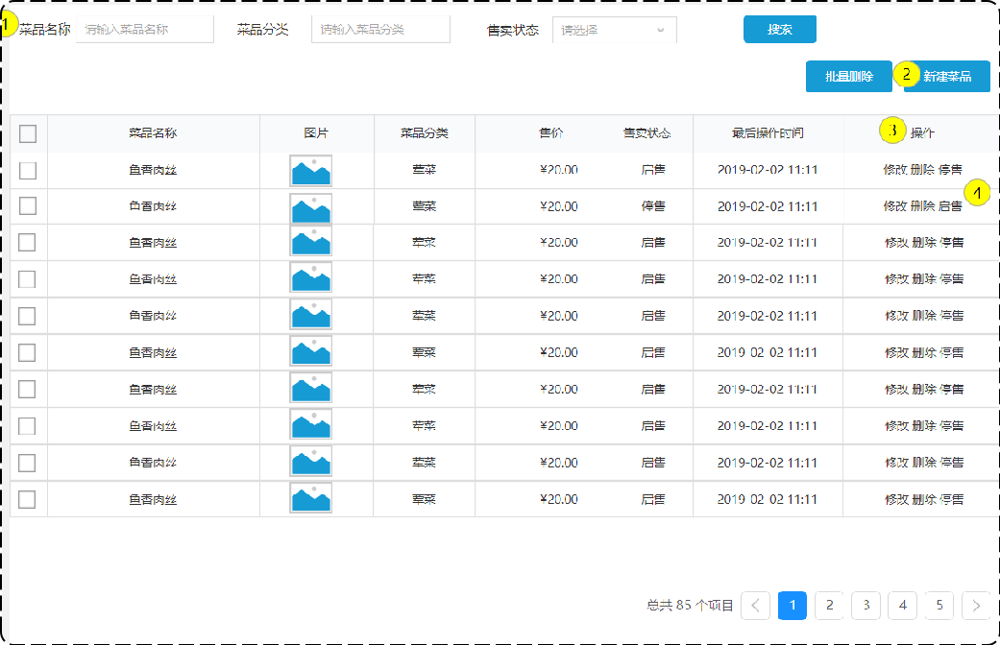

# 菜品管理之分页查询菜品

## 一、需求设计和分析

### 1.1.产品原型

系统中的菜品数据，很多的时候，如果在一个页面中，全部展示出来，会显得比较乱，不便于查看，所以一般的系统中都会以分页的方式来展示列表数据。

菜品分页原型图如下：



在菜品列表展示时，除了菜品的基本信息（名称、售价、售卖状态、最后操作时间）外，还有两个字段略微特殊：

- 第一个是图片字段 ，从数据库查询出来的仅仅是图片的名字，图片要想在表格中回显展示出来，就需要下载这个图片。
- 第二个是菜品分类，这里展示的是分类名称，而不是分类 ID，此时就需要根据菜品的分类 ID，左连接分类表查询分类名称，然后在页面展示。

业务规则：

- 根据页码展示菜品信息。
- 每页展示 10 条数据。
- 分页查询时，可以根据需要输入菜品名称、菜品分类、菜品状态进行查询。

### 1.2.接口设计

基本信息

**Path：** /admin/dish/page

**Method：** GET

接口描述：

请求参数

Query

| 参数名称   | 是否必须 | 示例     | 备注       |
| ---------- | -------- | -------- | ---------- |
| categoryId | 否       | 101      | 分类id     |
| status     | 否       | 1        | 分类状态   |
| name       | 否       | 宫保鸡丁 | 菜品名称   |
| page       | 是       | 1        | 页码       |
| pageSize   | 是       | 10       | 每页记录数 |

返回数据

| 名称            | 类型      | 是否必须 | 默认值 | 备注       | 其他信息          |
| --------------- | --------- | -------- | ------ | ---------- | ----------------- |
| code            | number    | 必须     |        |            |                   |
| msg             | null      | 非必须   |        |            |                   |
| data            | object    | 非必须   |        |            |                   |
| ├─ total        | number    | 必须     |        | 总记录数   |                   |
| ├─ records      | object [] | 必须     |        | 当前页数据 | item 类型: object |
| ├─ id           | number    | 必须     |        |            |                   |
| ├─ name         | string    | 必须     |        |            |                   |
| ├─ categoryId   | number    | 必须     |        |            |                   |
| ├─ price        | number    | 必须     |        |            |                   |
| ├─ image        | string    | 必须     |        |            |                   |
| ├─ description  | string    | 必须     |        |            |                   |
| ├─ status       | number    | 必须     |        |            |                   |
| ├─ updateTime   | string    | 必须     |        |            |                   |
| ├─ categoryName | string    | 必须     |        | 分类名称   |                   |

## 二、代码开发

### 2.1.DTO 类 DishPageQueryDTO

DTO 类设计 `DishPageQueryDTO` 类

sky-takeout-backend/sky-pojo/src/main/java/com/sky/dto/DishPageQueryDTO.java

```java
package com.sky.dto;

import lombok.Data;

import java.io.Serializable;

@Data
public class DishPageQueryDTO implements Serializable {
    private int page;
    private int pageSize;
    // 菜品名称
    private String name;
    //分类id
    private Integer categoryId;
    //状态 0表示禁用 1表示启用
    private Integer status;
}
```

### 2.2.VO 类 DishVO

VO 类设计 `DishVO` 类

sky-takeout-backend/sky-pojo/src/main/java/com/sky/vo/DishVO.java

```java
package com.sky.vo;

import com.sky.entity.DishFlavor;
import lombok.AllArgsConstructor;
import lombok.Builder;
import lombok.Data;
import lombok.NoArgsConstructor;

import java.io.Serializable;
import java.math.BigDecimal;
import java.time.LocalDateTime;
import java.util.ArrayList;
import java.util.List;

@Data
@Builder
@NoArgsConstructor
@AllArgsConstructor
public class DishVO implements Serializable {
    private Long id;
    //菜品名称
    private String name;
    //菜品分类id
    private Long categoryId;
    //菜品价格
    private BigDecimal price;
    //图片
    private String image;
    //描述信息
    private String description;
    //0 停售 1 起售
    private Integer status;
    //更新时间
    private LocalDateTime updateTime;
    //分类名称
    private String categoryName;
    //菜品关联的口味
    private List<DishFlavor> flavors = new ArrayList<>();
    //private Integer copies;
}
```

### 2.3.Controller 层

在 Controller 层的 `DishController` 控制器类中，定义方法 `page`

sky-takeout-backend/sky-server/src/main/java/com/sky/controller/admin/DishController.java

```java
……

/**
 * 此方法用于：分页查询菜品
 *
 * @param dishPageQueryDTO 前端提交的查询参数
 * @return Result<PageResult < DishVO>>
 */
@GetMapping("/page")
@Operation(summary = "菜品分页查询")
public Result<PageResult<DishVO>> page(DishPageQueryDTO dishPageQueryDTO) {
    log.info("菜品分页查询，查询参数为：{}", dishPageQueryDTO);

    PageResult<DishVO> pageResult = dishService.pageQuery(dishPageQueryDTO);
    return Result.success(pageResult);
}

……
```

在 Service 层的 `DishService` 接口中，定义方法 `pageQuery`、

sky-takeout-backend/sky-server/src/main/java/com/sky/service/DishService.java

```java
……

/**
 * 此方法用于：分页查询菜品
 *
 * @param dishPageQueryDTO 分页查询参数
 * @return 分页结果
 */
PageResult<DishVO> pageQuery(DishPageQueryDTO dishPageQueryDTO);

……
```

在 Service 层的 `DishServiceImpl` 实现类中，实现方法 `pageQuery`

sky-takeout-backend/sky-server/src/main/java/com/sky/service/impl/DishServiceImpl.java

```java
……

/**
 * 此方法用于：分页查询菜品
 *
 * @param dishPageQueryDTO 分页查询参数
 * @return 分页结果
 */
@Override
public PageResult<DishVO> pageQuery(DishPageQueryDTO dishPageQueryDTO) {
    // 分页查询
    PageHelper.startPage(dishPageQueryDTO.getPage(), dishPageQueryDTO.getPageSize());

    Page<DishVO> dishPage = dishMapper.selectWithPage(dishPageQueryDTO);
    return new PageResult<>(dishPage.getTotal(), dishPage.getResult());
}

……
```

在 Mapper 层是 `DishMapper` 接口中，定义方法 `selectWithPage`

- 使用 XML 映射文件的方式，处理动态 SQL 语句，根据不同的条件进行查询。
- PageHelper 插件，会为动态 SQL 拼接 LIMIT 语句。

sky-takeout-backend/sky-server/src/main/java/com/sky/mapper/DishMapper.java

```java
……

/**
 * 此方法用于：分页查询菜品
 *
 * @param dishPageQueryDTO 分页查询条件
 * @return Page<DishVO>
 */
Page<DishVO> selectWithPage(DishPageQueryDTO dishPageQueryDTO);

……
```

创建 XML 映射文件 `DishMapper`。

sky-takeout-backend/sky-server/src/main/resources/mapper/DishMapper.xml

```xml
<?xml version="1.0" encoding="UTF-8" ?>
<!DOCTYPE mapper PUBLIC "-//mybatis.org//DTD Mapper 3.0//EN"
        "http://mybatis.org/dtd/mybatis-3-mapper.dtd" >
<mapper namespace="com.sky.mapper.DishMapper">
    <select id="selectWithPage" parameterType="com.sky.dto.DishPageQueryDTO" resultType="com.sky.vo.DishVO">
        SELECT d.id, d.name, c.name AS categoryName, d.price, d.image, d.description, d.status, d.update_time
        FROM dish d
        LEFT JOIN category c ON d.category_id = c.id
        <where>
            <if test="name != null and name != ''">
                AND d.name like concat('%',#{name},'%')
            </if>
            <if test="categoryId != null">
                AND d.category_id = #{categoryId}
            </if>
            <if test="status != null">
                AND d.status = #{status}
            </if>
        </where>
        ORDER BY d.update_time DESC
    </select>
</mapper>
```

## 三、功能测试

在接口测试工具中，测试 GET `/admin/dish/page` 接口。

前端页面中，测试菜品管理模块的分页查询功能。
