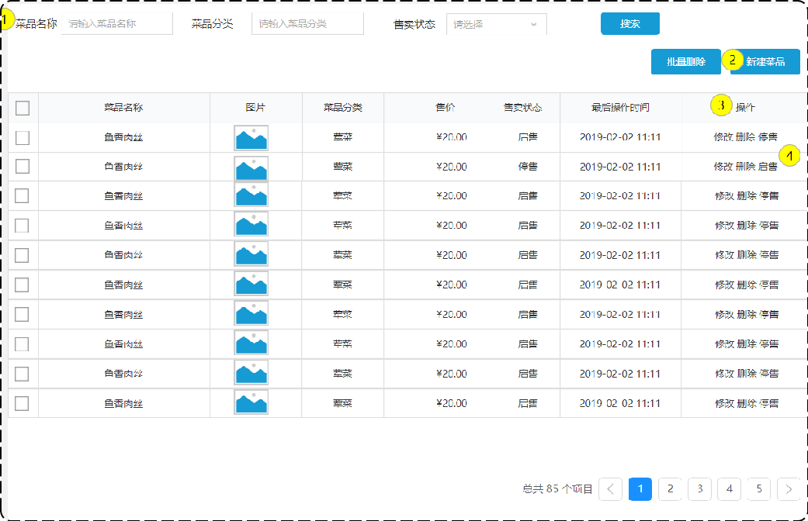

# 菜品管理之删除菜品

## 一、需求分析和设计

### 1.1.产品原型

在菜品列表页面，每个菜品后面对应的操作分别为**修改**、**删除**、**停售**；可通过删除功能完成对菜品及相关数据的删除。



业务规则：

- 可以一次删除一个菜品，也可以批量删除菜品（开发一个批量删除的接口即可）；
- 起售中的菜品不能删除；
- 被套餐关联的菜品不能删除；
- 删除菜品后，菜品关联的口味数据也需要删除掉；

注意：在进行删除菜品操作时，会涉及到以下 `dish`、`dish_flavor`、`setmeal_dish` 三张表，它们的关系如下图所示：


- 在 `dish` 表中，删除菜品基本数据的同时，也要把关联在 `dish_flavor` 表中的数据一块删除。
- `setmeal_dish` 表为菜品和套餐关联的中间表。
  - 若删除的菜品数据，关联着某个套餐；此时，删除失败。要先解除两者关联，再对菜品进行删除。

### 1.2.接口设计

基本信息

**Path：** /admin/dish

**Method：** DELETE

接口描述：

请求参数

Query

| 参数名称 | 是否必须 | 示例  | 备注                    |
| -------- | -------- | ----- | ----------------------- |
| ids      | 是       | 1,2,3 | 菜品 id，之间用逗号分隔 |

返回数据

| 名称 | 类型    | 是否必须 | 默认值 | 备注 | 其他信息      |
| ---- | ------- | -------- | ------ | ---- | ------------- |
| code | integer | 必须     |        |      | format: int32 |
| data | string  | 非必须   |        |      |               |
| msg  | string  | 非必须   |        |      |               |

## 二、代码开发

在 Controller 层的 `DishController` 类中，定义 `remove` 方法

sky-takeout-backend/sky-server/src/main/java/com/sky/controller/admin/DishController.java

```java
……

/**
 * 此方法用于：删除菜品
 *
 * @param ids 菜品id
 * @return Result<String>
 */
@DeleteMapping
@Operation(summary = "删除菜品")
public Result<String> remove(@RequestParam List<Long> ids) {
    log.info("删除菜品 {}", ids);

    HashMap<String, Integer> map = dishService.removeBatch(ids);
    StringJoiner sj = new StringJoiner("；");
    map.forEach((name, num) -> sj.add(name + "已删除" + num + "条"));
    return Result.success(sj.toString());
}

……
```

在 Service 层的 `DishService` 接口中，定义方法 `removeBatch`，用于批量删除菜品

sky-takeout-backend/sky-server/src/main/java/com/sky/service/DishService.java

```java
……

/**
 * 此方法用于：根据 id 批量删除菜品
 *
 * @param ids 菜品 Id
 * @return 删除结果
 */
HashMap<String, Integer> removeBatch(List<Long> ids);

……
```

在 Service 层的 `DishServiceImpl` 实现类中，实现 `removeBatch` 方法。

sky-takeout-backend/sky-server/src/main/java/com/sky/service/impl/DishServiceImpl.java

```java
……

/**
 * 此方法用于：根据 id 批量删除菜品
 *
 * @param ids 菜品 Id
 * @return 删除结果
 */
@Override
@Transactional
public HashMap<String, Integer> removeBatch(List<Long> ids) {
    // 菜品状态为起售中，不能删除菜品
    int i = dishMapper.countStatusByIds(ids);
    if (i > 0) throw new DeletionNotAllowedException(MessageConstant.DISH_ON_SALE);

    // 菜品被套餐关联，不能删除菜品
    List<Long> setmealIds = setmealDishMapper.selectSetmealIdsByDishId(ids);
    if (setmealIds != null && !setmealIds.isEmpty()) throw new DeletionNotAllowedException(MessageConstant.DISH_BE_RELATED_BY_SETMEAL);

    // 删除菜品数据
    int num1 = dishMapper.deleteBatchById(ids);
    // 删除菜品口味数据
    int num2 = dishFlavorMapper.deleteBatchByDishId(ids);

    return new HashMap<>(Map.of("菜品", num1, "菜品口味", num2));
}

……
```

在 Mapper 层 `DishMapper` 接口中定义 `countStatusByIds`

- 使用 XML 映射文件，处理动态 SQL 语句。

sky-takeout-backend/sky-server/src/main/java/com/sky/mapper/DishMapper.java

```java
……

/**
 * 根据菜品id查询菜品起售的个数
 *
 * @param ids 菜品id
 * @return 起售的个数
 */
int countStatusByIds(List<Long> ids);

……
```

DishMapper.xml

sky-akeout-backend/sky-server/src/main/resources/mapper/DishMapper.xml

```xml
……

<select id="countStatusByIds" resultType="java.lang.Integer">
    SELECT COUNT(*) FROM dish WHERE id IN
    <foreach collection="ids" item="id" separator="," open="(" close=")">
        #{id}
    </foreach>
</select>

……
```

在 Mapper 层，创建 `SetmealDishMapper` 接口，在其中定义 `selectSetmealIdsByDishId` 方法

- 使用 XML 映射文件的方式，处理 SQL 语句

sky-takeout-backend/sky-server/src/main/java/com/sky/mapper/SetmealDishMapper.java

```java
package com.sky.mapper;

import org.apache.ibatis.annotations.Mapper;

import java.util.List;

@Mapper
public interface SetmealDishMapper {
    /**
     * 此方法用于：根据菜品 id 查询套餐 id
     *
     * @param dishIds 菜品 id 集合
     * @return List<Long>
     */
    List<Long> selectSetmealIdsByDishId(List<Long> dishIds);
}
```

SetmealDishMapper.xml

sky-takeout-backend/sky-server/src/main/resources/mapper/SetmealDishMapper.xml

```xml
<?xml version="1.0" encoding="UTF-8" ?>
<!DOCTYPE mapper PUBLIC "-//mybatis.org//DTD Mapper 3.0//EN"
        "http://mybatis.org/dtd/mybatis-3-mapper.dtd" >
<mapper namespace="com.sky.mapper.SetmealDishMapper">
    <select id="selectSetmealIdsByDishId" resultType="java.lang.Long">
        SELECT setmeal_id FROM setmeal_dish WHERE dish_id IN
        <foreach collection="dishIds" item="id" open="(" separator="," close=")">
            #{id}
        </foreach>
    </select>
</mapper>
```

- 返回的是 `Long` 类型的集合。

在 Mapper 层的 `DishMapper` 接口中，定义方法 `deleteBatchById`

- 使用 XML 映射文件的方式，处理 SQL 语句

sky-takeout-backend/sky-server/src/main/java/com/sky/mapper/DishMapper.java

```java
……

/**
 * 此方法用于：批量删除菜品
 *
 * @param ids 菜品 Id
 * @return 删除记录数
 */
int deleteBatchById(List<Long> ids);

……
```

DishMapper.xml

sky-takeout-backend/sky-server/src/main/resources/mapper/DishMapper.xml

```xml
……

<delete id="deleteBatchById">
    DELETE FROM dish WHERE id IN
    <foreach collection="ids" item="id" separator="," open="(" close=")">
        #{id}
    </foreach>
</delete>

……
```

在 Mapper 层的 `DishFlavorMapper` 接口中，定义方法 `deleteBatchByDishId`

- 使用 XML 映射文件的方式，处理 SQL 语句

sky-takeout-backend/sky-server/src/main/java/com/sky/mapper/DishFlavorMapper.java

```java
……

/**
 * 此方法用于：根据菜品id删除对应的口味数据
 * @param ids 菜品 Id 集合
 * @return 删除的条数
 */
int deleteBatchByDishId(List<Long> ids);

……
```

DishFlavorMapper.xml

sky-takeout-backend/sky-server/src/main/resources/mapper/DishFlavorMapper.xml

```xml
<delete id="deleteBatchByDishId">
    DELETE FROM dish_flavor WHERE dish_id IN
    <foreach collection="ids" item="id" separator="," open="(" close=")">
        #{id}
    </foreach>
</delete>
```

## 三、功能测试

在前端页面测试删除菜单的功能。