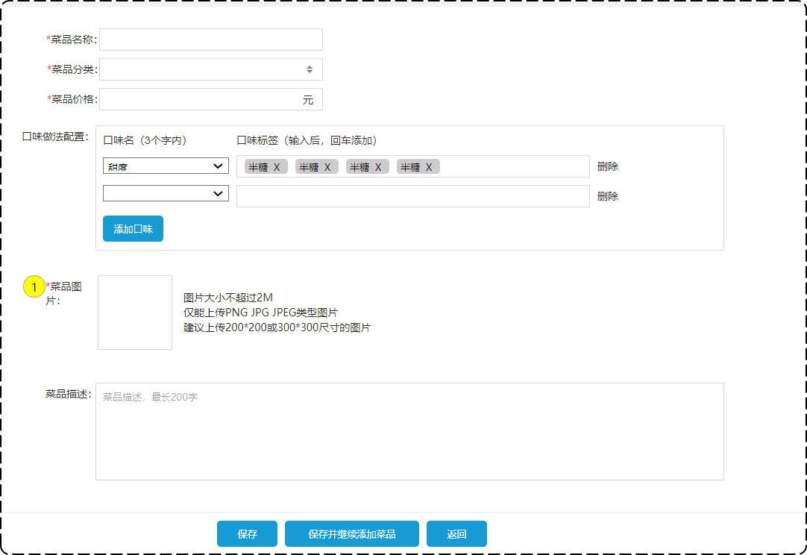

# 菜品管理之修改菜品

## 一、需求分析和设计

### 1.1.产品原型

在菜品管理列表页面，点击修改按钮，跳转到修改菜品页面，在修改页面回显菜品相关信息，并进行修改，最后点击保存按钮完成修改操作。

修改菜品原型图如下



### 1.2.接口涉及

通过对上述原型图进行分析，该页面共涉及 4 个接口。

- 根据 id 查询菜品，即回显；
- 根据类型查询分类（已实现）；
- 文件上传（已实现）；
- 修改菜品。

现在只需要实现**根据 id 查询菜品**和**修改菜品**两个接口。

#### 1.2.1.根据 Id 查询菜品接口

基本信息

**Path：** /admin/dish/{id}

**Method：** GET

接口描述：

请求参数

路径参数

| 参数名称 | 示例 | 备注   |
| -------- | ---- | ------ |
| id       | 101  | 菜品id |

返回数据

| 名称            | 类型          | 是否必须 | 默认值 | 备注 | 其他信息          |
| --------------- | ------------- | -------- | ------ | ---- | ----------------- |
| code            | integer       | 必须     |        |      | format: int32     |
| data            | object        | 必须     |        |      |                   |
| ├─ categoryId   | integer       | 必须     |        |      | format: int64     |
| ├─ categoryName | string        | 必须     |        |      |                   |
| ├─ description  | string        | 必须     |        |      |                   |
| ├─ flavors      | ==object []== | 必须     |        |      | item 类型: object |
| ├─ dishId       | integer       | 必须     |        |      | format: int64     |
| ├─ id           | integer       | 必须     |        |      | format: int64     |
| ├─ name         | string        | 必须     |        |      |                   |
| ├─ value        | string        | 必须     |        |      |                   |
| ├─ id           | integer       | 必须     |        |      | format: int64     |
| ├─ image        | string        | 必须     |        |      |                   |
| ├─ name         | string        | 必须     |        |      |                   |
| ├─ price        | number        | 必须     |        |      |                   |
| ├─ status       | integer       | 必须     |        |      | format: int32     |
| ├─ updateTime   | string        | 必须     |        |      | format: date-time |
| msg             | string        | 非必须   |        |      |                   |

#### 1.2.2.修改菜品接口

基本信息

**Path：** /admin/dish

**Method：** PUT

接口描述：

请求参数

Headers

| 参数名称     | 参数值           | 是否必须 | 示例 | 备注 |
| ------------ | ---------------- | -------- | ---- | ---- |
| Content-Type | application/json | 是       |      |      |

Body

| 名称        | 类型      | 是否必须 | 默认值 | 备注 | 其他信息          |
| ----------- | --------- | -------- | ------ | ---- | ----------------- |
| categoryId  | integer   | 必须     |        |      | format: int64     |
| description | string    | 非必须   |        |      |                   |
| flavors     | object [] | 非必须   |        |      | item 类型: object |
| ├─ dishId   | integer   | 非必须   |        |      | format: int64     |
| ├─ id       | integer   | 非必须   |        |      | format: int64     |
| ├─ name     | string    | 必须     |        |      |                   |
| ├─ value    | string    | 必须     |        |      |                   |
| id          | integer   | 必须     |        |      | format: int64     |
| image       | string    | 必须     |        |      |                   |
| name        | string    | 必须     |        |      |                   |
| price       | number    | 必须     |        |      |                   |
| status      | integer   | 非必须   |        |      | format: int32     |

返回数据

| 名称 | 类型    | 是否必须 | 默认值 | 备注 | 其他信息      |
| ---- | ------- | -------- | ------ | ---- | ------------- |
| code | integer | 必须     |        |      | format: int32 |
| data | string  | 非必须   |        |      |               |
| msg  | string  | 非必须   |        |      |               |

## 二、代码开发

### 2.1.根据 Id 查询菜品开发

在 Controller 层的 `DishController` 类中，定义方法 `dish`

sky-takeout-backend/sky-server/src/main/java/com/sky/controller/admin/DishController.java

```java
……

/**
 * 此方法用于：根据 id 查询菜品
 *
 * @param id 菜单 Id
 * @return Result<DishVO>
 */
@GetMapping("/{id}")
@Operation(summary = "根据id查询菜品")
public Result<DishVO> dish(@PathVariable Long id) {
    log.info("根据id查询菜品，菜品id为：{}", id);

    DishVO dishVO = dishService.dishWithFlavors(id);
    return Result.success(dishVO);
}

……
```

在 Service 层的 `DishService` 接口中，定义方法 `dishWithFlavors`。

sky-takeout-backend/sky-server/src/main/java/com/sky/service/DishService.java

```java
……

/**
 * 此方法用于：根据菜品 id 查询菜品和对应的口味
 *
 * @param id 菜品 Id
 * @return DishVO
 */
DishVO dishWithFlavors(Long id);

……
```

在 Service 层的 `DishServiceImpl` 实现类中，实现方法 `dishWithFlavors`

sky-takeout-backend/sky-server/src/main/java/com/sky/service/impl/DishServiceImpl.java

```java
……

/**
 * 此方法用于：根据菜品 id 查询菜品和对应的口味
 *
 * @param id 菜品 Id
 * @return DishVO
 */
@Override
public DishVO dishWithFlavors(Long id) {
    // 根据菜品 Id 查询菜品数据
    Dish dish = dishMapper.selectById(id);
    // 根据菜品 Id 查询口味数据
    List<DishFlavor> flavors = dishFlavorMapper.selectByDishId(id);
    
    // 将查询到的数据封装到 VO
    DishVO dishVO = new DishVO();
    BeanUtils.copyProperties(dish, dishVO);
    dishVO.setFlavors(flavors);
    return dishVO;
}

……
```

在 Mapper 层的 `DishMapper` 接口中，定义方法 `selectById`

- 使用注解的方式处理 SQL 语句。

sky-takeout-backend/sky-server/src/main/java/com/sky/mapper/DishMapper.java

```java
……

/**
 * 此方法用于：根据菜品 id 查询菜品数据
 *
 * @param id 菜品 Id
 * @return Dish
 */
@Select("SELECT id, name, category_id, price, image, description, status, create_time, update_time, create_user, update_user FROM dish WHERE id = #{id}")
Dish selectById(Long id);

……
```

在 Mapper 层的 `selectByDishId` 接口中，定义方法 `selectByDishId`

- 使用注解的方式处理 SQL 语句。

sky-takeout-backend/sky-server/src/main/java/com/sky/mapper/DishFlavorMapper.java

```java
……

/**
 * 此方法用于：根据菜品 id 查询对应的口味
 * @param id 菜品 Id
 * @return List<DishFlavor>
 */
@Select("SELECT id, dish_id, name, value FROM dish_flavor WHERE dish_id = #{id}")
List<DishFlavor> selectByDishId(Long id);

……
```

### 2.2.修改菜品开发

在 Controller 层 `DishController` 控制器类中，定义方法 `modify`

sky-takeout-backend/sky-server/src/main/java/com/sky/controller/admin/DishController.java

```java
……

/**
 * 此方法用于：修改菜品
 *
 * @param dishDTO 前端提交的菜品数据
 * @return Result<String>
 */
@PutMapping
@Operation(summary = "修改菜品")
public Result<String> modify(@RequestBody DishDTO dishDTO) {
    log.info("修改菜品：{}", dishDTO);

    int num = dishService.modifyWithFlavor(dishDTO);

    return num > 0 ? Result.success("成功修改" + num + "条数据")
            : Result.error("修改失败");
}

……
```

在 Service 层的 `DishService` 接口中，定义方法 `modifyWithFlavor`

sky-takeout-backend/sky-server/src/main/java/com/sky/service/DishService.java

```java
……

/**
 * 此方法用于：修改菜品
 *
 * @param dishDTO 菜品数据
 * @return 修改记录数
 */
int modifyWithFlavor(DishDTO dishDTO);

……
```

在 Service 层的 `DishServiceImpl` 实现类中，实现方法 `modifyWithFlavor`

sky-takeout-backend/sky-server/src/main/java/com/sky/service/impl/DishServiceImpl.java

```java
……

/**
 * 此方法用于：修改菜品
 *
 * @param dishDTO 菜品数据
 * @return 修改记录数
 */
@Override
public int modifyWithFlavor(DishDTO dishDTO) {
    // 修改菜品表基本信息
    Dish dish = new Dish();
    BeanUtils.copyProperties(dishDTO, dish);
    int i = dishMapper.update(dish);

    // 删除菜品对应的所有口味
    int j = dishFlavorMapper.deleteBatchByDishId(new ArrayList<>(List.of(dish.getId())));

    // 插入前端传过来的菜品口味
    int k = 0;
    List<DishFlavor> flavors = dishDTO.getFlavors();
    if (flavors != null && !flavors.isEmpty()) {
        Long dishId = dish.getId(); // 获取菜品的 id
        flavors.forEach(dishFlavor -> dishFlavor.setDishId(dishId));
        k = dishFlavorMapper.insertBatch(flavors);
    }

    return i + j + k;
}

……
```

- 在插入菜品口味前，先删除该菜品的所有口味，再插入前端传过来的菜品口味。

在 Mapper 层的 `DishMapper` 接口中，定义 `update` 方法。

- 在 XML 映射文件中，处理 SQL 语句，使用动态 SQL。

sky-takeout-backend/sky-server/src/main/java/com/sky/mapper/DishMapper.java

```java
……

/**
 * 此方法用于：修改菜品
 * @param dish 菜品对象
 * @return 修改记录数
 */
@AutoFill(OperationType.UPDATE)
int update(Dish dish);

……
```

- 添加公共属性注入的注解 `@AutoFill`。

DishMapper.xml 映射文件

sky-takeout-backend/sky-server/src/main/resources/mapper/DishMapper.xml

```xml
<update id="update">
    UPDATE dish
    <set>
        <if test="name != null and name != ''">
            name = #{name},
        </if>
        <if test="categoryId != null">
            category_id = #{categoryId},
        </if>
        <if test="price != null">
            price = #{price},
        </if>
        <if test="image != null and image != ''">
            image = #{image},
        </if>
        <if test="description != null and description != ''">
            description = #{description},
        </if>
        <if test="status != null">
            status = #{status},
        </if>
        <if test="updateTime != null">
            update_time = #{updateTime},
        </if>
        <if test="updateUser != null">
            update_user = #{updateUser},
        </if>
    </set>
    WHERE id = #{id}
</update>
```

在 Mapper 层的 `DishFlavorMapper` 接口中，定义 `deleteBatchByDishId` 方法；

- 在 XML 映射文件中，处理 SQL 语句，使用动态 SQL。
- 用于删除菜品下所有菜品口味数据。

sky-takeout-backend/sky-server/src/main/java/com/sky/mapper/DishFlavorMapper.java

```java
……

/**
 * 此方法用于：根据菜品 id 删除对应的口味数据
 * @param ids 菜品 Id 集合
 * @return 删除的条数
 */
int deleteBatchByDishId(List<Long> ids);

……
```

DishFlavorMapper 映射文件

sky-takeout-backend/sky-server/src/main/resources/mapper/DishFlavorMapper.xml

```xml
<delete id="deleteBatchByDishId">
    DELETE FROM dish_flavor WHERE dish_id IN
    <foreach collection="ids" item="id" separator="," open="(" close=")">
        #{id}
    </foreach>
</delete>
```

在 Mapper 层的 `DishFlavorMapper` 接口中，定义方法 `insertBatch`

- 在 XML 映射文件中，处理动态 SQL 语句。
- 用于批量插入菜品口味数据。

sky-takeout-backend/sky-server/src/main/java/com/sky/mapper/DishFlavorMapper.java

```java
……

/**
 * 此方法用于：批量插入菜品口味数据
 *
 * @param flavors 菜品口味集合
 * @return 插入的条数
 */
int insertBatch(List<DishFlavor> flavors);

……
```

DishFlavorMapper 映射文件

sky-takeout-backend/sky-server/src/main/resources/mapper/DishFlavorMapper.xml

```xml
<insert id="insertBatch" parameterType="com.sky.entity.DishFlavor">
    INSERT INTO dish_flavor(dish_id, name, value) VALUES
    <foreach collection="flavors" separator="," item="df">
        (#{df.dishId},#{df.name},#{df.value})
    </foreach>
</insert>
```

## 三、功能测试

在前端页面修改菜品。
