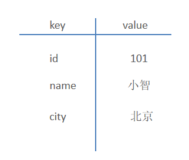

# Redis 下载安装、启动、数据类型、常用命令

Redis 是互联网技术领域使用最为广泛的**存储中间件**。[官网](https://redis.io)、[中文网](https://www.redis.net.cn/)。

Redis 主要特点有：

- 基于内存存储，读写性能高
- 适合存储在一定时间段内有很大的访问量的热点数据（热点商品、资讯、新闻）
- 企业应用广泛

Redis 是用 C 语言开发的基于内存的一个开源高性能键值对（key-value）数据库。



Redis 可以达到100000+ 的 QPS（每秒内查询次数）。

Redis 存储的 value 类型比较丰富，也被称为结构化的 NoSql 数据库。

- NoSql（Not Only SQL），泛指**非关系型数据库**。NoSql 数据库并不是要取代关系型数据库，而是关系型数据库的补充。

常见的关系型数据库（RDBMS）：

- Mysql
- Oracle
- DB2
- SQLServer

常见的非关系型数据库（NoSql）：

- Redis
- Mongo db
- MemCached

## 一、Redis 下载安装

### 1.1.Linux

使用系统自带的安装工具安装，执行命令：

```shell
# CentOS
yum install redis

# Ubuntu
apt update
apt install redis-server
```

如果你在 Ubuntu 上安装的 Redis 版本过低，可以尝试以下方法进行更新：

Ⅰ、添加 Redis PPA

在终端中执行以下命令，添加 Redis PPA：

```bash
sudo add-apt-repository ppa:redislabs/redis
```

Ⅱ、更新 apt cache

执行以下命令更新 apt cache：

```bash
sudo apt-get update
```

Ⅲ、安装最新版本 Redis

执行以下命令安装最新版本 Redis：

```bash
sudo apt-get install redis
```

四、安装完成后，你可以执行以下命令查看 Redis 版本：

```bash
redis-server -v

# 或者

redis-cli
INFO SERVER
```

### 1.2.Windows

方式一：WSL，参考上方 Linux 的安装方式。

方式二（不推荐）：.exe 安装文件安装。

### 1.3.Docker

查看 Redis 在 Docker 中的[官方文档](https://hub.docker.com/_/redis)。

执行命令：

```shell
docker run -d \
  --name redis \
  -p 6379:6379 \
  -e REDIS_PASSWORD=yourpassword \
  redis
```

redis 容器创建后，设置密码：

```sh
docker exec -it redis redis-cli
127.0.0.1:6379> CONFIG SET requirepass newpassword
```

> Redis 中没有用户的概念，只需使用密码就可连接

## 二、Redis 启动

Mac、Linux 在终端启动 Redis，执行命令：

```shell
redis-server
```

Windows 在 CMD 命令行中启动 Reids，执行命令：

```shell
redis-server.exe
```

打开一个新的终端，用 Redis 的客户端，进入 Redis 命令行客户端，执行命令：

```shell
redis-cli
```

- `-h` 指定 ip 地址。
- `-p` 指定端口号。
- `-a` 指定密码（如果需要）。

## 三、Redis GUI 工具

RedisInsight 是 Redis 官方出品的可视化管理工具。

在连接管理器中，配置要连接的 Redis 服务的地址、端口号。点击连接 Redis 服务。

左侧上方工具栏从上至下依次是：

1. 【连接管理器】，用来管理 Redis 服务，比如可以添加一个新的 Redis 服务。
2. 【浏览器Browser】，用来查看 Redis 服务里面的各种数据。
3. 【工作台】，里面包含一些手册和教程，上方是一个命令执行窗口，可以在此输入 Redis 命令，点击右侧执行按钮执行命令。下方查看命令执行结果。
4. 【分析工具】，用来查看 Redis 的性能，运行日志等等。
5. 【发布订阅模式的工具】，后续介绍。

点击左下方【>_CLI】，打开一个命令行窗口。和打开终端后执行 `redis-cli` 命令的效果是一样的。

点击左下方【Command Helper】，打开一个命令的帮助文档，可在搜索框中输入要搜索的命令，在 CLI 窗口中输入的命令，也会在该文档中显示对应的说明页面。

点击左下方【Profilter】，打开一个执行日志工具，用来查看 Redis 的执行日志。

## 四、Redis 数据类型

Redis 存储的是 key-value 结构的数据，其中 key 是字符串类型，value 有五种常用的数据类型：

- 字符串 string：普通字符串，Redis 中最简单的数据类型。
- 哈希 hash，也叫散列，类似于 Java 中的 HashMap 结构。
- 列表 list，按照插入顺序排序，可以有重复元素，类似于 Java 中的 LinkedList
- 集合 set，无序集合，没有重复元素，类似于 Java 中的 HashSet
- 有序集合 sorted set / zset，集合中每个元素关联一个分数 score，根据分数升序排序，没有重复元素。
  - 应用场景；各种排行榜。


## 五、Redis 常用命令

Redis 鱼 MySQL 不同，要根据不同的数据类型，执行不同的命令。

### 5.1.字符串命令

Redis 中字符串类型常用命令：\

- `SET key value`；设置指定 key 的值。
- `GET key`；获取指定 key 的值。
- `SETEX key seconds value`；设置指定 key 的值，并将 key 的过期时间设为 seconds 。
  - 应用场景：短信验证码 5 分钟内有效。

- `SETNX key value`；只有在 key 不存在时，设置 key 的值。
  - 应用场景：分布式锁。

### 5.2.哈希命令

Redis hash 是一个 string 类型的 field 和 value 的映射表；

hash 特别适合用于存储对象，常用命令：

- `HSET key field value`；将哈希表 key 中的字段 field 的值设为 value。
- `HGET key field`；获取存储在哈希表中指定字段的值。
- `HDEL key field`；删除存储在哈希表中的指定字段。
- `HKEYS key`；获取哈希表中所有字段。
- `HVALS key`；获取哈希表中所有值。


### 5.3.列表命令

Redis 列表是简单的字符串列表，按照插入顺序排序，常用命令：

- `LPUSH key value1 [value2]`；将一个或多个值插入到列表头部。
- `LRANGE key start stop`；获取列表指定范围内的元素。
- `RPOP key`；移除并获取列表最后一个元素。
- `LLEN key`；获取列表长度。
- `BRPOP key1 [key2 ] timeout`；移出并获取列表的最后一个元素， 如果列表没有元素会阻塞列表直到等待超    时或发现可弹出元素为止。


返回列表中的所有元素：

```sh
LRANGE mylist 0 -1
```

### 5.4.集合命令

Redis set 是 string 类型的无序集合。集合成员是唯一的，这就意味着集合中不能出现重复的数据，常用命令：

- `SADD key member1 [member2]`；向集合添加一个或多个成员。
- `SMEMBERS key`；返回集合中的所有成员。
- `SCARD key`；获取集合的成员数。
- `SINTER key1 [key2]`；返回给定所有集合的交集。
- `SUNION key1 [key2]`；返回所有给定集合的并集。
- `SREM key member1 [member2]`；移除集合中一个或多个成员。


### 5.5.有序集合命令

Redis 有序集合是 string 类型元素的集合，且不允许有重复成员。每个元素都会关联一个 double 类型的分数。常用命令：

- `ZADD key score1 member1 [score2 member2]`；向有序集合添加一个或多个成员。
- `ZRANGE key start stop [WITHSCORES]`；通过索引区间返回有序集合中指定区间内的成员。
- `ZINCRBY key increment member`；有序集合中对指定成员的分数加上增量 increment。
- `ZREM key member [member ...]`；移除有序集合中的一个或多个成员。


返回有序集合中的所有元素：

```sh
RANGE zset 0 -1 WITHSCORES
```

### 5.6.通用命令

Redis 的通用命令，是不分数据类型的，都可以使用的命令：

- `KEYS pattern`；查找所有符合给定模式（pattern）的 key。
- `EXISTS key`；检查给定 key 是否存在。
- `TYPE key`；返回 key 所储存的值的类型。
- `DEL key1 [key2] ……`；该命令用于在 key 存在是删除 key。
