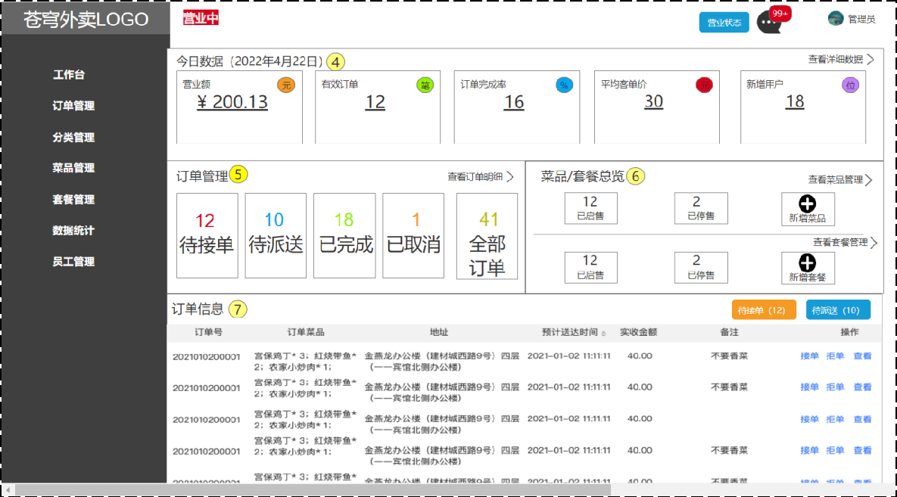

# 店铺营业状态设置

## 一、需求分析和设计

### 1.1.产品原型

进到苍穹外卖后台，显示餐厅的营业状态，营业状态分为**营业中**和**打烊中**；

- 若当前餐厅处于**营业状态**，自动接收任何订单，客户可在小程序进行下单操作；
- 若当前餐厅处于**打烊状态**，不接受任何订单，客户无法在小程序进行下单操作。



### 1.2.接口设计

根据上述原型图设计接口，共包含 3 个接口。

**接口设计：**

- 设置营业状态。
- 管理端查询营业状态。
- 用户端查询营业状态。

> 从技术层面分析，其实管理端和用户端查询营业状态时，可通过一个接口去实现。因为营业状态是一致的。
>
> 但是项目有约定：
>
> - **管理端**发出的请求，统一使用 `/admin` 作为前缀。
> - **用户端**发出的请求，统一使用 `/user` 作为前缀。
>
> 因为访问路径不一致，所以分为两个接口实现。

#### 1.2.1.设置营业状态接口

基本信息

**Path：** /admin/shop/{status}

**Method：** PUT

接口描述：

Headers

| 参数名称     | 参数值           | 是否必须 | 示例 | 备注 |
| ------------ | ---------------- | -------- | ---- | ---- |
| Content-Type | application/json | 是       |      |      |

路径参数

| 参数名称 | 示例 | 备注                             |
| -------- | ---- | -------------------------------- |
| status   | 1    | 店铺营业状态：1 为营业，0 为打烊 |

返回数据

| 名称 | 类型    | 是否必须 | 默认值 | 备注 | 其他信息      |
| ---- | ------- | -------- | ------ | ---- | ------------- |
| code | integer | 必须     |        |      | format: int32 |
| data | string  | 非必须   |        |      |               |
| msg  | string  | 非必须   |        |      |               |

#### 1.2.2.管理/用户端获取营业状态接口

基本信息

**Path：** /admin/shop/status

**Method：** GET

接口描述：

返回数据

| 名称 | 类型    | 是否必须 | 默认值 | 备注                           | 其他信息      |
| ---- | ------- | -------- | ------ | ------------------------------ | ------------- |
| code | integer | 必须     |        |                                | format: int32 |
| data | integer | 必须     |        | 店铺营业状态：1为营业，0为打烊 | format: int32 |
| msg  | string  | 非必须   |        |                                |               |

### 1.3.营业状态存储方式

虽然，可以通过 MySQL 中的一张表，来存储营业状态数据（如下表所示），但整个表中只有一个字段，意义不大。

| key         | value |
| ----------- | ----- |
| SHOP_STATUS | 1     |

营业状态数据，更适合使用 Redis 的字符串类型，来存储。

> 提高 Spring Boot 项目启动速度：
>
> - 在测试类中注释掉 `@SpringBootTest` 注解，避免每次启动项目时，执行测试类中的方法。

## 二、代码开发

### 2.1.Controller 层

在 Controller 层，创建 `ShopController` 类。

- 在其中注入 `redisTemplate` 对象，用于 Redis 操作。

sky-takeout-backend/sky-server/src/main/java/com/sky/controller/admin/ShopController.java

```java
package com.sky.controller.admin;

import com.sky.result.Result;
import io.swagger.v3.oas.annotations.Operation;
import io.swagger.v3.oas.annotations.tags.Tag;
import lombok.extern.slf4j.Slf4j;
import org.apache.ibatis.jdbc.Null;
import org.springframework.beans.factory.annotation.Autowired;
import org.springframework.data.redis.core.RedisTemplate;
import org.springframework.web.bind.annotation.*;

@Slf4j
@RestController("adminShopController")
@RequestMapping("/admin/shop")
@Tag(name = "店铺相关接口")
public class ShopController {
    private static final String KEY = "SHOP_STATUS";

    private final RedisTemplate<Object, Object> redisTemplate;
    
    @Autowired
    public ShopController(RedisTemplate<Object, Object> redisTemplate) {
        this.redisTemplate = redisTemplate;
    }

    @PutMapping("/{status}")
    @Operation(summary = "修改营业状态")
    public Result<Null> modifyStatus(@PathVariable Integer status) {
        log.info("修改营业状态为：{}", status);

        redisTemplate.opsForValue().set(KEY, status);
        return Result.success();
    }

    @GetMapping("/status")
    @Operation(summary = "查询营业状态")
    public Result<Integer> queryStatus() {
        Integer shopStatus = (Integer) redisTemplate.opsForValue().get(KEY);
        log.info("查询营业状态为：{}", shopStatus);

        return Result.success(shopStatus);
    }
}
```

创建 controller.user 包，用于存放客户端小程序的接口 Controller 控制器类。

- 将 controller.admin 包下的 `ShopController` 类，复制到该包下面，并修改其中的方法，只保留查看营业状态的方法。

sky-takeout-backend/sky-server/src/main/java/com/sky/controller/user/ShopController.java

```java
package com.sky.controller.user;

import com.sky.result.Result;
import io.swagger.v3.oas.annotations.Operation;
import io.swagger.v3.oas.annotations.tags.Tag;
import lombok.extern.slf4j.Slf4j;
import org.springframework.beans.factory.annotation.Autowired;
import org.springframework.data.redis.core.RedisTemplate;
import org.springframework.web.bind.annotation.*;

@Slf4j
@RestController("userShopController")
@RequestMapping("/user/shop")
@Tag(name = "店铺相关接口")
public class ShopController {
    private static final String KEY = "SHOP_STATUS";

    private final RedisTemplate<Object, Object> redisTemplate;
    
    @Autowired
    public ShopController(RedisTemplate<Object, Object> redisTemplate) {
        this.redisTemplate = redisTemplate;
    }

    @GetMapping("/status")
    @Operation(summary = "查询营业状态")
    public Result<Integer> queryStatus() {
        log.info("查询营业状态");
        Integer shopStatus = (Integer) redisTemplate.opsForValue().get(KEY);

        return Result.success(shopStatus);
    }
}
```

1. 项目中，有两个 Controller 类名称都是 `ShopController`；
2. 这会造成在项目启动时报错，因为默认 Spring 容器中有两个名字相同的 Bean 对象（名称默认为首字母小写即 `shopController`）。
3. 使用 Controller 类的 `@RestController` 注解的 `value` 属性指定 Bean 对象的名称。

> 为 Knife4j 配置接口文档分包扫描：
>
> sky-takeout-backend/sky-server/src/main/resources/application.yml
>
> ```yaml
> ……
> 
> springdoc:
>   swagger-ui:
>     path: /swagger-ui.html
>     tags-sorter: alpha
>     operations-sorter: alpha
>   api-docs:
>     path: /v3/api-docs
>   group-configs:
>     - group: "admin"
>       packages-to-scan: "com.sky.controller.admin"
>     - group: "user"
>       packages-to-scan: "com.sky.controller.user"
> ```

## 三、功能测试

在前端页面和接口测试工具中，测试接口。
