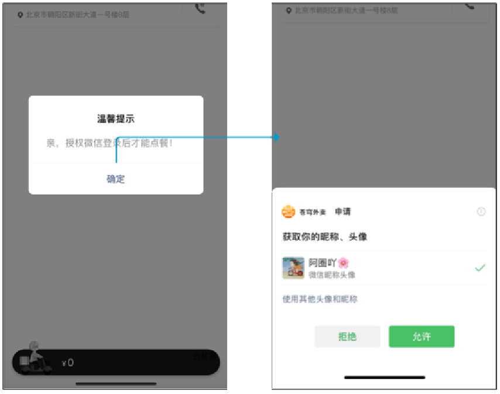

# 微信小程序登录后端开发

创建一个微信小程序项目。

在小程序 app.js 中，进行静默登录，获取 code。

在小程序中 ，发送异步请求，获取 openId。[后端获取 OpenId 官方文档](https://developers.weixin.qq.com/miniprogram/dev/OpenApiDoc/user-login/code2Session.html)、[微信登录时序图官方文档](https://developers.weixin.qq.com/miniprogram/dev/framework/open-ability/login.html)

使用接口测试工具，测试后端发送请求到微信服务器获取 OpenId。

导入提供好的微信小程序项目。

## 一、需求分析和设计

### 1.1.产品原型

用户进入到小程序，微信授权获取头像和昵称，再进行静默登录后，才能点餐。

- 若第一次使用小程序来点餐，就是一个新用户，需要把这个新用户保存到数据库中，完成自动注册。



微信登录业务规则：

- 基于微信登录实现小程序的登录功能；
- 如果是新用户，需要自动完成注册。

### 1.2.接口设计

要完成微信登录的话，就要获得微信用户的 openid；

在小程序端获取授权码（code）后，向后端服务发送请求，携带授权码；

这样后端服务在收到授权码后，就可以去请求微信接口服务，得到 openId 和 Session_Key。

最终，后端向小程序返回 openid 和 token 数据。

基于上述的登录流程，就可以设计出该接口的**请求参数**和**返回数据**。

基本信息

**Path：** /user/user/login

**Method：** POST

接口描述：

请求参数

Headers

| 参数名称     | 参数值           | 是否必须 | 示例 | 备注 |
| ------------ | ---------------- | -------- | ---- | ---- |
| Content-Type | application/json | 是       |      |      |

Body

| 名称 | 类型   | 是否必须 | 默认值 | 备注       | 其他信息 |
| ---- | ------ | -------- | ------ | ---------- | -------- |
| code | string | 必须     |        | 微信授权码 |          |

返回数据

| 名称      | 类型    | 是否必须 | 默认值 | 备注           | 其他信息      |
| --------- | ------- | -------- | ------ | -------------- | ------------- |
| code      | integer | 必须     |        |                | format: int32 |
| data      | object  | 必须     |        |                |               |
| ├─ id     | integer | 必须     |        | 用户id         | format: int64 |
| ├─ openid | string  | 必须     |        | 微信用户openid |               |
| ├─ token  | string  | 必须     |        | jwt令牌        |               |
| msg       | string  | 非必须   |        |                |               |

### 1.3.表设计

当用户第一次使用小程序时，会完成自动注册，把用户信息存储到 user 表中。

| **字段名**  | **数据类型** | **说明**           | **备注** |
| ----------- | ------------ | ------------------ | -------- |
| id          | bigint       | 主键               | 自增     |
| openid      | varchar(45)  | 微信用户的唯一标识 |          |
| name        | varchar(32)  | 用户姓名           |          |
| phone       | varchar(11)  | 手机号             |          |
| sex         | varchar(2)   | 性别               |          |
| id_number   | varchar(18)  | 身份证号           |          |
| avatar      | varchar(500) | 微信用户头像路径   |          |
| create_time | datetime     | 注册时间           |          |

> 说明：手机号字段比较特殊，个人身份注册的小程序，没有权限获取到微信用户的手机号；如果是以企业的资质注册的小程序，就能够拿到微信用户的手机号。

## 二、代码开发

### 2.1.配置文件准备

在 application-dev.yml 配置文件中，配置小程序的 appId、appSecret

sky-takeout-backend/sky-server/src/main/resources/application-dev.yml

```yaml
sky:
  ……
  wechat:
    appid: xxxx
    secret: xxxxxx
```

在 application.yml 中，配置小程序的 jwt 令牌相关参数；并引用 application-dev.yml 配置文件中的 appId、appSecret 属性。

sky-takeout-backend/sky-server/src/main/resources/application.yml

```yaml
sky:
  jwt:
    ……
    # 设置用户端（小程序）jwt 签名加密时使用的秘钥
    user-secret-key: kkcfwx
    # 设置用户端（小程序）jwt 过期时间
    user-ttl: 7200000
    # 设置用户端（小程序）传递过来的令牌名称
    user-token-name: authentication
  wechat:
    appid: ${sky.wechat.appid}
    secret: ${sky.wechat.secret}
```

### 2.2.实体类准备

创建 `UserLoginDTO` 类，用于接收小程序端传过来的参数。

sky-takeout-backend/sky-pojo/src/main/java/com/sky/dto/UserLoginDTO.java

```java
package com.sky.dto;

import lombok.Data;

import java.io.Serializable;

/**
 * C端用户登录
 */
@Data
public class UserLoginDTO implements Serializable {
    private String code;
}
```

创建 `UserLoginVO` 类，用于返回响应给小程序端。

sky-takeout-backend/sky-pojo/src/main/java/com/sky/vo/UserLoginVO.java

```java
package com.sky.vo;

import lombok.AllArgsConstructor;
import lombok.Builder;
import lombok.Data;
import lombok.NoArgsConstructor;

import java.io.Serializable;

@Data
@Builder
@NoArgsConstructor
@AllArgsConstructor
public class UserLoginVO implements Serializable {
    private Long id;
    private String openid;
    private String token;
}
```

### 2.3.Controller 层

创建 `UserController` 控制器类，在其中定义 `login` 方法，用于用户登录。

sky-takeout-backend/sky-server/src/main/java/com/sky/controller/user/UserController.java

```java
package com.sky.controller.user;

import com.sky.constant.JwtClaimsConstant;
import com.sky.dto.UserLoginDTO;
import com.sky.entity.User;
import com.sky.properties.JwtProperties;
import com.sky.result.Result;
import com.sky.service.UserService;
import com.sky.utils.JwtUtil;
import com.sky.vo.UserLoginVO;
import io.swagger.v3.oas.annotations.Operation;
import io.swagger.v3.oas.annotations.tags.Tag;
import lombok.extern.slf4j.Slf4j;
import org.apache.commons.collections4.map.HashedMap;
import org.springframework.beans.factory.annotation.Autowired;
import org.springframework.web.bind.annotation.PostMapping;
import org.springframework.web.bind.annotation.RequestBody;
import org.springframework.web.bind.annotation.RequestMapping;
import org.springframework.web.bind.annotation.RestController;

import java.util.Map;

@RestController
@RequestMapping("/user/user")
@Slf4j
@Tag(name = "用户端（小程序）相关接口")
public class UserController {
    @Autowired
    private UserService userService;
    @Autowired
    private JwtProperties jwtProperties;

    /**
     * 此方法用于：微信登录
     *
     * @return
     */
    @PostMapping("/login")
    @Operation(summary = "微信登录")
    public Result<UserLoginVO> login(@RequestBody UserLoginDTO userLoginDTO) {
        log.info("微信登录授权码：{}", userLoginDTO.getCode());

        User user = userService.userLogin(userLoginDTO);

        // 为微信用户生成 jwt 令牌
        Map<String, Object> claim = new HashedMap<>(Map.of(JwtClaimsConstant.USER_ID, user.getId()));
        String token = JwtUtil.createJWT(jwtProperties.getUserSecretKey(), jwtProperties.getUserTtl(), claim);

        UserLoginVO userLoginVO = UserLoginVO.builder()
                .id(user.getId())
                .openid(user.getOpenid())
                .token(token)
                .build();
        return Result.success(userLoginVO);
    }
}
```

- 在 Service 层中，获取用户对象，并根据用户的 id，创建 jwt 令牌返回给小程序端。

### 2.4.Service 层

创建 `UserService` 接口，在其中定义 `userLogin` 方法

sky-takeout-backend/sky-server/src/main/java/com/sky/service/UserService.java

```java
package com.sky.service;

import com.sky.dto.UserLoginDTO;
import com.sky.entity.User;

public interface UserService {
    /**
     * 此方法用于：微信登录
     *
     * @param userLoginDTO 微信登录参数
     * @return User
     */
    User userLogin(UserLoginDTO userLoginDTO);
}
```

创建 `UserServiceImpl` 类，实现 `UserService` 接口。

分为五步操作：

1. 调用微信接口服务，获得当前微信用户的 openId；
2. 判断 openId 是否为空，如果为空表示登录失败，抛出业务异常；
3. 判断当前用户是否为新用户；
4. 如果是新用户，自动完成注册；
5. 返回这个用户对象。

sky-takeout-backend/sky-server/src/main/java/com/sky/service/impl/UserServiceImpl.java

```java
package com.sky.service.impl;

import com.alibaba.fastjson.JSON;
import com.alibaba.fastjson.JSONObject;
import com.sky.constant.MessageConstant;
import com.sky.dto.UserLoginDTO;
import com.sky.entity.User;
import com.sky.exception.LoginFailedException;
import com.sky.mapper.UserMapper;
import com.sky.properties.WeChatProperties;
import com.sky.service.UserService;
import com.sky.utils.HttpClientUtil;
import lombok.extern.slf4j.Slf4j;
import org.springframework.beans.factory.annotation.Autowired;
import org.springframework.stereotype.Service;

import java.time.LocalDateTime;
import java.util.HashMap;

@Service
@Slf4j
public class UserServiceImpl implements UserService {
    private static final String WX_LOGIN = "https://api.weixin.qq.com/sns/jscode2session";
    @Autowired
    private WeChatProperties weChatProperties;
    @Autowired
    private UserMapper userMapper;

    /**
     * 此方法用于：发送请求，获取微信用户的 openid
     *
     * @param code 微信端发送的临时登录凭证
     * @return
     */
    private String getOpenId(String code) {
        HashMap<String, String> claim = new HashMap<>() {{
            put("appid", weChatProperties.getAppid());
            put("secret", weChatProperties.getSecret());
            put("js_code", code);
            put("grant_type", "authorization_code");
        }};

        String jsonStr = HttpClientUtil.doGet(WX_LOGIN, claim);
        JSONObject jsonObject = JSON.parseObject(jsonStr);
        return jsonObject.getString("openid");
    }

    /**
     * 此方法用于：微信登录
     *
     * @param userLoginDTO 微信登录参数
     * @return User
     */
    @Override
    public User userLogin(UserLoginDTO userLoginDTO) {
        // 调用微信接口服务，获得当前微信用户的 openId
        String code = userLoginDTO.getCode();
        String openid = getOpenId(code);

        // 判断 openId 是否为空，如果为空表示登录失败，抛出业务异常
        if (openid == null) throw new LoginFailedException(MessageConstant.LOGIN_FAILED);

        // 判断当前用户是否为新用户
        User user = userMapper.selectByOpenId(openid);

        // 如果是新用户，自动完成注册
        if (user == null) {
            user = User.builder()
                    .openid(openid)
                    .createTime(LocalDateTime.now())
                    .build();
            userMapper.insert(user);
        }

        // 返回这个用户对象。
        return user;
    }
}
```

### 2.5.Mapper 层

创建 `UserMapper` 接口，在其中定义 `selectByOpenId`、`insert` 方法，分别用于根据 openid 查找用户、插入用户记录。

sky-takeout-backend/sky-server/src/main/java/com/sky/mapper/UserMapper.java

```java
package com.sky.mapper;

import com.sky.entity.User;
import org.apache.ibatis.annotations.Insert;
import org.apache.ibatis.annotations.Mapper;
import org.apache.ibatis.annotations.Options;
import org.apache.ibatis.annotations.Select;

@Mapper
public interface UserMapper {
    @Select("SELECT id, openid, name, phone, sex, id_number, avatar, create_time FROM user WHERE openid = #{openId}")
    User selectByOpenId(String openId);

    @Options(useGeneratedKeys = true, keyProperty = "id")
    @Insert("INSERT INTO user (openid, name, phone, sex, id_number, avatar, create_time) VALUES (#{openid}, #{name}, #{phone}, #{sex}, #{idNumber}, #{avatar}, #{createTime})")
    int insert(User user);
}
```

- 插入数据后，要取到主键值 Id，使用 `@Options(useGeneratedKeys = true, keyProperty = "id")`

## 三、功能测试

使用接口测试工具，测试 POST 请求 `/user/user/login`；

在小程序端进行测试。

## 四、代码完善

在后端创建一个拦截器 `JwtTokenUserInterceptor`，用于校验用户端（小程序）请求中传过来的令牌。

sky-takeout-backend/sky-server/src/main/java/com/sky/interceptor/JwtTokenUserInterceptor.java

```java
package com.sky.interceptor;

import com.alibaba.fastjson.JSONObject;
import com.sky.constant.JwtClaimsConstant;
import com.sky.context.BaseContext;
import com.sky.properties.JwtProperties;
import com.sky.result.Result;
import com.sky.utils.JwtUtil;
import io.jsonwebtoken.Claims;
import jakarta.servlet.http.HttpServletRequest;
import jakarta.servlet.http.HttpServletResponse;
import lombok.extern.slf4j.Slf4j;
import org.springframework.beans.factory.annotation.Autowired;
import org.springframework.stereotype.Component;
import org.springframework.web.method.HandlerMethod;
import org.springframework.web.servlet.HandlerInterceptor;

/**
 * 用户端（小程序）jwt令牌校验的拦截器
 */
@Component
@Slf4j
public class JwtTokenUserInterceptor implements HandlerInterceptor {

    @Autowired
    private JwtProperties jwtProperties;

    /**
     * 校验jwt
     *
     * @param request
     * @param response
     * @param handler
     * @return
     * @throws Exception
     */
    public boolean preHandle(HttpServletRequest request, HttpServletResponse response, Object handler) throws Exception {
        //判断当前拦截到的是Controller的方法还是其他资源
        if (!(handler instanceof HandlerMethod)) {
            //当前拦截到的不是动态方法，直接放行
            return true;
        }

        //1、从请求头中获取令牌
        String token = request.getHeader(jwtProperties.getUserTokenName());

        //2、校验令牌
        try {
            log.info("jwt校验:{}", token);
            Claims claims = JwtUtil.parseJWT(jwtProperties.getUserSecretKey(), token);
            Long userId = Long.valueOf(claims.get(JwtClaimsConstant.USER_ID).toString());
            log.info("当前用户id：{}", userId); // 获取到员工 Id，并存入 ThreadLocal
            BaseContext.setCurrentId(userId);
            //3、通过，放行
            return true;
        } catch (Exception ex) {
            //4、不通过，响应401状态码
            Result<Object> result = Result.error("NOT_LOGIN");
            String jsonRes = JSONObject.toJSONString(result);
            response.setStatus(401);
            response.getWriter().write(jsonRes);
            return false;
        }
    }
}
```

在 `WebMvcConfiguration` 配置类中，注册拦截器。

sky-takeout-backend/sky-server/src/main/java/com/sky/config/WebMvcConfiguration.java

```java
……

/**
 * 配置类，注册 web 层相关组件
 */
@Configuration
@Slf4j
public class WebMvcConfiguration implements WebMvcConfigurer {
    @Autowired
    private JwtTokenAdminInterceptor jwtTokenAdminInterceptor;
    @Autowired
    private JwtTokenUserInterceptor jwtTokenUserInterceptor;

    /**
     * 注册自定义拦截器
     *
     * @param registry
     */
    public void addInterceptors(InterceptorRegistry registry) {
        log.info("开始注册自定义拦截器...");
        registry.addInterceptor(jwtTokenAdminInterceptor)
                .addPathPatterns("/admin/**")
                .excludePathPatterns("/admin/employee/login");

        registry.addInterceptor(jwtTokenUserInterceptor)
                .addPathPatterns("/user/**")
                .excludePathPatterns("/user/user/login")
                .excludePathPatterns("/user/shop/status"); // 用户可以在不登陆的状态下查看店铺营业状态
    }
  
    ……
}
```
