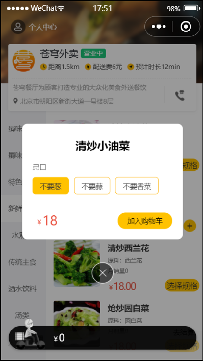
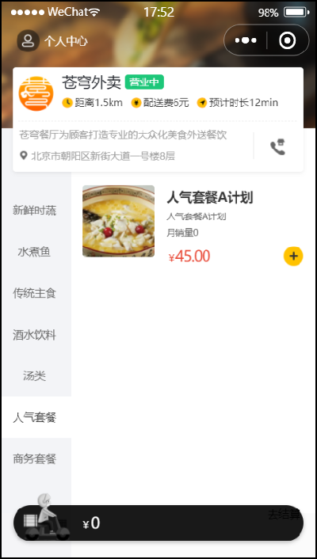
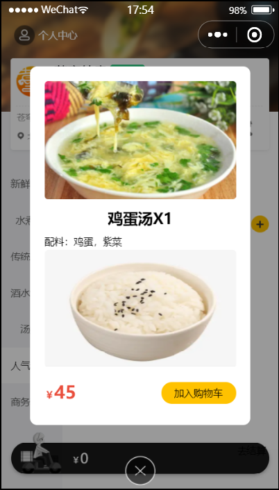

# 导入商品功能模块代码

## 一、需求分析和设计

### 1.1.产品原型

菜品列表效果图如下，涉及到的接口：

- 查询分类；
- 根据分类 Id，查询对应的菜品。

菜品口味效果图如下，涉及到的接口：

- 根据分类 Id，查询对应的菜品（会带出口味数据）。

套餐列表效果图如下，涉及到接口：

- 根据分类 Id，查询套餐。

套餐详情效果图如下，涉及到接口：

- 根据套餐 Id，查询菜品。

### 1.2.接口设计

根据上述原型图分析可知，共包含4个接口：

- 查询分类
- 根据分类id查询菜品
- 根据分类id查询套餐
- 根据套餐id查询包含的菜品
