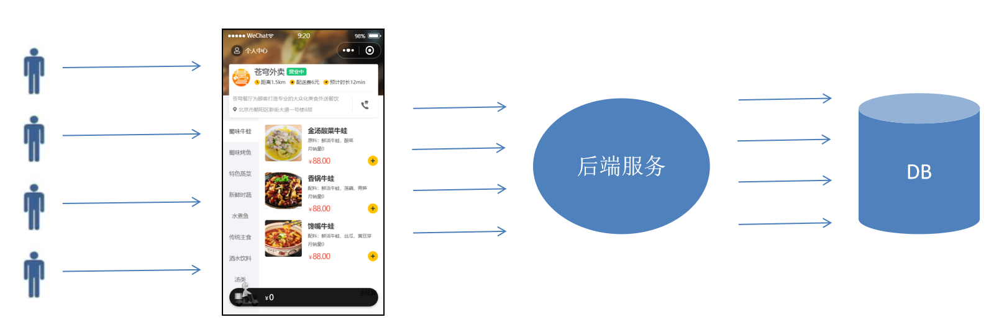

# 缓存菜品

将菜品数据，缓存在 Redis 中。

## 一、问题说明

用户端小程序，展示的菜品数据，都是通过查询数据库获得；

如果用户端，访问量比较大，数据库访问压力也随之增大。



结论：系统数据查询的瓶颈，主要体现在数据库。

## 二、实现思路

通过 Redis 来缓存菜品数据，减少数据库查询操作。

- 内存操作，相对于磁盘 IO 操作，效率高。


缓存逻辑分析：

- 每个分类下的菜品，保存一份缓存数据，如下图所示，分类中的菜品集合序列化成字符串后保存在 Redis 中。
- 数据库中菜品数据有变更时，清理缓存数据。


## 三、代码开发

### 3.1.用户端开发

根据分类 id 查询菜品操作时，菜品缓存逻辑的开发。

在 `DishController` 控制器类的 `list` 方法中，加入缓存的逻辑：

1. 构造 redis 中的 key；规则：dish_{categoruId}
2. 查询 redis 中是否存在菜品数据；
3. 如果存在，直接返回；
4. 如果不存在，查询数据库，并将查询结果放入 redis 中。

sky-takeout-backend/sky-server/src/main/java/com/sky/controller/user/DishController.java

```java
……


private final RedisTemplate<Object, Object> redisTemplate;

@Autowired
public DishController(DishService dishService, RedisTemplate<Object, Object> redisTemplate) {
    this.dishService = dishService;
    this.redisTemplate = redisTemplate;
}

/**
 * 根据分类id查询菜品
 *
 * @param categoryId 分类 id
 * @return Result<List < DishVO>>
 */
@GetMapping("/list")
@Operation(summary = "根据分类id查询菜品")
@SuppressWarnings("unchecked")
public Result<List<DishVO>> list(Long categoryId) {
    log.info("根据分类id查询菜品，分类id为：{}", categoryId);

    // 构造 redis 中的 key；规则：dish_{categoruId}
    String key = "dish_" + categoryId;

    // 查询 redis 中是否存在菜品数据
    ValueOperations<Object, Object> valueOperations = redisTemplate.opsForValue();
    List<DishVO> dishVOList = (List<DishVO>) valueOperations.get(key);

    // 如果存在，直接返回；
    if (dishVOList != null && !dishVOList.isEmpty())
        return Result.success(dishVOList);

    // 如果不存在，查询数据库，并将查询结果放入 redis 中。
    dishVOList = dishService.listWithFlavorByCategoryId(categoryId);
    log.info("查询结果：{}", dishVOList);
    valueOperations.set(key, dishVOList);

    return Result.success(dishVOList);
}

……
```

### 3.2.管理端开发

在管理端：新增菜品、修改菜品、删除菜品、起售/停售菜品后，都要清理缓存。

#### 3.2.1.新增菜品

sky-takeout-backend/sky-server/src/main/java/com/sky/controller/admin/DishController.java

```java
……

private final DishService dishService;
private final RedisTemplate<Object, Object> redisTemplate;

@Autowired
public DishController(DishService dishService, RedisTemplate<Object, Object> redisTemplate) {
    this.dishService = dishService;
    this.redisTemplate = redisTemplate;
}

……

/**
 * 此方法用于：新增菜品
 *
 * @param dishDTO 前端提交的菜品数据
 * @return Result<String>
 */
@PostMapping
@Operation(summary = "新增菜品")
public Result<String> save(@RequestBody DishDTO dishDTO) {
    log.info("新增菜品：{}", dishDTO);

    int num = dishService.saveWithFlavor(dishDTO);

    // 清理 Redis 缓存
    if (num <= 0)
        return Result.error("插入失败");

    // 构造 key
    String key = "dish_" + dishDTO.getCategoryId();
    redisTemplate.delete(key);
    return Result.success("成功插入" + num + "条数据");
}
```

#### 3.2.2.删除菜品

删除菜品时，可能是批量删除，那么就会涉及到很多的分类，要根据菜品 id，查询出所有涉及到的分类 id，比较麻烦；

所以这里采用删除所有分类的缓存数据的方案：

sky-takeout-backend/sky-server/src/main/java/com/sky/controller/admin/DishController.java

```java
……

/**
 * 此方法用于：删除菜品
 *
 * @param ids 菜品id
 * @return Result<String>
 */
@DeleteMapping
@Operation(summary = "删除菜品")
public Result<String> remove(@RequestParam List<Long> ids) {
    log.info("删除菜品 {}", ids);

    HashMap<String, Integer> map = dishService.removeBatch(ids);

    // 将 redis 中所有的菜品缓存数据清理掉：所有以 dish_ 开头的 key
    Set<Object> keys = redisTemplate.keys("dish_*"); // 查询时支持通配符；删除时不支持通配符
    if (keys != null) redisTemplate.delete(keys);

    StringJoiner sj = new StringJoiner("；");
    map.forEach((name, num) -> sj.add(name + "已删除" + num + "条"));
    return Result.success(sj.toString());
}

……
```

#### 3.2.3.修改菜品

如果修改的是菜品中的分类，那么会涉及到两个分类的缓存。比较麻烦。

所以这里也采用删除所有分类的缓存数据的方案：

sky-takeout-backend/sky-server/src/main/java/com/sky/controller/admin/DishController.java

```java
……

/**
 * 此方法用于：修改菜品
 *
 * @param dishDTO 前端提交的菜品数据
 * @return Result<String>
 */
@PutMapping
@Operation(summary = "修改菜品")
public Result<String> modify(@RequestBody DishDTO dishDTO) {
    log.info("修改菜品：{}", dishDTO);

    int num = dishService.modifyWithFlavor(dishDTO);

    if (num <= 0)
        return Result.error("修改失败");

    // 将 redis 中所有的菜品缓存数据清理掉：所有以 dish_ 开头的 key
    Set<Object> keys = redisTemplate.keys("dish_*"); // 查询时支持通配符；删除时不支持通配符
    if (keys != null) redisTemplate.delete(keys);

    return Result.success("成功修改" + num + "条数据");
}

……
```

#### 3.2.4.修改分类起售/停售

在管理端的 `CategoryController` 控制器类中

这里也采用删除所有分类的缓存数据的方案：

sky-takeout-backend/sky-server/src/main/java/com/sky/controller/admin/CategoryController.java

```java
……

/**
 * 启用、禁用分类
 * @param status 状态
 * @param id 分类 id
 * @return Result<String>
 */
@PostMapping("/status/{status}")
@Operation(summary = "启用禁用分类")
public Result<String> startOrStop(@PathVariable("status") Integer status, Long id){
    categoryService.startOrStop(status,id);

    // 将 redis 中分类缓存数据清理掉：以 dish_ 开头的 key
    String key = "dish_" + id;
    redisTemplate.delete(key);

    return Result.success();
}

……
```

## 四、功能测试

在用户端（小程序）中，查询多个分类中的菜品；观察 Redis 中新增了很多菜品分类的缓存；

在管理端，修改一个菜品的价格；观察 Redis 中所有的菜品分类缓存都被删除了；
