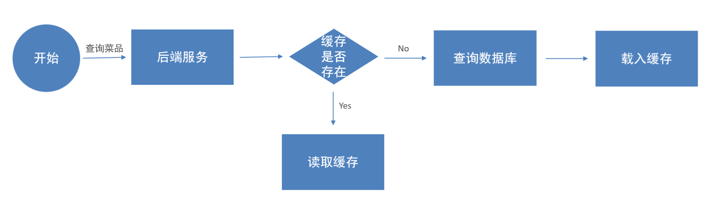

# 缓存菜品

将菜品数据，缓存在 Redis 中。

## 一、问题说明

用户端小程序，展示的菜品数据，都是通过查询数据库获得；

如果用户端，访问量比较大，数据库访问压力也随之增大。

结论：系统数据查询的瓶颈，主要体现在数据库。

## 二、实现思路

通过 Redis 来缓存菜品数据，减少数据库查询操作。

- 内存操作，相对于磁盘 IO 操作，效率高。

缓存逻辑分析：

- 每个分类下的菜品，保存一份缓存数据，如下图所示，分类中的菜品集合序列化成字符串后保存在 Redis 中。
- 数据库中菜品数据有变更时，清理缓存数据。

