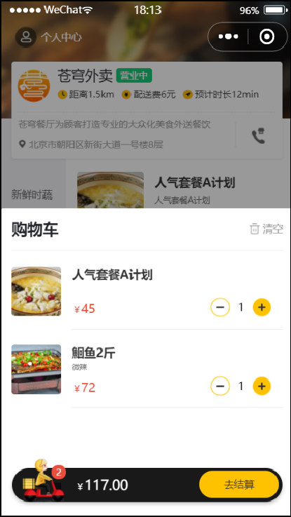

# 查看购物车

## 一、需求分析和设计

### 1.1.产品原型

当用户添加完菜品和套餐后，可进入到购物车中，查看购物中的菜品和套餐。



### 1.2.接口设计

基本信息

**Path：** /user/shoppingCart/list

**Method：** GET

接口描述：

请求参数

返回数据

| 名称          | 类型      | 是否必须 | 默认值 | 备注 | 其他信息          |
| ------------- | --------- | -------- | ------ | ---- | ----------------- |
| code          | integer   | 必须     |        |      | format: int32     |
| data          | object [] | 非必须   |        |      | item 类型: object |
| ├─ amount     | number    | 非必须   |        |      |                   |
| ├─ createTime | string    | 非必须   |        |      | format: date-time |
| ├─ dishFlavor | string    | 非必须   |        |      |                   |
| ├─ dishId     | integer   | 非必须   |        |      | format: int64     |
| ├─ id         | integer   | 非必须   |        |      | format: int64     |
| ├─ image      | string    | 非必须   |        |      |                   |
| ├─ name       | string    | 非必须   |        |      |                   |
| ├─ number     | integer   | 非必须   |        |      | format: int32     |
| ├─ setmealId  | integer   | 非必须   |        |      | format: int64     |
| ├─ userId     | integer   | 非必须   |        |      | format: int64     |
| msg           | string    | 非必须   |        |      |                   |

## 二、代码开发

### 2.1.Controller 层

`ShoppingCartController` 控制器类中，定义 `list` 方法

sky-takeout-backend/sky-server/src/main/java/com/sky/controller/user/ShoppingCartController.java

```java
……

@GetMapping("/list")
@Operation(summary = "查看购物车")
public Result<List<ShoppingCart>> list() {
    log.info("查看购物车");
    List<ShoppingCart> list = shoppingCartService.showShoppingCart();
    return Result.success(list);
}

……
```

### 2.2.Service  层

`ShoppingCartService` 接口，定义 `showShoppingCart` 方法

sky-takeout-backend/sky-server/src/main/java/com/sky/service/ShoppingCartService.java

```java
……

/**
 * 此方法用于：查看购物车
 *
 * @return List<ShoppingCart>
 */
List<ShoppingCart> showShoppingCart();

……
```

`ShoppingCartServiceImpl` 实现类，实现 `showShoppingCart` 方法。

sky-takeout-backend/sky-server/src/main/java/com/sky/service/impl/ShoppingCartServiceImpl.java

```java
……

/**
 * 此方法用于：查看购物车
 *
 * @return List<ShoppingCart>
 */
@Override
public List<ShoppingCart> showShoppingCart() {
    Long userId = BaseContext.getCurrentId();
    ShoppingCart shoppingCart = ShoppingCart.builder()
            .userId(userId)
            .build();

    return shoppingCartMapper.selectByShoppingCart(shoppingCart);
}

……
```

- 这里通过 `BaseContext` 封装的 `ThreadLocal` 获取用户 id，所以在请求参数中不需要传用户 id；

### 2.3.Mapper 层

使用已有的 `ShoppingCartMapper` 接口中的 `selectByShoppingCart` 方法；

sky-takeout-backend/sky-server/src/main/java/com/sky/mapper/ShoppingCartMapper.java

```java
……

/**
 * 此方法用于：根据用户 id ，套餐 id；或者用户 id，菜品 id查询购物车
 * @param shoppingCart 查询条件
 * @return List<ShoppingCart>
 */
List<ShoppingCart> selectByShoppingCart(ShoppingCart shoppingCart);

……
```

## 三、功能测试

当进入小程序时，就会发起查看购物车的请求。

点击购物车图标，也会发起查看购物车的请求。
