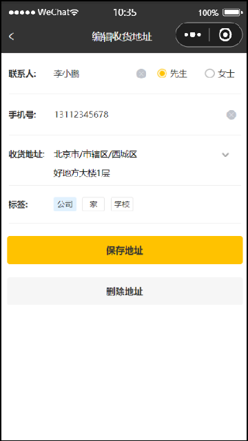

# 导入地址簿功能代码

## 一、需求设计和分析

地址簿，指的是消费者用户的地址信息，用户登录成功后可以维护自己的地址信息。同一个用户可以有多个地址信息，但是只能有一个**默认地址**。

### 1.1.产品原型




对于地址簿管理，我们需要实现以下几个功能：

- 查询地址列表
- 新增地址
- 修改地址
- 删除地址
- 设置默认地址
- 查询默认地址

### 1.2.接口设计

根据原型图可知有以下接口：

- 新增地址
- 查询登录用户所有地址
- 查询默认地址
- 根据 id 修改地址
- 根据 id 删除地址
- 根据 id 查询地址
- 设置默认地址

#### 1.2.1.新增地址

基本信息

**Path：** /user/addressBook

**Method：** POST

接口描述：

请求参数

Headers

| 参数名称     | 参数值           | 是否必须 | 示例 | 备注 |
| ------------ | ---------------- | -------- | ---- | ---- |
| Content-Type | application/json | 是       |      |      |

Body

| 名称         | 类型    | 是否必须 | 默认值 | 备注     | 其他信息      |
| ------------ | ------- | -------- | ------ | -------- | ------------- |
| cityCode     | string  | 非必须   |        |          |               |
| cityName     | string  | 非必须   |        |          |               |
| consignee    | string  | 非必须   |        |          |               |
| detail       | string  | 必须     |        | 详细地址 |               |
| districtCode | string  | 非必须   |        |          |               |
| districtName | string  | 非必须   |        |          |               |
| id           | integer | 非必须   |        |          | format: int64 |
| isDefault    | integer | 非必须   |        |          | format: int32 |
| label        | string  | 非必须   |        |          |               |
| phone        | string  | 必须     |        | 手机号   |               |
| provinceCode | string  | 非必须   |        |          |               |
| provinceName | string  | 非必须   |        |          |               |
| sex          | string  | 必须     |        |          |               |
| userId       | integer | 非必须   |        |          | format: int64 |

返回数据

| 名称 | 类型    | 是否必须 | 默认值 | 备注 | 其他信息      |
| ---- | ------- | -------- | ------ | ---- | ------------- |
| code | integer | 必须     |        |      | format: int32 |
| data | object  | 非必须   |        |      |               |
| msg  | string  | 非必须   |        |      |               |

#### 1.2.2.查询登录用户所有地址

基本信息

**Path：** /user/addressBook/list

**Method：** GET

接口描述：

请求参数

返回数据

| 名称            | 类型    | 是否必须 | 默认值 | 备注 | 其他信息      |
| --------------- | ------- | -------- | ------ | ---- | ------------- |
| code            | integer | 必须     |        |      | format: int32 |
| data            | object  | 非必须   |        |      |               |
| ├─ id           | number  | 必须     |        |      |               |
| ├─ userId       | number  | 必须     |        |      |               |
| ├─ consignee    | string  | 必须     |        |      |               |
| ├─ phone        | string  | 必须     |        |      |               |
| ├─ sex          | string  | 必须     |        |      |               |
| ├─ provinceCode | string  | 必须     |        |      |               |
| ├─ provinceName | string  | 必须     |        |      |               |
| ├─ cityCode     | string  | 必须     |        |      |               |
| ├─ cityName     | string  | 必须     |        |      |               |
| ├─ districtCode | string  | 必须     |        |      |               |
| ├─ districtName | string  | 必须     |        |      |               |
| ├─ detail       | string  | 必须     |        |      |               |
| ├─ label        | string  | 必须     |        |      |               |
| ├─ isDefault    | number  | 必须     |        |      |               |
| msg             | string  | 非必须   |        |      |               |

#### 1.2.3.查询默认地址

基本信息

**Path：** /user/addressBook/default

**Method：** GET

接口描述：

请求参数

返回数据

| 名称            | 类型    | 是否必须 | 默认值 | 备注 | 其他信息      |
| --------------- | ------- | -------- | ------ | ---- | ------------- |
| code            | integer | 必须     |        |      | format: int32 |
| data            | object  | 非必须   |        |      |               |
| ├─ cityCode     | string  | 非必须   |        |      |               |
| ├─ cityName     | string  | 非必须   |        |      |               |
| ├─ consignee    | string  | 非必须   |        |      |               |
| ├─ detail       | string  | 非必须   |        |      |               |
| ├─ districtCode | string  | 非必须   |        |      |               |
| ├─ districtName | string  | 非必须   |        |      |               |
| ├─ id           | integer | 非必须   |        |      | format: int64 |
| ├─ isDefault    | integer | 非必须   |        |      | format: int32 |
| ├─ label        | string  | 非必须   |        |      |               |
| ├─ phone        | string  | 非必须   |        |      |               |
| ├─ provinceCode | string  | 非必须   |        |      |               |
| ├─ provinceName | string  | 非必须   |        |      |               |
| ├─ sex          | string  | 非必须   |        |      |               |
| ├─ userId       | integer | 非必须   |        |      | format: int64 |
| msg             | string  | 非必须   |        |      |               |

#### 1.2.4.根据 id 修改地址

基本信息

**Path：** /user/addressBook

**Method：** PUT

**接口描述：**

请求参数

Headers

| 参数名称     | 参数值           | 是否必须 | 示例 | 备注 |
| ------------ | ---------------- | -------- | ---- | ---- |
| Content-Type | application/json | 是       |      |      |

Body

| 名称         | 类型    | 是否必须 | 默认值 | 备注     | 其他信息      |
| ------------ | ------- | -------- | ------ | -------- | ------------- |
| cityCode     | string  | 非必须   |        |          |               |
| cityName     | string  | 非必须   |        |          |               |
| consignee    | string  | 非必须   |        |          |               |
| detail       | string  | 必须     |        | 详细地址 |               |
| districtCode | string  | 非必须   |        |          |               |
| districtName | string  | 非必须   |        |          |               |
| id           | integer | 必须     |        | 主键值   | format: int64 |
| isDefault    | integer | 非必须   |        |          | format: int32 |
| label        | string  | 非必须   |        |          |               |
| phone        | string  | 必须     |        | 手机号   |               |
| provinceCode | string  | 非必须   |        |          |               |
| provinceName | string  | 非必须   |        |          |               |
| sex          | string  | 必须     |        |          |               |
| userId       | integer | 非必须   |        |          | format: int64 |

返回数据

| 名称 | 类型    | 是否必须 | 默认值 | 备注 | 其他信息      |
| ---- | ------- | -------- | ------ | ---- | ------------- |
| code | integer | 必须     |        |      | format: int32 |
| data | object  | 非必须   |        |      |               |
| msg  | string  | 非必须   |        |      |               |

#### 1.2.5.根据 id 删除地址

基本信息

**Path：** /user/addressBook

**Method：** DELETE

接口描述：

请求参数

Query

| 参数名称 | 是否必须 | 示例 | 备注   |
| -------- | -------- | ---- | ------ |
| id       | 是       | 101  | 地址id |

返回数据

| 名称 | 类型    | 是否必须 | 默认值 | 备注 | 其他信息      |
| ---- | ------- | -------- | ------ | ---- | ------------- |
| code | integer | 必须     |        |      | format: int32 |
| data | object  | 非必须   |        |      |               |
| msg  | string  | 非必须   |        |      |               |

#### 1.2.6.根据 id 查询地址

基本信息

**Path：** /user/addressBook/{id}

**Method：** GET

接口描述：

请求参数

路径参数

| 参数名称 | 示例 | 备注   |
| -------- | ---- | ------ |
| id       | 101  | 地址id |

返回数据

| 名称            | 类型   | 是否必须 | 默认值 | 备注 | 其他信息 |
| --------------- | ------ | -------- | ------ | ---- | -------- |
| code            | number | 必须     |        |      |          |
| data            | object | 必须     |        |      |          |
| ├─ id           | number | 非必须   |        |      |          |
| ├─ phone        | string | 非必须   |        |      |          |
| ├─ consignee    | string | 非必须   |        |      |          |
| ├─ userId       | number | 非必须   |        |      |          |
| ├─ cityCode     | string | 非必须   |        |      |          |
| ├─ provinceName | string | 非必须   |        |      |          |
| ├─ provinceCode | string | 非必须   |        |      |          |
| ├─ sex          | string | 非必须   |        |      |          |
| ├─ districtName | string | 非必须   |        |      |          |
| ├─ districtCode | string | 非必须   |        |      |          |
| ├─ cityName     | string | 非必须   |        |      |          |
| ├─ isDefault    | number | 非必须   |        |      |          |
| ├─ label        | string | 非必须   |        |      |          |
| ├─ detail       | string | 非必须   |        |      |          |
| msg             | string | 非必须   |        |      |          |

#### 1.2.7.设置默认地址

基本信息

**Path：** /user/addressBook/default

**Method：** PUT

接口描述：

请求参数

Headers

| 参数名称     | 参数值           | 是否必须 | 示例 | 备注 |
| ------------ | ---------------- | -------- | ---- | ---- |
| Content-Type | application/json | 是       |      |      |

Body

| 名称 | 类型    | 是否必须 | 默认值 | 备注   | 其他信息      |
| ---- | ------- | -------- | ------ | ------ | ------------- |
| id   | integer | 必须     |        | 地址id | format: int64 |

返回数据

| 名称 | 类型    | 是否必须 | 默认值 | 备注 | 其他信息      |
| ---- | ------- | -------- | ------ | ---- | ------------- |
| code | integer | 必须     |        |      | format: int32 |
| data | object  | 非必须   |        |      |               |
| msg  | string  | 非必须   |        |      |               |

### 1.2.数据库设计

```mysql
DROP TABLE IF EXISTS `address_book`;
CREATE TABLE `address_book`
(
    `id`            bigint                       NOT NULL AUTO_INCREMENT COMMENT '主键',
    `user_id`       bigint                       NOT NULL COMMENT '用户id',
    `consignee`     VARCHAR(50) COLLATE utf8_bin       DEFAULT NULL COMMENT '收货人',
    `sex`           VARCHAR(2) COLLATE utf8_bin        DEFAULT NULL COMMENT '性别',
    `phone`         VARCHAR(11) COLLATE utf8_bin NOT NULL COMMENT '手机号',
    `province_code` VARCHAR(12) CHARACTER SET utf8mb4  DEFAULT NULL COMMENT '省级区划编号',
    `province_name` VARCHAR(32) CHARACTER SET utf8mb4  DEFAULT NULL COMMENT '省级名称',
    `city_code`     VARCHAR(12) CHARACTER SET utf8mb4  DEFAULT NULL COMMENT '市级区划编号',
    `city_name`     VARCHAR(32) CHARACTER SET utf8mb4  DEFAULT NULL COMMENT '市级名称',
    `district_code` VARCHAR(12) CHARACTER SET utf8mb4  DEFAULT NULL COMMENT '区级区划编号',
    `district_name` VARCHAR(32) CHARACTER SET utf8mb4  DEFAULT NULL COMMENT '区级名称',
    `detail`        VARCHAR(200) CHARACTER SET utf8mb4 DEFAULT NULL COMMENT '详细地址',
    `label`         VARCHAR(100) CHARACTER SET utf8mb4 DEFAULT NULL COMMENT '标签',
    `is_default`    tinyint(1) NOT NULL DEFAULT '0' COMMENT '默认 0 否 1是',
    PRIMARY KEY (`id`)
) ENGINE=InnoDB AUTO_INCREMENT=2 DEFAULT CHARSET=utf8mb3 COLLATE=utf8_bin COMMENT='地址簿';
```

## 二、代码导入

将现有的 AddressBook 代码导入到项目中。

## 三、功能测试

在小程序端新增地址；设置默认地址。
