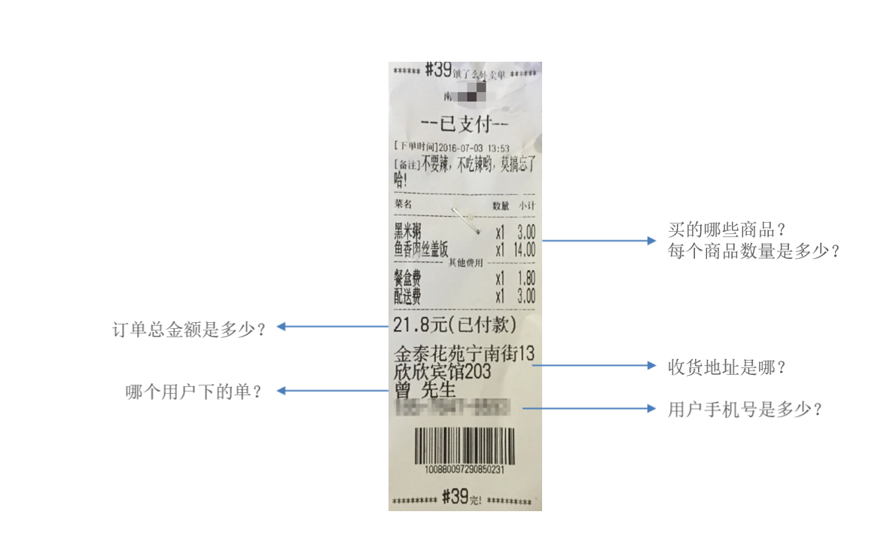

# 用户下单

## 一、需求分析和设计

### 1.1.产品原型

用户下单业务说明：在电商系统中，用户是通过下单的方式通知商家，用户已经购买了商品，需要商家进行备货和发货。

用户下单后会产生订单相关数据，订单数据需要能够体现如下信息：



用户将菜品或者套餐，加入购物车后，可以点击购物车中的"去结算"按钮，页面跳转到订单确认页面，点击"去支付"按钮则完成下单操作。


### 1.2.接口设计

基本信息

**Path：** /user/order/submit

**Method：** POST

接口描述：

请求参数

Headers

| 参数名称     | 参数值           | 是否必须 | 示例 | 备注 |
| ------------ | ---------------- | -------- | ---- | ---- |
| Content-Type | application/json | 是       |      |      |

Body

| 名称                  | 类型    | 是否必须 | 默认值 | 备注                                     | 其他信息      |
| --------------------- | ------- | -------- | ------ | ---------------------------------------- | ------------- |
| addressBookId         | integer | 必须     |        | 地址簿id                                 | format: int64 |
| amount                | number  | 必须     |        | 总金额                                   |               |
| deliveryStatus        | integer | 必须     |        | 配送状态：  1立即送出  0选择具体时间     | format: int32 |
| estimatedDeliveryTime | string  | 必须     |        | 预计送达时间                             |               |
| packAmount            | integer | 必须     |        | 打包费                                   | format: int32 |
| payMethod             | integer | 必须     |        | 付款方式                                 | format: int32 |
| remark                | string  | 必须     |        | 备注                                     |               |
| tablewareNumber       | integer | 必须     |        | 餐具数量                                 | format: int32 |
| tablewareStatus       | integer | 必须     |        | 餐具数量状态  1按餐量提供  0选择具体数量 | format: int32 |

返回数据

| 名称           | 类型    | 是否必须 | 默认值 | 备注     | 其他信息          |
| -------------- | ------- | -------- | ------ | -------- | ----------------- |
| code           | integer | 必须     |        |          | format: int32     |
| data           | object  | 必须     |        |          |                   |
| ├─ id          | integer | 必须     |        | 订单id   | format: int64     |
| ├─ orderAmount | number  | 必须     |        | 订单金额 |                   |
| ├─ orderNumber | string  | 必须     |        | 订单号   |                   |
| ├─ orderTime   | string  | 必须     |        | 下单时间 | format: date-time |
| msg            | string  | 非必须   |        |          |                   |

### 1.3.数据库设计

涉及两个表：它们之间的关系是：一对多。

#### 1.3.1.订单表 orders

| **字段名**              | **数据类型**  | **说明**     | **备注**                                                     |
| ----------------------- | ------------- | ------------ | ------------------------------------------------------------ |
| id                      | bigint        | 主键         | 自增                                                         |
| number                  | varchar(50)   | 订单号       |                                                              |
| **status**              | **int**       | **订单状态** | **1 待付款；2 待接单；3 已接单；4 派送中；5 已完成；6 已取消** |
| **user_id**             | **bigint**    | **用户id**   | **逻辑外键**                                                 |
| **address_book_id**     | **bigint**    | **地址id**   | **逻辑外键**                                                 |
| order_time              | datetime      | 下单时间     |                                                              |
| checkout_time           | datetime      | 付款时间     |                                                              |
| pay_method              | int           | 支付方式     | 1 微信支付；2 支付宝支付                                     |
| **pay_status**          | **tinyint**   | **支付状态** | **0 未支付；1 已支付；2 退款**                               |
| amount                  | decimal(10,2) | 订单金额     |                                                              |
| remark                  | varchar(100)  | 备注信息     |                                                              |
| phone                   | varchar(11)   | 手机号       | 冗余字段                                                     |
| address                 | varchar(255)  | 详细地址信息 | 冗余字段                                                     |
| consignee               | varchar(32)   | 收货人       | 冗余字段                                                     |
| cancel_reason           | varchar(255)  | 订单取消原因 |                                                              |
| rejection_reason        | varchar(255)  | 拒单原因     |                                                              |
| cancel_time             | datetime      | 订单取消时间 |                                                              |
| estimated_delivery_time | datetime      | 预计送达时间 |                                                              |
| delivery_status         | tinyint       | 配送状态     | 1立即送出 0选择具体时间                                      |
| delivery_time           | datetime      | 送达时间     |                                                              |
| pack_amount             | int           | 打包费       |                                                              |
| tableware_number        | int           | 餐具数量     |                                                              |
| tableware_status        | tinyint       | 餐具数量状态 | 1按餐量提供 0选择具体数量                                    |

#### 1.3.2.订单明细表 order_detail

| **字段名**     | **数据类型**  | **说明**     | **备注**     |
| -------------- | ------------- | ------------ | ------------ |
| id             | bigint        | 主键         | 自增         |
| name           | varchar(32)   | 商品名称     | 冗余字段     |
| image          | varchar(255)  | 商品图片路径 | 冗余字段     |
| **order_id**   | **bigint**    | **订单id**   | **逻辑外键** |
| **dish_id**    | **bigint**    | **菜品id**   | **逻辑外键** |
| **setmeal_id** | **bigint**    | **套餐id**   | **逻辑外键** |
| dish_flavor    | varchar(50)   | 菜品口味     |              |
| number         | int           | 商品数量     |              |
| amount         | decimal(10,2) | 商品单价     |              |

## 三、代码开发

### 3.1.Controller 层

`OrderController` 控制器类，在其中新增 `submit` 方法。

sky-takeout-backend/sky-server/src/main/java/com/sky/controller/user/OrderController.java

```java
package com.sky.controller.user;

import com.sky.dto.OrdersSubmitDTO;
import com.sky.result.Result;
import com.sky.service.OrderService;
import com.sky.vo.OrderSubmitVO;
import io.swagger.v3.oas.annotations.Operation;
import io.swagger.v3.oas.annotations.tags.Tag;
import lombok.extern.slf4j.Slf4j;
import org.springframework.beans.factory.annotation.Autowired;
import org.springframework.web.bind.annotation.PostMapping;
import org.springframework.web.bind.annotation.RequestBody;
import org.springframework.web.bind.annotation.RequestMapping;
import org.springframework.web.bind.annotation.RestController;

@RestController("userOrderController")
@RequestMapping("/user/order")
@Slf4j
@Tag(name = "用户订单接口")
public class OrderController {
    private final OrderService orderService;

    @Autowired
    public OrderController(OrderService orderService) {
        this.orderService = orderService;
    }

    @PostMapping("/submit")
    @Operation(summary = "用户下单")
    public Result<OrderSubmitVO> submit(@RequestBody OrdersSubmitDTO ordersSubmitDTO) {
        log.info("用户下单，参数 {}", ordersSubmitDTO);

        OrderSubmitVO orderSubmitVO = orderService.submitOrder(ordersSubmitDTO);
        return Result.success(orderSubmitVO);
    }
}
```

### 3.2.Service 层

`OrderService` 接口，在其中定义 `submitOrder` 方法；

sky-takeout-backend/sky-server/src/main/java/com/sky/service/OrderService.java

```java
package com.sky.service;

import com.sky.dto.OrdersSubmitDTO;
import com.sky.vo.OrderSubmitVO;

public interface OrderService {
    /**
     * 此方法用于：用户下单
     *
     * @param ordersSubmitDTO 订单数据
     * @return OrderSubmitVO
     */
    OrderSubmitVO submitOrder(OrdersSubmitDTO ordersSubmitDTO);
}
```

`OrderServiceImpl` 实现类，实现 `submitOrder` 方法：分为 5 步：

1. 处理各种业务异常（地址为空等，购物车为空）；
2. 在订单表中插入数据；
3. 在订单明细表中插入 n 条数据 orders；
4. 清空购物车；
5. 封装返回结果

sky-takeout-backend/sky-server/src/main/java/com/sky/service/impl/OrderServiceImpl.java

```java
package com.sky.service.impl;

import ……

import java.time.LocalDateTime;
import java.util.List;

@Service
@Slf4j
public class OrderServiceImpl implements OrderService {
    private final OrderMapper orderMapper;
    private final OrderDetailMapper orderDetailMapper;
    private final AddressBookMapper addressBookMapper;
    private final ShoppingCartMapper shoppingCartMapper;

    @Autowired
    public OrderServiceImpl(OrderMapper orderMapper, OrderDetailMapper orderDetailMapper, AddressBookMapper addressBookMapper, ShoppingCartMapper shoppingCartMapper) {
        this.orderMapper = orderMapper;
        this.orderDetailMapper = orderDetailMapper;
        this.addressBookMapper = addressBookMapper;
        this.shoppingCartMapper = shoppingCartMapper;
    }

    @Transactional
    @Override
    public OrderSubmitVO submitOrder(OrdersSubmitDTO ordersSubmitDTO) {
        // 处理各种业务异常（地址为空等，购物车为空）
        AddressBook addressBook = addressBookMapper.getById(ordersSubmitDTO.getAddressBookId());
        if (addressBook == null)
            throw new AddressBookBusinessException(MessageConstant.ADDRESS_BOOK_IS_NULL);

        Long userId = BaseContext.getCurrentId();
        ShoppingCart shoppingCart = ShoppingCart.builder().userId(userId).build();
        List<ShoppingCart> shoppingCarts = shoppingCartMapper.selectByShoppingCart(shoppingCart);
        if (shoppingCarts == null || shoppingCarts.isEmpty())
            throw new ShoppingCartBusinessException(MessageConstant.SHOPPING_CART_IS_NULL);

        // 在订单表中插入数据
        Orders orders = Orders.builder()
                .orderTime(LocalDateTime.now())
                .payStatus(Orders.UN_PAID)
                .status(Orders.PENDING_PAYMENT)
                .number(String.valueOf(System.currentTimeMillis()))
                .phone(addressBook.getPhone())
                .consignee(addressBook.getConsignee())
                .userId(userId)
                .build();
        BeanUtils.copyProperties(ordersSubmitDTO, orders);
        int i = orderMapper.insert(orders);
        log.info("插入订单数据：{} 条", i);

        // 在订单明细表中插入 n 条数据orders
        List<OrderDetail> orderDetailList = shoppingCarts.stream().map(sc -> {
            OrderDetail orderDetail = OrderDetail.builder().orderId(orders.getId()).build();
            BeanUtils.copyProperties(sc, orderDetail);
            return orderDetail;
        }).toList();
        int j = orderDetailMapper.insertBatch(orderDetailList);
        log.info("插入订单明细数据：{} 条", j);

        // 清空购物车
        int k = shoppingCartMapper.deleteByUserId(userId);
        log.info("清空购物车：{} 条", k);

        // 封装返回结果
        return OrderSubmitVO.builder()
                .id(orders.getId())
                .orderTime(orders.getOrderTime())
                .orderNumber(orders.getNumber())
                .orderAmount(orders.getAmount())
                .build();
    }
}
```

- 涉及到两个表（order、order_detail）的插入操作，使用 `@Transactional` 注解，开启事务。

### 3.3.Mapper 层

`OrderMapper` 接口，定义 `insert` 方法，用于插入订单记录；

sky-takeout-backend/sky-server/src/main/java/com/sky/mapper/OrderMapper.java

```java
package com.sky.mapper;

import com.sky.entity.Orders;
import org.apache.ibatis.annotations.Mapper;

@Mapper
public interface OrderMapper {
    /**
     * 此方法用于：插入订单记录
     *
     * @param orders 订单实体类
     * @return int
     */
    int insert(Orders orders);
}
```

使用 XML 映射文件，处理 SQL 语句：

sky-takeout-backend/sky-server/src/main/resources/mapper/OrderMapper.xml

```xml
<?xml version="1.0" encoding="UTF-8" ?>
<!DOCTYPE mapper PUBLIC "-//mybatis.org//DTD Mapper 3.0//EN"
        "http://mybatis.org/dtd/mybatis-3-mapper.dtd" >
<mapper namespace="com.sky.mapper.OrderMapper">
    <!-- 插入成功后，要返回主键值-->
    <insert id="insert" useGeneratedKeys="true" keyProperty="id">
        INSERT INTO orders (number, status, user_id, address_book_id, order_time, checkout_time, pay_method, pay_status, amount, remark, phone, address, user_name, consignee, cancel_reason, rejection_reason, cancel_time, estimated_delivery_time, delivery_status, delivery_time, pack_amount, tableware_number, tableware_status)
        VALUES (#{number}, #{status}, #{userId}, #{addressBookId}, #{orderTime}, #{checkoutTime}, #{payMethod}, #{payStatus}, #{amount}, #{remark}, #{phone}, #{address}, #{userName}, #{consignee}, #{cancelReason}, #{rejectionReason}, #{cancelTime}, #{estimatedDeliveryTime}, #{deliveryStatus}, #{deliveryTime}, #{packAmount}, #{tablewareNumber}, #{tablewareStatus})
    </insert>
</mapper>
```

`OrderDetailMapper` 接口，定义 `insertBatch` 方法，用于批量插入订单明细。

sky-takeout-backend/sky-server/src/main/java/com/sky/mapper/OrderDetailMapper.java

```java
package com.sky.mapper;

import com.sky.entity.OrderDetail;
import org.apache.ibatis.annotations.Mapper;

import java.util.List;

@Mapper
public interface OrderDetailMapper {
    /**
     * 此方法用于：批量插入订单明细数据
     * @param orderDetailList 订单明细数据
     * @return int
     */
    int insertBatch(List<OrderDetail> orderDetailList);
}
```

使用 XML 映射文件，处理动态 SQL 语句：

sky-takeout-backend/sky-server/src/main/resources/mapper/OrderDetailMapper.xml

```xml
<?xml version="1.0" encoding="UTF-8" ?>
<!DOCTYPE mapper PUBLIC "-//mybatis.org//DTD Mapper 3.0//EN"
        "http://mybatis.org/dtd/mybatis-3-mapper.dtd" >
<mapper namespace="com.sky.mapper.OrderDetailMapper">

    <insert id="insertBatch">
        INSERT INTO order_detail (id, name, image, order_id, dish_id, setmeal_id, dish_flavor, number, amount) VALUES
        <foreach collection="orderDetailList" separator="," item="od">
            (#{od.id}, #{od.name}, #{od.image}, #{od.orderId}, #{od.dishId}, #{od.setmealId}, #{od.dishFlavor}, #{od.number}, #{od.amount})
        </foreach>
    </insert>
</mapper>
```
