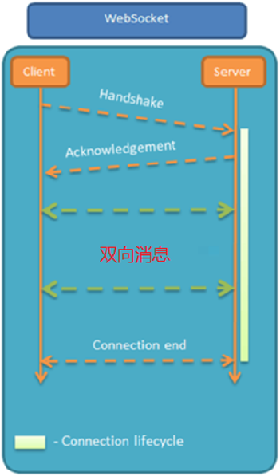

# WebSocket

## 一、WebSocket 介绍

WebSocket 是基于 TCP 的一种网络协议。它实现了客户端与服务器全双工通信；

- 客户端和服务器只需要完成**一次握手**，两者之间就可以创建持久性的连接， 并进行**双向数据传输**。

HTTP 协议和 WebSocket 协议对比：

- HTTP 是短连接；WebSocket 是长连接；
- HTTP 通信是单向的，基于请求响应模式；WebSocket 支持双向通信；
- HTTP 和 WebSocket 底层都是 TCP 连接；

 

WebSocket 协议支持双向通信，功能看似比 HTTP 协议强大，但并不适用所有的业务功能，它有如下缺点：

- 服务器长期维护长连接需要一定的成本；
- 各个浏览器支持程度不一样；
- WebSocket 是长连接，受网络限制比较大，需要处理好重连；

WebSocket 并不能完全取代 HTTP，它只适合在特定的场景下使用；

## 二、WebSocket 应用场景

WebSocket 应用场景：

- 视频弹幕；
- 网页聊天；
- 体育实况更新；
- 股票基金报价实时更新；

## 三、入门案例

实现步骤：

Ⅰ、导入 Spring Boot WebSocket 起步依赖 maven 坐标；

sky-takeout-backend/sky-server/pom.xml

```xml
<dependency>
    <groupId>org.springframework.boot</groupId>
    <artifactId>spring-boot-starter-websocket</artifactId>
</dependency>
```

Ⅱ、导入 WebSocket 服务端组件 `WebSocketServer`，用于和客户端通信；

sky-takeout-backend/sky-server/src/main/java/com/sky/webSocket/WebSocketServer.java

```java
package com.sky.webSocket;

import jakarta.websocket.OnClose;
import jakarta.websocket.OnMessage;
import jakarta.websocket.OnOpen;
import jakarta.websocket.Session;
import jakarta.websocket.server.PathParam;
import jakarta.websocket.server.ServerEndpoint;
import org.springframework.stereotype.Component;

import java.util.Collection;
import java.util.HashMap;
import java.util.Map;

/**
 * WebSocket服务
 */
@Component
@ServerEndpoint("/ws/{sid}")
public class WebSocketServer {
    //存放会话对象
    private static final Map<String, Session> sessionMap = new HashMap<>();

    /**
     * 连接建立成功调用的方法
     */
    @OnOpen
    public void onOpen(Session session, @PathParam("sid") String sid) {
        System.out.println("客户端：" + sid + "建立连接");
        sessionMap.put(sid, session);
    }

    /**
     * 收到客户端消息后调用的方法
     *
     * @param message 客户端发送过来的消息
     */
    @OnMessage
    public void onMessage(String message, @PathParam("sid") String sid) {
        System.out.println("收到来自客户端：" + sid + "的信息:" + message);
    }

    /**
     * 连接关闭调用的方法
     *
     * @param sid 客户端 id
     */
    @OnClose
    public void onClose(@PathParam("sid") String sid) {
        System.out.println("连接断开:" + sid);
        sessionMap.remove(sid);
    }

    /**
     * 群发
     *
     * @param message 消息
     */
    public void sendToAllClient(String message) {
        Collection<Session> sessions = sessionMap.values();
        for (Session session : sessions) {
            try {
                //服务器向客户端发送消息
                session.getBasicRemote().sendText(message);
            } catch (Exception e) {
                System.out.println(e.getMessage());
            }
        }
    }

}
```

Ⅲ、导入配置类 `WebSocketConfiguration`，注册 WebSocket 的服务端组件；

sky-takeout-backend/sky-server/src/main/java/com/sky/config/WebSocketConfiguration.java

```java
package com.sky.config;

import org.springframework.context.annotation.Bean;
import org.springframework.context.annotation.Configuration;
import org.springframework.web.socket.server.standard.ServerEndpointExporter;

/**
 * WebSocket配置类，用于注册WebSocket的Bean
 */
@Configuration
public class WebSocketConfiguration {
    @Bean
    public ServerEndpointExporter serverEndpointExporter() {
        return new ServerEndpointExporter();
    }
}
```

Ⅳ、导入定时任务类 `WebSocketTask`，定时向客户端推送数据，用于测试；

sky-takeout-backend/sky-server/src/main/java/com/sky/task/WebSocketTask.java

```java
package com.sky.task;

import com.sky.webSocket.WebSocketServer;
import org.springframework.beans.factory.annotation.Autowired;
import org.springframework.scheduling.annotation.Scheduled;
import org.springframework.stereotype.Component;

import java.time.LocalDateTime;
import java.time.format.DateTimeFormatter;

@Component
public class WebSocketTask {
    @Autowired
    private WebSocketServer webSocketServer;

    /**
     * 通过WebSocket每隔5秒向客户端发送消息
     */
    @Scheduled(cron = "0/5 * * * * ?")
    public void sendMessageToClient() {
        webSocketServer.sendToAllClient("这是来自服务端的消息：" + DateTimeFormatter.ofPattern("HH:mm:ss").format(LocalDateTime.now()));
    }
}
```

Ⅴ、使用提供的 websocket.html 页面作为 WebSocket 客户端；

- 打开/刷新页面，客户端（浏览器）会与服务器自动建立 WebSocket 连接。然后可以给服务器发送信息。
- 服务器的 WebSocketTask 定时任务，会定时发送消息给客户端（浏览器）；

```html
<!doctype html>
<html lang="en">
<head>
    <meta charset="UTF-8">
    <meta name="viewport" content="width=device-width, initial-scale=1">
    <title>WebSocket Demo</title>
</head>
<body>
<label for="text">
    <input id="text" type="text"/>
</label>
<button onclick="send()">发送消息</button>
<button onclick="closeWebSocket()">关闭连接</button>
<div id="message"></div>
</body>

<script type="text/javascript">
    var websocket = null;
    var clientId = Math.random().toString(36).substr(2);

    //判断当前浏览器是否支持WebSocket
    if (!'WebSocket' in window)
        alert('Not support websocket')

    //连接WebSocket节点
    websocket = new WebSocket("ws://localhost:8080/ws/" + clientId);

    //连接发生错误的回调方法
    websocket.onerror = function () {
        setMessageInnerHTML("error");
    };

    //连接成功建立的回调方法
    websocket.onopen = function () {
        setMessageInnerHTML("连接成功");
    }

    //接收到消息的回调方法
    websocket.onmessage = function (event) {
        setMessageInnerHTML(event.data);
    }

    //连接关闭的回调方法
    websocket.onclose = function () {
        setMessageInnerHTML("close");
    }

    //监听窗口关闭事件，当窗口关闭时，主动去关闭websocket连接，防止连接还没断开就关闭窗口，server端会抛异常。
    window.onbeforeunload = function () {
        websocket.close();
    }

    //将消息显示在网页上
    function setMessageInnerHTML(innerHTML) {
        document.getElementById('message').innerHTML += innerHTML + '<br/>';
    }

    //发送消息
    function send() {
        var message = document.getElementById('text').value;
        websocket.send(message);
    }

    //关闭连接
    function closeWebSocket() {
        websocket.close();
    }
</script>
</html>
```
