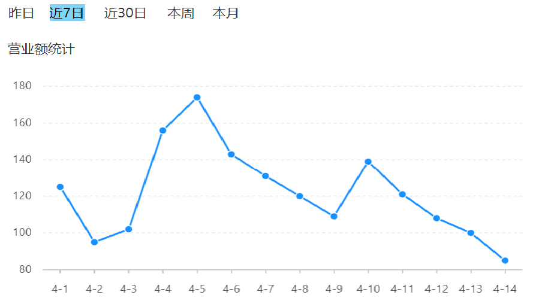

# 营业额统计

前端使用 Apache Echarts 作为数据可视化的方案；

## 一、需求分析和设计

### 1.1.产品原型

营业额统计，是基于折现图来展现，并且按照天来展示的。实际上，就是某一个时间范围之内的每一天的营业额。

在前端页面，不管光标放在哪个点上，那么它就会把具体的数值展示出来。

并且还需要注意日期并不是固定写死的，是由上边时间选择器来决定。

- 比如选择是近 7 天、或者是近 30 日，或者是本周，就会把相应这个时间段之内的每一天日期通过横坐标展示。



### 1.2.接口设计

基本信息

**Path：** /admin/report/turnoverStatistics

**Method：** GET

接口描述：

请求参数

Query

| 参数名称 | 是否必须 | 示例       | 备注     |
| -------- | -------- | ---------- | -------- |
| begin    | 是       | 2022-05-01 | 开始日期 |
| end      | 是       | 2022-05-31 | 结束日期 |

返回数据

| 名称            | 类型    | 是否必须 | 默认值 | 备注                             | 其他信息      |
| --------------- | ------- | -------- | ------ | -------------------------------- | ------------- |
| code            | integer | 必须     |        |                                  | format: int32 |
| data            | object  | 必须     |        |                                  |               |
| ├─ dateList     | string  | 必须     |        | 日期列表，日期之间以逗号分隔     |               |
| ├─ turnoverList | string  | 必须     |        | 营业额列表，营业额之间以逗号分隔 |               |
| msg             | string  | 非必须   |        |                                  |               |

## 二、代码开发

### 2.1.VO 类准备

 `TurnoverReportVO` VO 类

sky-takeout-backend/sky-pojo/src/main/java/com/sky/vo/TurnoverReportVO.java

```java
package com.sky.vo;

import lombok.AllArgsConstructor;
import lombok.Builder;
import lombok.Data;
import lombok.NoArgsConstructor;

import java.io.Serializable;

@Data
@Builder
@NoArgsConstructor
@AllArgsConstructor
public class TurnoverReportVO implements Serializable {
    //日期，以逗号分隔，例如：2022-10-01,2022-10-02,2022-10-03
    private String dateList;

    //营业额，以逗号分隔，例如：406.0,1520.0,75.0
    private String turnoverList;
}
```

### 2.2.Controller 层

创建 `ReportController`，在其中定义 `turnoverStatistics` 方法

sky-takeout-backend/sky-server/src/main/java/com/sky/controller/admin/ReportController.java

```java
package com.sky.controller.admin;

import com.sky.result.Result;
import com.sky.service.ReportService;
import com.sky.vo.TurnoverReportVO;
import io.swagger.v3.oas.annotations.Operation;
import io.swagger.v3.oas.annotations.tags.Tag;
import lombok.extern.slf4j.Slf4j;
import org.springframework.beans.factory.annotation.Autowired;
import org.springframework.format.annotation.DateTimeFormat;
import org.springframework.web.bind.annotation.GetMapping;
import org.springframework.web.bind.annotation.RequestMapping;
import org.springframework.web.bind.annotation.RequestParam;
import org.springframework.web.bind.annotation.RestController;

import java.time.LocalDate;

@RestController
@RequestMapping("/admin/report")
@Slf4j
@Tag(name = "数据统计相关接口")
public class ReportController {
    private final ReportService reportService;

    @Autowired
    public ReportController(ReportService reportService) {
        this.reportService = reportService;
    }

    @GetMapping("/turnoverStatistics")
    @Operation(summary = "营业额统计")
    public Result<TurnoverReportVO> turnoverStatistics(
            @DateTimeFormat(pattern = "yyyy-MM-dd") @RequestParam("begin") LocalDate startDate,
            @DateTimeFormat(pattern = "yyyy-MM-dd") @RequestParam("end") LocalDate endDate
    ) {
        log.info("营业额统计，开始日期：{}，结束日期：{}", startDate, endDate);

        TurnoverReportVO turnoverReportVO = reportService.turnoverStatistics(startDate, endDate);
        return Result.success(turnoverReportVO);
    }
}
```

### 2.3.Service 层

`ReportService` 接口

sky-takeout-backend/sky-server/src/main/java/com/sky/service/ReportService.java

```java
package com.sky.service;

import com.sky.vo.TurnoverReportVO;

import java.time.LocalDate;

public interface ReportService {
    /**
     * 此方法用于：营业额统计
     *
     * @param startDate 开始日期
     * @param endDate   结束日期
     * @return TurnoverReportVO
     */
    TurnoverReportVO turnoverStatistics(LocalDate startDate, LocalDate endDate);
}
```

ReportServiceImpl 实现类中，实现 `turnoverStatistics` 方法。

sky-takeout-backend/sky-server/src/main/java/com/sky/service/impl/ReportServiceImpl.java

```java
package com.sky.service.impl;

import com.sky.entity.Orders;
import com.sky.mapper.OrderMapper;
import com.sky.service.ReportService;
import com.sky.vo.TurnoverReportVO;
import org.apache.commons.lang3.StringUtils;
import org.springframework.beans.factory.annotation.Autowired;
import org.springframework.stereotype.Service;

import java.time.LocalDate;
import java.time.LocalDateTime;
import java.time.LocalTime;
import java.util.HashMap;
import java.util.List;
import java.util.Map;
import java.util.stream.Collectors;
import java.util.stream.Stream;

@Service
public class ReportServiceImpl implements ReportService {
    private final OrderMapper orderMapper;

    @Autowired
    public ReportServiceImpl(OrderMapper orderMapper) {
        this.orderMapper = orderMapper;
    }

    /**
     * 此方法用于：营业额统计
     *
     * @param startDate 开始日期
     * @param endDate   结束日期
     * @return TurnoverReportVO
     */
    @Override
    public TurnoverReportVO turnoverStatistics(LocalDate startDate, LocalDate endDate) {
        if (startDate.isAfter(endDate))
            throw new IllegalArgumentException("Start date must be before or equal to end date");

        // 获取日期范围内所有日期
        List<LocalDate> dateList = Stream.iterate(startDate, date -> date.plusDays(1))
                .limit(startDate.until(endDate).getDays() + 1) // 包括结束日期
                .collect(Collectors.toList());

        // 获取日期范围内所有日期字符串
        String dateListStr = StringUtils.join(dateList, ",");

        // 获取日期范围内所有营业额
        List<Double> sumList = dateList.stream().map(date -> {
            LocalDateTime begin = LocalDateTime.of(date, LocalTime.MIN);
            LocalDateTime end = LocalDateTime.of(date, LocalTime.MAX);

            HashMap<String, Object> claim = new HashMap<>(Map.of(
                    "begin", begin,
                    "end", end,
                    "status", Orders.COMPLETED
            ));
            Double sum = orderMapper.sumByStatusAndOrderTime(claim);
            if (sum == null) sum = 0.0;
            return sum;
        }).toList();

        String sumListStr = StringUtils.join(sumList, ",");

        return TurnoverReportVO.builder()
                .dateList(dateListStr)
                .turnoverList(sumListStr)
                .build();
    }
}
```

- 获取两日期（LocalDate）之间的所有日期（LocalDate）
- 获取日期（LocalDate）对应的开始日期时间（LocalDateTime）和结束日期时间（LocalDateTime）。
- 为 Mapper 层接口中的方法，传入 HashMap；

### 2.4.Mapper 层

`OrderMapper` 接口中，新增方法 `sumByStatusAndOrderTime`

sky-takeout-backend/sky-server/src/main/java/com/sky/mapper/OrderMapper.java

```java
……

/**
 * 此方法用于：统计订单金额
 * @param claim 查询条件
 * @return Double
 */
Double  (HashMap<String, Object> claim);

……
```

使用 XML 映射文件，处理动态 SQL

sky-takeout-backend/sky-server/src/main/resources/mapper/OrderMapper.xml

```xml
<select id="sumByStatusAndOrderTime" resultType="java.lang.Double">
    SELECT SUM(amount) FROM orders
    <where>
        <if test="begin != null">
            AND order_time &gt;= #{begin}
        </if>
        <if test="end != null">
            AND order_time &lt;= #{end}
        </if>
        <if test="status != null">
            AND status = #{status}
        </if>
    </where>
</select>
```
