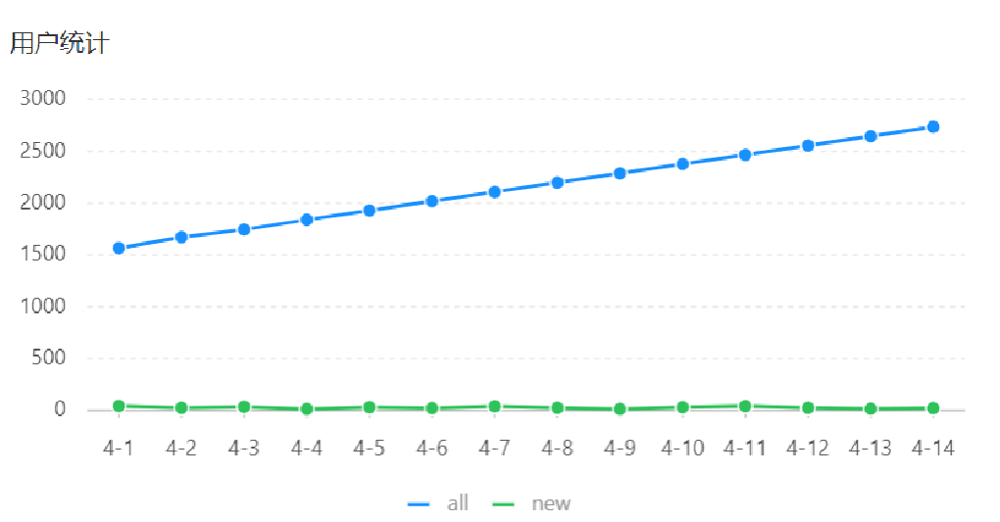

# 用户统计

## 一、需求分析和设计

### 1.1.产品原型

所谓用户统计，实际上统计的是用户的数量。

通过折线图来展示，上面这根蓝色线，代表的是用户总量；下边这根绿色线，代表的是新增用户数量。

具体到每一天。所以说用户统计主要统计**两个数据**，一个是**总的用户数量**，另外一个是**新增用户数量**。



业务规则：

- 基于可视化报表的折线图，展示用户数据，X 轴为日期，Y 轴为用户数；
- 根据时间选择区间，展示每天的用户总量和新增用户量数据。

### 1.2.接口设计

基本信息

**Path：** /admin/report/userStatistics

**Method：** GET

接口描述：

请求参数

Query

| 参数名称 | 是否必须 | 示例       | 备注     |
| -------- | -------- | ---------- | -------- |
| begin    | 是       | 2022-05-01 | 开始日期 |
| end      | 是       | 2022-05-31 | 结束日期 |

返回数据

| 名称             | 类型    | 是否必须 | 默认值 | 备注                       | 其他信息      |
| ---------------- | ------- | -------- | ------ | -------------------------- | ------------- |
| code             | integer | 必须     |        |                            | format: int32 |
| data             | object  | 必须     |        |                            |               |
| ├─ dateList      | string  | 必须     |        | 日期列表，以逗号分隔       |               |
| ├─ newUserList   | string  | 必须     |        | 新增用户数列表，以逗号分隔 |               |
| ├─ totalUserList | string  | 必须     |        | 总用户量列表，以逗号分隔   |               |
| msg              | string  | 非必须   |        |                            |               |

## 二、代码开发

### 2.1.VO 类设计

UserReportVO 类

sky-takeout-backend/sky-pojo/src/main/java/com/sky/vo/UserReportVO.java

```java
package com.sky.vo;

import lombok.AllArgsConstructor;
import lombok.Builder;
import lombok.Data;
import lombok.NoArgsConstructor;

import java.io.Serializable;

@Data
@Builder
@NoArgsConstructor
@AllArgsConstructor
public class UserReportVO implements Serializable {
    //日期，以逗号分隔，例如：2022-10-01,2022-10-02,2022-10-03
    private String dateList;

    //用户总量，以逗号分隔，例如：200,210,220
    private String totalUserList;

    //新增用户，以逗号分隔，例如：20,21,10
    private String newUserList;
}
```

### 2.2.Controller 层

ReportController 控制器类中，新增方法 `userStatistics`

sky-takeout-backend/sky-server/src/main/java/com/sky/controller/admin/ReportController.java

```java
……

@GetMapping("/userStatistics")
@Operation(summary = "用户统计")
public Result<UserReportVO> userStatistics(
        @DateTimeFormat(pattern = "yyyy-MM-dd") @RequestParam("begin") LocalDate startDate,
        @DateTimeFormat(pattern = "yyyy-MM-dd") @RequestParam("end") LocalDate endDate
) {
    log.info("用户统计，开始日期：{}，结束日期：{}", startDate, endDate);

    UserReportVO userReportVO = reportService.userStatistics(startDate, endDate);
    return Result.success(userReportVO);
}

……
```

### 2.3.Service  层

`ReportService` 接口中，新增 `userStatistics` 方法

sky-takeout-backend/sky-server/src/main/java/com/sky/service/ReportService.java

```java
/**
 * 此方法用于：用户统计
 *
 * @param startDate 开始日期
 * @param endDate   结束日期
 * @return UserReportVO
 */
UserReportVO userStatistics(LocalDate startDate, LocalDate endDate);
```

`ReportServiceImpl` 实现类中，实现 `userStatistics` 方法

sky-takeout-backend/sky-server/src/main/java/com/sky/service/impl/ReportServiceImpl.java

```java
/**
 * 此方法用于：用户统计
 *
 * @param startDate 开始日期
 * @param endDate   结束日期
 * @return UserReportVO
 */
@Override
public UserReportVO userStatistics(LocalDate startDate, LocalDate endDate) {
    List<LocalDate> dateList = getDateList(startDate, endDate);
    String dateListStr = StringUtils.join(dateList, ",");

    // 获取每天的总用户数量、新增用户数量
    ArrayList<Integer> totalUserList = new ArrayList<>();
    ArrayList<Integer> newUserList = new ArrayList<>();
    for (LocalDate date : dateList) {
        LocalDateTime begin = LocalDateTime.of(date, LocalTime.MIN);
        LocalDateTime end = LocalDateTime.of(date, LocalTime.MAX);

        Map<String, LocalDateTime> claim = new HashMap<>();
        claim.put("end", end);
        Integer totalCount = userMapper.countByMap(claim);
        totalUserList.add(totalCount);

        claim.put("begin", begin);
        Integer newCount = userMapper.countByMap(claim);
        newUserList.add(newCount);
    }
    String totalUserListStr = StringUtils.join(totalUserList, ",");
    String newUserListStr = StringUtils.join(newUserList, ",");

    return UserReportVO.builder()
            .dateList(dateListStr)
            .totalUserList(totalUserListStr)
            .newUserList(newUserListStr)
            .build();
}
```

### 2.4.Mapper 层

在 Mapper 层 `UserMapper` 接口中，新增 `countByMap` 方法

sky-takeout-backend/sky-server/src/main/java/com/sky/mapper/UserMapper.java

```java
/**
 * 此方法用于：根据动态条件，统计用户数量
 * @param map 动态条件
 * @return 用户数量
 */
Integer countByMap(Map<String, LocalDateTime> map);
```

使用动态 SQL 处理查询条件。

sky-takeout-backend/sky-server/src/main/resources/mapper/UserMapper.xml

```xml
<?xml version="1.0" encoding="UTF-8" ?>
<!DOCTYPE mapper PUBLIC "-//mybatis.org//DTD Mapper 3.0//EN"
        "http://mybatis.org/dtd/mybatis-3-mapper.dtd" >
<mapper namespace="com.sky.mapper.UserMapper">

    <select id="countByMap" resultType="java.lang.Integer">
        SELECT COUNT(*) FROM user
        <where>
            <if test="begin != null">
                AND create_time &lt;= #{begin}
            </if>
            <if test="end != null">
                AND create_time &gt;= #{end}
            </if>
        </where>
    </select>
</mapper>
```

- 当传了 `end`，表示查询的是总用户数；
- 当传来 `begin` 和 `end`，表示查询的是新增用户数。

## 三、功能测试

在管理端页面，查询用户统计。
