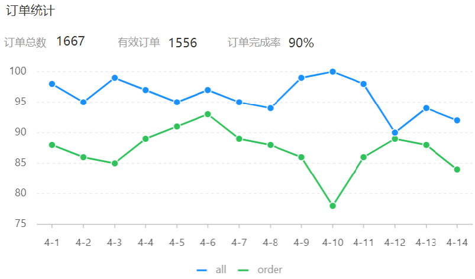

# 订单统计

## 一、需求分析和设计

### 1.1.产品原型

订单统计通过一个折现图来展现，折线图上有两根线，分别反映的是每一天的数据。

- 蓝色的线代表**订单总数**；
- 绿色的线代表**有效订单数**，指的就是状态是“已完成”的订单。

上面还有3个数字，分别是订单总数、有效订单、订单完成率，它指的是整个时间区间之内总的数据。



业务规则：

- 有效订单指状态为 “已完成” 的订单。
- 基于可视化报表的折线图展示订单数据，X 轴为日期，Y 轴为订单数量；
- 根据时间选择区间，展示每天的订单总数和有效订单数。
- 展示所选时间区间内的有效订单数、总订单数、订单完成率，订单完成率 = 有效订单数 / 总订单数 * 100%

### 1.2.接口设计

基本信息

**Path：** /admin/report/ordersStatistics

**Method：** GET

接口描述：

请求参数

Query

| 参数名称 | 是否必须 | 示例       | 备注     |
| -------- | -------- | ---------- | -------- |
| begin    | 是       | 2022-05-01 | 开始日期 |
| end      | 是       | 2022-05-31 | 结束日期 |

返回数据

| 名称                   | 类型    | 是否必须 | 默认值 | 备注                       | 其他信息       |
| ---------------------- | ------- | -------- | ------ | -------------------------- | -------------- |
| code                   | integer | 必须     |        |                            | format: int32  |
| data                   | object  | 必须     |        |                            |                |
| ├─ dateList            | string  | 必须     |        | 日期列表，以逗号分隔       |                |
| ├─ orderCompletionRate | number  | 必须     |        | 订单完成率                 | format: double |
| ├─ orderCountList      | string  | 必须     |        | 订单数列表，以逗号分隔     |                |
| ├─ totalOrderCount     | integer | 必须     |        | 订单总数                   | format: int32  |
| ├─ validOrderCount     | integer | 必须     |        | 有效订单数                 | format: int32  |
| ├─ validOrderCountList | string  | 必须     |        | 有效订单数列表，以逗号分隔 |                |
| msg                    | string  | 非必须   |        |                            |                |

## 二、代码开发

### 2.1.VO 类设计

OrderReportVO 类

sky-takeout-backend/sky-pojo/src/main/java/com/sky/vo/OrderReportVO.java

```java
package com.sky.vo;

import lombok.AllArgsConstructor;
import lombok.Builder;
import lombok.Data;
import lombok.NoArgsConstructor;

import java.io.Serial;
import java.io.Serializable;

@Data
@Builder
@NoArgsConstructor
@AllArgsConstructor
public class OrderReportVO implements Serializable {
    @Serial
    private static final long serialVersionUID = 4160444566542239361L;
    //日期，以逗号分隔，例如：2022-10-01,2022-10-02,2022-10-03
    private String dateList;

    //每日订单数，以逗号分隔，例如：260,210,215
    private String orderCountList;

    //每日有效订单数，以逗号分隔，例如：20,21,10
    private String validOrderCountList;

    //订单总数
    private Integer totalOrderCount;

    //有效订单数
    private Integer validOrderCount;

    //订单完成率
    private Double orderCompletionRate;
}
```

### 2.2.Controller 层

ReportController 控制器列，新增方法 `orderStatistics`

sky-takeout-backend/sky-server/src/main/java/com/sky/controller/admin/ReportController.java

```java
……

@GetMapping("/ordersStatistics")
@Operation(summary = "订单统计")
public Result<OrderReportVO> orderStatistics(
        @DateTimeFormat(pattern = "yyyy-MM-dd") @RequestParam("begin") LocalDate startDate,
        @DateTimeFormat(pattern = "yyyy-MM-dd") @RequestParam("end") LocalDate endDate
) {
    log.info("订单统计，开始日期：{}，结束日期：{}", startDate, endDate);

    OrderReportVO orderReportVO = reportService.orderStatistics(startDate, endDate);
    return Result.success(orderReportVO);
}

……
```

### 2.3.Service  层

ReportService 接口，新增 `orderStatistics` 方法

sky-takeout-backend/sky-server/src/main/java/com/sky/service/ReportService.java

```java
……

/**
 * 此方法用于：订单统计
 * @param startDate 开始日期
 * @param endDate 结束日期
 * @return OrderReportVO
 */
OrderReportVO orderStatistics(LocalDate startDate, LocalDate endDate);

……
```

ReportServiceImpl 类，实现 `orderStatistics` 方法

sky-takeout-backend/sky-server/src/main/java/com/sky/service/impl/ReportServiceImpl.java

```java
……

/**
 * 此方法用于：订单统计
 *
 * @param startDate 开始日期
 * @param endDate   结束日期
 * @return OrderReportVO
 */
@Override
public OrderReportVO orderStatistics(LocalDate startDate, LocalDate endDate) {
    List<LocalDate> dateList = getDateList(startDate, endDate);
    String dateListStr = StringUtils.join(dateList, ",");

    // 获取每天的订单总数、有效订单数
    ArrayList<Integer> orderCountList = new ArrayList<>();
    ArrayList<Integer> validOrderCountList = new ArrayList<>();
    for (LocalDate date : dateList) {
        LocalDateTime begin = LocalDateTime.of(date, LocalTime.MIN);
        LocalDateTime end = LocalDateTime.of(date, LocalTime.MAX);

        // 查询当日总订单数
        HashMap<String, Object> claim = new HashMap<>();
        claim.put("begin", begin);
        claim.put("end", end);
        Integer orderCount = orderMapper.countByMap(claim);
        orderCountList.add(orderCount);

        // 查询当如订单总数
        claim.put("status", Orders.COMPLETED);
        Integer validOrderCount = orderMapper.countByMap(claim);
        validOrderCountList.add(validOrderCount);
    }
    String orderCountListStr = StringUtils.join(orderCountList, ",");
    String validOrderCountListStr = StringUtils.join(validOrderCountList, ",");

    // 计算时间区间内的订单总数
    Integer totalOrderCount = orderCountList.stream().reduce(0, Integer::sum);

    // 计算时间区间内的有效订单数
    Integer validOrderCount = validOrderCountList.stream().reduce(0, Integer::sum);

    // 计算订单完成率
    Double orderCompletionRate = totalOrderCount != 0 ? validOrderCount.doubleValue() / totalOrderCount : 0.0;

    return OrderReportVO.builder()
            .dateList(dateListStr)
            .orderCountList(orderCountListStr)
            .validOrderCountList(validOrderCountListStr)
            .totalOrderCount(totalOrderCount)
            .validOrderCount(validOrderCount)
            .orderCompletionRate(orderCompletionRate)
            .build();
}

……
```

- 同样采用往 Map 里传入键值对，来动态处理 SQL 查询条件。

### 2.4.Mapper 层

OrderMapper 接口，新增 `countByMap` 方法

sky-takeout-backend/sky-server/src/main/java/com/sky/mapper/OrderMapper.java

```java
/**
 * 此方法用于：根据条件统计订单数量
 *
 * @param claim 查询条件
 * @return Integer
 */
Integer countByMap(HashMap<String, Object> claim);
```

使用 XML 映射文件，处理动态 SQL

sky-takeout-backend/sky-server/src/main/resources/mapper/OrderMapper.xml

```xml
<select id="countByMap" resultType="java.lang.Integer">
    SELECT COUNT(*) FROM orders
    <where>
        <if test="begin != null">
            order_time &gt;= #{begin}
        </if>
        <if test="end != null">
            AND order_time &lt;= #{end}
        </if>
        <if test="status != null">
            AND status = 5
        </if>
    </where>
</select>
```

## 三、功能测试

在管理端页面，查询订单统计。
