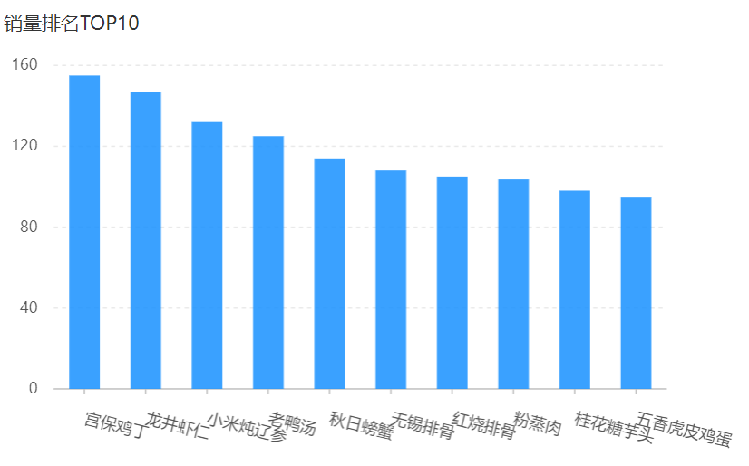

# 销量排名

## 一、需求分析和设计

### 1.1.产品原型

所谓销量排名，销量指的是商品销售的数量。项目当中的商品主要包含两类：一个是**套餐**，一个是**菜品**，

所以销量排名，其实指的就是菜品和套餐销售的数量排名。通过柱形图，来展示销量排名，这些销量是按照降序来排列，并且只需要统计销量排名前十的商品。



业务规则：

- 根据时间选择区间，展示销量前 10 的商品（包括菜品和套餐）。
- 基于可视化报表的柱状图降序展示商品销量。
- 此处的销量为商品销售的份数。

### 1.2.接口设计

基本信息

**Path：** /admin/report/top10

**Method：** GET

**接口描述：**

请求参数

Query

| 参数名称 | 是否必须 | 示例       | 备注     |
| -------- | -------- | ---------- | -------- |
| begin    | 是       | 2022-05-01 | 开始日期 |
| end      | 是       | 2022-05-31 | 结束日期 |

返回数据

| 名称          | 类型    | 是否必须 | 默认值 | 备注                     | 其他信息      |
| ------------- | ------- | -------- | ------ | ------------------------ | ------------- |
| code          | integer | 必须     |        |                          | format: int32 |
| data          | object  | 必须     |        |                          |               |
| ├─ nameList   | string  | 必须     |        | 商品名称列表，以逗号分隔 |               |
| ├─ numberList | string  | 必须     |        | 销量列表，以逗号分隔     |               |
| msg           | string  | 非必须   |        |                          |               |

## 二、代码开发

### 2.1.VO 类准备

SalesTop10ReportVO 类

sky-takeout-backend/sky-pojo/src/main/java/com/sky/vo/SalesTop10ReportVO.java

```java
package com.sky.vo;

import lombok.AllArgsConstructor;
import lombok.Builder;
import lombok.Data;
import lombok.NoArgsConstructor;

import java.io.Serializable;

@Data
@Builder
@NoArgsConstructor
@AllArgsConstructor
public class SalesTop10ReportVO implements Serializable {
    //商品名称列表，以逗号分隔，例如：鱼香肉丝,宫保鸡丁,水煮鱼
    private String nameList;

    //销量列表，以逗号分隔，例如：260,215,200
    private String numberList;
}
```

### 2.2.DTO 类准备

SalesTop10ReportVO 类

sky-takeout-backend/sky-pojo/src/main/java/com/sky/vo/SalesTop10ReportVO.java

```java
package com.sky.vo;

import lombok.AllArgsConstructor;
import lombok.Builder;
import lombok.Data;
import lombok.NoArgsConstructor;

import java.io.Serializable;

@Data
@Builder
@NoArgsConstructor
@AllArgsConstructor
public class SalesTop10ReportVO implements Serializable {
    //商品名称列表，以逗号分隔，例如：鱼香肉丝,宫保鸡丁,水煮鱼
    private String nameList;

    //销量列表，以逗号分隔，例如：260,215,200
    private String numberList;
}
```

### 2.3.Controller 层

ReportController 控制器类，新增 `top10` 方法。

sky-takeout-backend/sky-server/src/main/java/com/sky/controller/admin/ReportController.java

```java
……

@GetMapping("/top10")
public Result<SalesTop10ReportVO> top10(
        @DateTimeFormat(pattern = "yyyy-MM-dd") @RequestParam("begin") LocalDate startDate,
        @DateTimeFormat(pattern = "yyyy-MM-dd") @RequestParam("end") LocalDate endDate
) {
    log.info("查询销量排名top10，开始日期：{}，结束日期：{}", startDate, endDate);
    return Result.success(reportService.top10(startDate, endDate));
}

……
```

### 2.3.Service  层

`ReportService` 接口，新增 `top10` 方法。

sky-takeout-backend/sky-server/src/main/java/com/sky/service/ReportService.java

```java
/**
 * 此方法用于：销量排名
 *
 * @param startDate 开始日期
 * @param endDate   结束日期
 * @return SalesTop10ReportVO
 */
SalesTop10ReportVO top10(LocalDate startDate, LocalDate endDate);
```

ReportServiceImpl 实现类，实现 `top10` 方法

sky-takeout-backend/sky-server/src/main/java/com/sky/service/impl/ReportServiceImpl.java

```java
/**
 * 此方法用于：销量排名
 *
 * @param startDate 开始日期
 * @param endDate   结束日期
 * @return SalesTop10ReportVO
 */
@Override
public SalesTop10ReportVO top10(LocalDate startDate, LocalDate endDate) {
    LocalDateTime begin = LocalDateTime.of(startDate, LocalTime.MIN);
    LocalDateTime end = LocalDateTime.of(endDate, LocalTime.MAX);

    List<GoodsSalesDTO> list = orderMapper.selectSalesTop(begin, end);

    List<String> names = list.stream().map(GoodsSalesDTO::getName).collect(Collectors.toList());
    String nameListStr = StringUtils.join(names, ",");

    List<Integer> sales = list.stream().map(GoodsSalesDTO::getNumber).collect(Collectors.toList());
    String numberListStr = StringUtils.join(sales, ",");

    return SalesTop10ReportVO.builder()
            .nameList(nameListStr)
            .numberList(numberListStr)
            .build();
}
```

- 使用 Stream 流和方法引用，将 goodsSalesDTO 对象中的 Name 和 Number 收集成列表。

### 2.4.Mapper 层

OrderMapper 接口中，新增 `selectSalesTop` 方法

sky-takeout-backend/sky-server/src/main/java/com/sky/mapper/OrderMapper.java

```java
/**
 * 此方法用于：查询销量排名 top10
 *
 * @param begin 开始时间
 * @param end   结束时间
 * @return List<GoodsSalesDTO>
 */
List<GoodsSalesDTO> selectSalesTop(LocalDateTime begin, LocalDateTime end);
```

使用 XML 映射文件，处理动态 SQL

sky-takeout-backend/sky-server/src/main/resources/mapper/OrderMapper.xml

```xml
<select id="selectSalesTop" resultType="com.sky.dto.GoodsSalesDTO">
    SELECT od.name, SUM(od.number) num FROM order_detail od
    LEFT JOIN orders o ON od.order_id = o.id
    <where>
        <if test="begin != null">
            AND o.order_time &gt;= #{begin}
        </if>
        <if test="end != null">
            AND o.order_time &lt;= #{end}
        </if>
    </where>
    GROUP BY od.name
    ORDER BY num DESC
    LIMIT 0, 10
</select>
```

## 三、功能测试

在管理端页面，查询销售排名。
