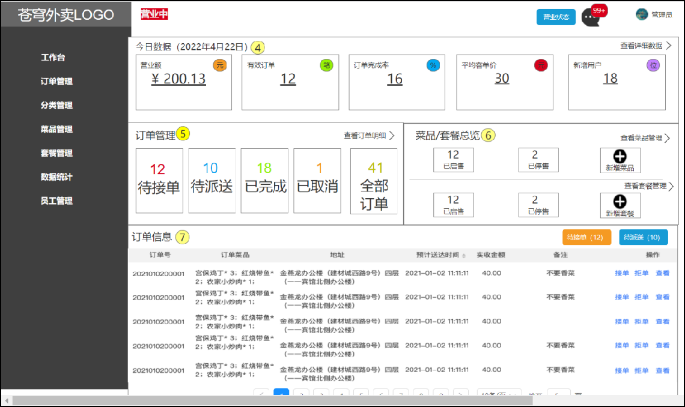

# 工作台代码导入

## 一、需求分析和设计

### 1.1.产品原型

工作台是系统运营的数据看板，并提供快捷操作入口，可以有效提高商家的工作效率。

工作台展示的数据：

- 今日数据
- 订单管理
- 菜品总览
- 套餐总览
- 订单信息

原型图：

名词解释：

- 营业额：已完成订单的总金额。
- 有效订单：已完成订单的数量。
- 订单完成率：有效订单数 / 总订单数 * 100%
- 平均客单价：营业额 / 有效订单数。
- 新增用户：新增用户的数量。

### 1.2.接口设计

通过上述原型图分析，共包含 6 个接口：

- 今日数据接口
- 订单管理接口
- 菜品总览接口
- 套餐总览接口
- 订单搜索（已完成）
- 各个状态的订单数量统计（已完成）

#### 1.2.1.今日数据接口

基本信息

**Path：** /admin/workspace/businessData

**Method：** GET

**接口描述：**

请求参数

返回数据

| 名称                   | 类型    | 是否必须 | 默认值 | 备注       | 其他信息       |
| ---------------------- | ------- | -------- | ------ | ---------- | -------------- |
| code                   | integer | 必须     |        |            | format: int32  |
| data                   | object  | 必须     |        |            |                |
| ├─ newUsers            | integer | 必须     |        | 新增用户数 | format: int32  |
| ├─ orderCompletionRate | number  | 必须     |        | 订单完成率 | format: double |
| ├─ turnover            | number  | 必须     |        | 营业额     | format: double |
| ├─ unitPrice           | number  | 必须     |        | 平均客单价 | format: double |
| ├─ validOrderCount     | integer | 必须     |        | 有效订单数 | format: int32  |
| msg                    | string  | 非必须   |        |            |                |

#### 1.2.2.订单管理接口

基本信息

**Path：** /admin/workspace/overviewOrders

**Method：** GET

接口描述：

请求参数

返回数据

| 名称               | 类型    | 是否必须 | 默认值 | 备注       | 其他信息      |
| ------------------ | ------- | -------- | ------ | ---------- | ------------- |
| code               | integer | 必须     |        |            | format: int32 |
| data               | object  | 必须     |        |            |               |
| ├─ allOrders       | integer | 必须     |        | 全部订单   | format: int32 |
| ├─ cancelledOrders | integer | 必须     |        | 已取消数量 | format: int32 |
| ├─ completedOrders | integer | 必须     |        | 已完成数量 | format: int32 |
| ├─ deliveredOrders | integer | 必须     |        | 待派送数量 | format: int32 |
| ├─ waitingOrders   | integer | 必须     |        | 待接单数量 | format: int32 |
| msg                | string  | 非必须   |        |            |               |

#### 1.2.3.菜品总览接口

基本信息

**Path：** /admin/workspace/overviewDishes

**Method：** GET

接口描述：

请求参数

返回数据

| 名称            | 类型    | 是否必须 | 默认值 | 备注           | 其他信息      |
| --------------- | ------- | -------- | ------ | -------------- | ------------- |
| code            | integer | 必须     |        |                | format: int32 |
| data            | object  | 必须     |        |                |               |
| ├─ discontinued | integer | 必须     |        | 已停售菜品数量 | format: int32 |
| ├─ sold         | integer | 必须     |        | 已启售菜品数量 | format: int32 |
| msg             | string  | 非必须   |        |                |               |

#### 1.2.4.套餐总览接口

基本信息

**Path：** /admin/workspace/overviewSetmeals

**Method：** GET

接口描述：

请求参数

返回数据

| 名称            | 类型    | 是否必须 | 默认值 | 备注           | 其他信息      |
| --------------- | ------- | -------- | ------ | -------------- | ------------- |
| code            | integer | 必须     |        |                | format: int32 |
| data            | object  | 必须     |        |                |               |
| ├─ discontinued | integer | 必须     |        | 已停售套餐数量 | format: int32 |
| ├─ sold         | integer | 必须     |        | 已启售套餐数量 | format: int32 |
| msg             | string  | 非必须   |        |                |               |

## 二、代码导入

将 `WorkSpaceController` 控制器类导入。

sky-takeout-backend/sky-server/src/main/java/com/sky/controller/admin/WorkSpaceController.java

## 三、功能测试

在管理端页面，查询工作台的相关接口。
