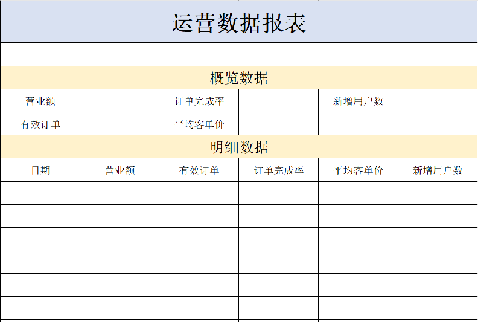

# Apache POI、导出运营数据 Excel 报表

Apache POI 是一个处理 Miscrosoft Office 各种文件格式的开源项目。

我们可以使用 POI 在 Java 程序中，对 Miscrosoft Office 各种文件进行读写操作。

一般情况下，POI 都是用于操作 Excel 文件的。

Apache POI 的应用场景：

- 银行网银系统导出交易明细；
- 各种业务系统导出 Excel 报表；
- 批量导入业务数据；

## 一、Apache POI 使用

Apache POI 既可以将数据写入 Excel 文件，也可以读取 Excel 文件中的数据，接下来分别进行实现。

### 1.1.Maven 坐标导入

sky-takeout-backend/sky-server/pom.xml

```xml
<dependency>
    <groupId>org.apache.poi</groupId>
    <artifactId>poi</artifactId>
</dependency>
<dependency>
    <groupId>org.apache.poi</groupId>
    <artifactId>poi-ooxml</artifactId>
</dependency>
```

sky-takeout-backend/pom.xml

```xml
<properties>
    ……
    <poi>5.3.0</poi>
</properties>
<dependencyManagement>
    ……
    <!-- poi -->
    <dependency>
        <groupId>org.apache.poi</groupId>
        <artifactId>poi</artifactId>
        <version>${poi}</version>
    </dependency>
    <dependency>
        <groupId>org.apache.poi</groupId>
        <artifactId>poi-ooxml</artifactId>
        <version>${poi}</version>
    </dependency>
</dependencyManagement>
```

### 1.2.Apache POI 入门案例

Excel 读取和写入

sky-takeout-backend/sky-server/src/test/java/com/sky/POITest.java

```java
package com.sky;

import org.apache.poi.xssf.usermodel.XSSFRow;
import org.apache.poi.xssf.usermodel.XSSFSheet;
import org.apache.poi.xssf.usermodel.XSSFWorkbook;

import java.io.FileInputStream;
import java.io.FileOutputStream;
import java.io.IOException;

public class POITest {
    /**
     * 此方法用于：创建 Excel 文件，并写入内容。
     */
    private static void write() throws IOException {
        // 在内存中，创建一个工作簿
        XSSFWorkbook xlsx = new XSSFWorkbook();
        // 在工作簿中，创建一个工作表
        XSSFSheet sheet1 = xlsx.createSheet("Sheet1");

        // 在工作表中，创建一行（rownum 编号从 0 开始）
        XSSFRow row = sheet1.createRow(1);

        // 在行中，创建单元格（cellnum 编号从 0 开始），并写入内容。
        row.createCell(1).setCellValue("姓名");
        row.createCell(2).setCellValue("城市");

        // 再创建一行
        row = sheet1.createRow(2);
        row.createCell(1).setCellValue("张三");
        row.createCell(2).setCellValue("北京");

        // 再创建一行
        row = sheet1.createRow(3);
        row.createCell(1).setCellValue("李四");
        row.createCell(2).setCellValue("上海");

        FileOutputStream fos = new FileOutputStream("info.xlsx");
        xlsx.write(fos);
        fos.close();
        xlsx.close();
    }

    /**
     * 此方法用于：读取 Excel 文件。
     */
    private static void read() throws IOException {
        // 读取磁盘上已经存在的 Excel 文件。
        FileInputStream fis = new FileInputStream("info.xlsx");
        XSSFWorkbook xlsx = new XSSFWorkbook(fis);
        // 读取第一个工作表
        XSSFSheet sheet1 = xlsx.getSheetAt(0);

        // 获取工作表最后一行的行号（行号从 0 开始）
        int lastRowNum = sheet1.getLastRowNum();
        for (int i = 1; i <= lastRowNum; i++) {
            // 获取某一行
            XSSFRow row = sheet1.getRow(i);
            String cellVal1 = row.getCell(1).getStringCellValue();
            String cellVal2 = row.getCell(2).getStringCellValue();
            System.out.println(cellVal1 + " " + cellVal2);
        }

        fis.close();
        xlsx.close();
    }

    public static void main(String[] args) throws IOException {
        write();
        read();
    }
}
```

## 二、导出运营数据 Excel 报表

### 2.1.需求分析和设计

在数据统计页面，有一个数据导出的按钮，点击该按钮时，就会下载一个文件。

这个文件实际上是一个 Excel 形式的文件：

- 文件中主要包含最近 30 日运营相关的数据。
- 表格的形式已经固定，主要由概览数据和明细数据两部分组成。
- 真正导出这个报表之后，相对应的数字就会填充在表格中，就可以进行存档。

#### 2.1.1.产品原型

导出的 Excel 报表格式：



业务规则：

- 导出 Excel 形式的报表文件；
- 导出最近 30 天的运营数据；

#### 2.1.2.接口设计

基本信息

**Path：** /admin/report/export

**Method：** GET

接口描述：

请求参数

返回数据

```javascript
OK
```

要求返回下载文件的输出流。

### 2.2.代码开发

实现步骤

1. 设计 Excel 模板文件；
2. 查询近 30 天的运营数据；
3. 将查询到的运营数据写入模板文件；
4. 通过输出流将 Excel 文件下载到客户端浏览器。

#### 2.2.1.Controller 层

`ReportController` 控制器类，新增 `export` 方法。

sky-takeout-backend/sky-server/src/main/java/com/sky/controller/admin/ReportController.java

```java
……

@GetMapping("/export")
@Operation(summary = "导出运营数据报表")
public void export(HttpServletResponse response) throws IOException {
    reportService.exportBusinessData(response);
}

……
```

- 在 `export` 方法形参中，声明 `HttpServletResponse response` 对象，用于获取输出流。

#### 2.2.2.Service  层

在 `ReportService` 接口中，新增 `exportBusinessData` 方法。

sky-takeout-backend/sky-server/src/main/java/com/sky/service/ReportService.java

```java
……

/**
 * 此方法用于：导出运营数据报表
 *
 * @param response HttpServletResponse
 */
void exportBusinessData(HttpServletResponse response) throws IOException;

……
```

在 `ReportServiceImpl` 实现类中，注入 `WorkSpaceService` 对象。实现 `export` 方法。

- 使用 Apache POI 实现 Excel 文件的读写。

sky-takeout-backend/sky-server/src/main/java/com/sky/service/impl/ReportServiceImpl.java

```java
……

/**
 * 此方法用于：导出运营数据报表
 *
 * @param response HttpServletResponse
 */
@Override
public void exportBusinessData(HttpServletResponse response) throws IOException {
    // 获取最近 30 天的开始时间、结束时间
    LocalDate startDate = LocalDate.now().minusDays(30);
    LocalDate endDate = LocalDate.now().minusDays(1);

    // 查询概览数据
    LocalDateTime begin = LocalDateTime.of(startDate, LocalTime.MIN);
    LocalDateTime end = LocalDateTime.of(endDate, LocalTime.MAX);
    BusinessDataVO businessDataVO = workspaceService.getBusinessData(begin, end);

    // 写入到 Excel 文件中
    InputStream is = this.getClass().getClassLoader().getResourceAsStream("template/运营数据报表模板.xlsx");

    // 基于模板文件，在内存中创建 Excel 文件
    if (is == null) return;
    XSSFWorkbook xlsx = new XSSFWorkbook(is);

    // 表格设置时间范围
    XSSFSheet sheet1 = xlsx.getSheet("Sheet1");
    XSSFRow row = sheet1.getRow(1);
    XSSFCell cell1 = row.getCell(1);
    cell1.setCellValue("时间：" + startDate + " 至 " + endDate);

    row = sheet1.getRow(3); // 获取第 4 行
    // 表格设置营业额
    row.getCell(2).setCellValue(businessDataVO.getTurnover());
    // 表格设置订单完成率
    row.getCell(4).setCellValue(businessDataVO.getOrderCompletionRate());
    // 表格设置新增用户数
    row.getCell(6).setCellValue(businessDataVO.getNewUsers());

    row = sheet1.getRow(4); // 获取第 5 行
    // 表格设置有效订单数
    row.getCell(2).setCellValue(businessDataVO.getValidOrderCount());
    // 表格设置平均客单价
    row.getCell(4).setCellValue(businessDataVO.getUnitPrice());

    // 表格设置明细数
    List<LocalDate> dateList = getDateList(startDate, endDate);
    LocalDate date;
    for (int i = 0; i < dateList.size(); i++) {
        // 查询某一天的营业数据
        date = dateList.get(i);
        begin = LocalDateTime.of(date, LocalTime.MIN);
        end = LocalDateTime.of(date, LocalTime.MAX);
        businessDataVO = workspaceService.getBusinessData(begin, end);

        row = sheet1.getRow(i + 7);
        row.getCell(1).setCellValue(date.toString());
        row.getCell(2).setCellValue(businessDataVO.getTurnover());
        row.getCell(3).setCellValue(businessDataVO.getValidOrderCount());
        row.getCell(4).setCellValue(businessDataVO.getOrderCompletionRate());
        row.getCell(5).setCellValue(businessDataVO.getUnitPrice());
        row.getCell(6).setCellValue(businessDataVO.getNewUsers());
    }

    // 输出流写出文件给客户端。
    ServletOutputStream os = response.getOutputStream();
    xlsx.write(os);

    // 释放资源
    os.close();
    is.close();
    xlsx.close();
}
```
